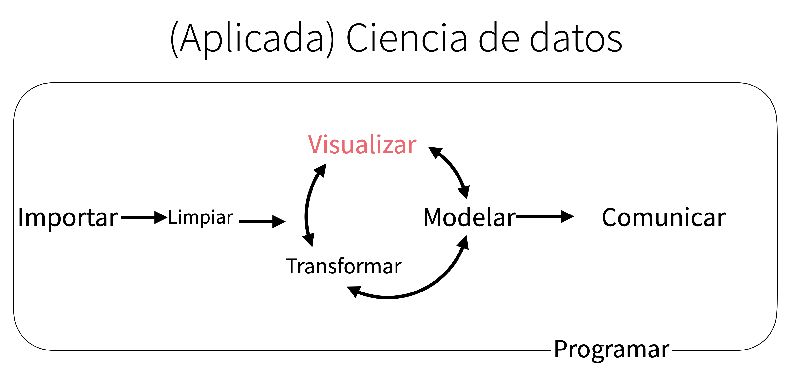

```{r setup, include=FALSE}
library(learnr)
library(gradethis)
library(learnrhash)
library(tidyverse)
library(ggplot2)
require("maps")
gradethis::gradethis_setup()
knitr::opts_chunk$set(exercise.checker = gradethis::grade_learnr)
```

<style type="text/css">
  body{
  font-size: 13pt;
}
</style>

```{r stormtrooper, fig.margin = TRUE, echo = FALSE, fig.width=3, out.width = "100%", fig.cap="Ilustración por Emilio Morones."}

```

## Primeros pasos
¿Los autos con un motor más grande utilizan más combustible que los autos con un motor más pequeño?
¿Cómo se ve la relación entre el tamaño de un motor y el uso de combustible? 
¿Positiva, negativa, lineal, no lineal?

```{r mpg-setup}
mpg <- as.data.frame(mpg)
```

```{r chunk1, exercise=TRUE}
mpg
?mpg
# displ (tamaño del motor)
# hwy (eficiencia del uso del combustible)
```

### Primera gráfica
```{r chunk2, exercise=TRUE}
ggplot(data = mpg) + # crea un sistema de coordenadas para agregar capas
  geom_point(mapping = aes(x = displ, y = hwy)) # agrega una capa de puntos a la gráfica y crea una gráfica de dispersión
```

¿Esta gráfica comprueba o refuta tu hipótesis acerca de la eficiencia del uso del combustible y el tamaño del motor?

### Plantilla
<div align="center">**ggplot(data = < DATA >) + < GEOM_FUNCTION >(mapping = aes(< MAPPINGS >))** </div>

### Preguntas

```{r quiz1, echo = FALSE}
quiz(caption = "Responde",
  question("¿Qué ves si sólo corres `ggplot(data = mpg)`?",
           answer("Una gráfica por defecto del paquete"),
           answer("Imprime en consola el data frame"),
           answer("Te proporciona información sobre el data frame"),
           answer("Sale una gráfica vacía", correct = TRUE, message = "Esta es la primer capa donde se comenzarán a incluir las gráficas"),
           allow_retry = TRUE
  ),
  question("¿Cuántos renglones y columnas tiene `mpg`?",
           answer("2 y 3"),
           answer("90 y 12"),
           answer("234 y 11", correct = TRUE),
           allow_retry = TRUE
  ),
  question("¿Qué describe la variable `drv`? (utiliza `?mpg`)",
           answer("El tipo de transmisión"),
           answer("El tipo de tren de transmisión, donde f = tracción delantera, r = tracción trasera, 4 = 4wd", correct = TRUE),
           answer("Millas de carretera por galón"),
           allow_retry = TRUE
  ),
  question_text(
  "Qué pasa si haces una gráfica de dispersión entre class y drv? ¿Por qué no es útil esta gráfica?",
  answer(NULL, correct = TRUE),
  incorrect = "Lo estaremos revisando! Gracias!",
  try_again_button = "Modifica tu respuesta",
  allow_retry = TRUE
)
)
```

### Ejercicio: Has una gráfica de dispersión entre las variables hwy vs cyl.
```{r chunk3, exercise=TRUE}
ggplot(data = ___) + geom_point(mapping = aes(x = __, y = __))
```
<div id="chunk3-hint">
**Hint:** **ggplot(data = < DATA >) + < GEOM_FUNCTION >(mapping = aes(< MAPPINGS >)) **. Ya cargué el paquete necesario para ti.
</div>
```{r chunk3-solution}
ggplot(data = mpg) + geom_point(mapping = aes(x = hwy, y = cyl))
```
```{r chunk3-check}
grade_this_code()
```


## Mapear elementos estéticos 
>> El mejor valor de una imagen es cuando nos forza a notar lo que nunca esperamos ver.
John Tukey

```{r mpg-grafica-1}
mpg %>% mutate(rojo =case_when(hwy > 20 & displ >5~T, T~F)) %>% ggplot() + geom_point(aes(x =displ, y = hwy, color = rojo)) + scale_color_manual(values = c("black","red")) + theme(legend.position = "none")
```

Los puntos rojos parece ser que se salen de la relación lineal. ¿Cómo podrías explicar estos carros?
Una posible hipótesis es que sean carros híbridos.

Podemos agregar una tercera dimensión a nuestra gráfica de dos dimensiones mediante la estética.
Es un elemento visual de los objetos en la gráfica. Puede ser tamaño, forma, transparencia, color

```{r mpg-grafica-2, warning=FALSE}
ggplot(data = mpg) + 
  geom_point(mapping = aes(x = displ, y = hwy, color = class))
```

Podemos darnos cuenta que 5 de los 6 puntos que parecieran salirse de la relación es porque son carros
de 2 plazas. En retrospectiva no podían ser híbridos pues éstos no tienen tamaños de motor tan grande

```{r mpg-grafica-3,  warning=FALSE}
ggplot(data = mpg) + 
  geom_point(mapping = aes(x = displ, y = hwy, alpha = class))
```

```{r mpg-grafica-4, warning=FALSE}
ggplot(data = mpg) + 
  geom_point(mapping = aes(x = displ, y = hwy, size = class))
```

```{r mpg-grafica-5,  warning=FALSE}
ggplot(data = mpg) + 
  geom_point(mapping = aes(x = displ, y = hwy, shape = class))
```

¿Qué pasó con los suv? Para las formas sólo utiliza 6 diferentes formas por defecto

```{r mpg-grafica-6}
ggplot(data = mpg) + 
  geom_point(mapping = aes(x = displ, y = hwy), size = 10)
```

* colores son en "string"
* formas en número
* tamaño en milímetros


### Ejercicio:
```{r chunk8, exercise=TRUE}
ggplot(data = mpg) + 
  geom_point(mapping = aes(x = displ, y = hwy, color = "blue"))
```

```{r quiz2, echo = FALSE}
quiz(caption = "Responde",
  question_text(
  "¿Qué hay de malo con este código?",
  answer(NULL, correct = TRUE),
  incorrect = "Lo estaremos revisando! Gracias!",
  try_again_button = "Modifica tu respuesta",
  allow_retry = TRUE
)
)
```

```{r quiz2, echo = FALSE}
quiz(caption = "Responde",
  question_text(
  "¿Qué hay de malo con este código?",
  answer(NULL, correct = TRUE),
  incorrect = "Lo estaremos revisando! Gracias!",
  try_again_button = "Modifica tu respuesta",
  allow_retry = TRUE
)
)
```

```{r quiz2, echo = FALSE}
quiz(caption = "Responde",
  question_text(
  "¿Qué hay de malo con este código?",
  answer(NULL, correct = TRUE),
  incorrect = "Lo estaremos revisando! Gracias!",
  try_again_button = "Modifica tu respuesta",
  allow_retry = TRUE
)
)
```


```{r quiz3, echo = FALSE}
quiz(caption = "Responde",
  question("¿Qué variables de `mpg` son categóricas?",
           answer("manufacturer, model y displ"),
           answer("model, displ, year"),
           answer("disp, trabs, class"),
           answer("manufacturer, model, year, trans, drv, fl, class", correct = TRUE),
           allow_retry = TRUE
  ),
  question("¿Qué variables de mpg son continuas??",
           answer("menufacturer y model"),
           answer("year y cyl"),
           answer("disp, cty y hwy", correct = TRUE),
           allow_retry = TRUE
  ),
  question("¿Qué hace la estética 'stroke'? pista: utiliza geom_point" ,
           answer("Controla el color"),
           answer("Controla el tamaño del trazo", correct = TRUE),
           answer("Controla el ancho del eje"),
           allow_retry = TRUE
  )
)
```

```{r quiz4, echo = FALSE}
quiz(caption = "Responde",
  question_text(
  "¿Qué pasa si en lugar de poner una variable ponemos una condición? ej: aes(color = displ < 5)",
  answer(NULL, correct = TRUE),
  incorrect = "Lo estaremos revisando! Gracias!",
  try_again_button = "Modifica tu respuesta",
  allow_retry = TRUE
)
)
```

```{r chunk9, exercise=TRUE}
ggplot(data = mpg) + 
  geom_point(mapping = aes(x = displ, y = hwy, color = displ < 5), stroke = 2, shape = 21)
```

```{r quiz5, echo = FALSE}
quiz(caption = "Responde",
  question_text(
  "Mapea una variable continua para color, tamaño y forma ¿Qué sucede?",
  answer(NULL, correct = TRUE),
  incorrect = "Lo estaremos revisando! Gracias!",
  try_again_button = "Modifica tu respuesta",
  allow_retry = TRUE
)
)
```

## Problemas comunes 

* type-o
* paréntesis
* comillas
* "+" en consola
* "+" en renglón
* ayuda y ve ejemplos
* lee el error
* googlea el error

## Facets 

```{r chunk11, warning=FALSE}
ggplot(data = mpg) + 
  geom_point(mapping = aes(x = displ, y = hwy)) + 
  facet_wrap(~ class, nrow = 2)
```

```{r chunk12, warning=FALSE}
ggplot(data = mpg) + 
  geom_point(mapping = aes(x = displ, y = hwy)) + 
  facet_grid(drv ~ cyl)
```

### Ejercicio

```{r quiz6, echo = FALSE}
quiz(caption = "Responde",
  question_text(
  "¿Qué pasa cuando utilizas los facets en variables continuas?",
  answer(NULL, correct = TRUE),
  incorrect = "Lo estaremos revisando! Gracias!",
  try_again_button = "Modifica tu respuesta",
  allow_retry = TRUE
),
question_text(
  "¿Qué significan los campos vacíos en facet_grid(drv~cyl)? ¿Cómo se relacionan con esta gráfica?",
  answer(NULL, correct = TRUE),
  incorrect = "Lo estaremos revisando! Gracias!",
  try_again_button = "Modifica tu respuesta",
  allow_retry = TRUE
)
)
```

```{r chunk13, exercise=TRUE}
______
```


```{r quiz7, echo = FALSE}
quiz(caption = "Responde",
  question_text(
  "¿Qué gráficas realiza el siguiente código?",
  answer(NULL, correct = TRUE),
  incorrect = "Lo estaremos revisando! Gracias!",
  try_again_button = "Modifica tu respuesta",
  allow_retry = TRUE
),
question_text(
  "¿Qué significa . ?",
  answer(NULL, correct = TRUE),
  incorrect = "Lo estaremos revisando! Gracias!",
  try_again_button = "Modifica tu respuesta",
  allow_retry = TRUE
)
)
```


```{r chunk14, exercise=TRUE}
ggplot(data = mpg) + 
  geom_point(mapping = aes(x = displ, y = hwy)) +
  facet_grid(drv ~ .)
```

```{r chunk15, exercise=TRUE}
ggplot(data = mpg) + 
  geom_point(mapping = aes(x = displ, y = hwy)) +
  facet_grid(. ~ cyl)
```

```{r quiz8, echo = FALSE}
quiz(caption = "Responde",
  question_text(
  "¿Qué ventajas y desventajas hay al utilizar facets sobre usar la estética del color?",
  answer(NULL, correct = TRUE),
  incorrect = "Lo estaremos revisando! Gracias!",
  try_again_button = "Modifica tu respuesta",
  allow_retry = TRUE
),
question_text(
  "¿Cómo podría cambiar el balance si tuviéramos una bd más grande?",
  answer(NULL, correct = TRUE),
  incorrect = "Lo estaremos revisando! Gracias!",
  try_again_button = "Modifica tu respuesta",
  allow_retry = TRUE
)
)
```

```{r chunk17, exercise=TRUE}
ggplot(data = mpg) + 
  geom_point(mapping = aes(x = displ, y = hwy)) + 
  facet_wrap(~ class, nrow = 2)
```

```{r chunk18, exercise=TRUE}
ggplot(data = mpg) + 
  geom_point(mapping = aes(x = displ, y = hwy, color = class))
```


```{r quiz9, echo = FALSE}
quiz(caption = "Responde",
  question_text(
  "¿Qué hace los parámetros nrow y ncol de facet_wrap. Qué otros parámetros contralan el diseño de los páneles individualmente?",
  answer(NULL, correct = TRUE),
  incorrect = "Lo estaremos revisando! Gracias!",
  try_again_button = "Modifica tu respuesta",
  allow_retry = TRUE
),
question_text(
  "Cuando utilizas facet_grid debes poner la viarable con mayor número de categorías únicas en las columnas ¿por qué?",
  answer(NULL, correct = TRUE),
  incorrect = "Lo estaremos revisando! Gracias!",
  try_again_button = "Modifica tu respuesta",
  allow_retry = TRUE
)
)
```


## Objetos geométricos 

```{r gridExtra, warning=FALSE}
library(gridExtra)
a <- ggplot(mpg) +
  geom_point(mapping = aes(x = displ, y = hwy))
  
b <- ggplot(mpg) +
  geom_smooth(mapping = aes(x = displ, y = hwy))

grid.arrange(a,b,nrow = 1)
```


### diferentes geoms:
* objeto geométrico para representar datos. ej. gráfica de barras: geom de barras
* gráfica de líneas: geom de líneas
* gráfica de dispersión: geom de puntos
* la gráfica de la derecha utiliza el geom de suavidad (valores ajustados)


### izquierda
```{r izquierda, warning=FALSE}
ggplot(data = mpg) + 
  geom_point(mapping = aes(x = displ, y = hwy))
```

### derecha

```{r derecha, warning=FALSE}
ggplot(data = mpg) + 
  geom_smooth(mapping = aes(x = displ, y = hwy))
```

* cada geom tiene argumentos para ser mapeados.
* Sin embargo, no todos los parámetros estéticos funcionan para todos los geom. Ej: puedes ajustar la forma de un punto pero no puedes ajustar la forma de una línea
* geom_smooth dibujará diferentes tipos de línea con el parámetro linetype para cada valor único de la gráfica

```{r geom_smooth1, warning=FALSE}
ggplot(data = mpg) + 
  geom_smooth(mapping = aes(x = displ, y = hwy, linetype = drv))
```

A lo mejor esto lo hace más claro

```{r geom_smooth2, warning=FALSE}
ggplot(data = mpg) + 
  geom_point(aes( x = displ, y = hwy, color = drv)) +
  geom_smooth(mapping = aes(x = displ, y = hwy, linetype = drv, color = drv))
```

* Nota que está gráfica contiene 2 geoms en una misma gráfica.
* ggplot2 provee más de 40 geoms y extensiones del paquete provee aún más

```{r geoms1, warning=FALSE}
a <- ggplot(data = mpg) +
  geom_smooth(mapping = aes(x = displ, y = hwy))

b <- ggplot(data = mpg) +
  geom_smooth(mapping = aes(x = displ, y = hwy, group = drv))

c <- ggplot(data = mpg) +
  geom_smooth(
    mapping = aes(x = displ, y = hwy, color = drv),
    show.legend = FALSE
  )

grid.arrange(a,b,c,nrow = 1)
```

Sólo es necesario poner + para agregar múltiples geoms en una misma gráfica

```{r geoms2, warning=FALSE}
ggplot(data = mpg) + 
  geom_point(mapping = aes(x = displ, y = hwy)) +
  geom_smooth(mapping = aes(x = displ, y = hwy))
```

Esto genera duplicación de código

```{r geoms3, warning=FALSE}
ggplot(data = mpg, mapping = aes(x = displ, y = hwy)) + 
  geom_point() +
  geom_smooth()
```

Se pueden establecer mapeos globales

```{r geoms31, warning=FALSE}
ggplot(data = mpg, mapping = aes(x = displ, y = hwy)) + 
  geom_point(mapping = aes(color = class)) + 
  geom_smooth()
```

Cuando escribes mapeos locales para cada geom, entonces extienede los mapeos globales

```{r geoms4, warning=FALSE}
ggplot(data = mpg, mapping = aes(x = displ, y = hwy)) + 
  geom_point(mapping = aes(color = class)) + 
  geom_smooth(data = filter(mpg, class == "subcompact"), se = FALSE)
```

Se puede especificar datos específicos por geom. Los datos locales reescribirá los globales para esa capa nada más

### Ejercicios
* 1. Corre este código en tu cabeza y has una predicción de cómo es el resultado.

```{r geoms5, exercise=TRUE}
ggplot(data = mpg, mapping = aes(x = displ, y = hwy, color = drv)) + 
  geom_point() + 
  geom_smooth(se = FALSE)
```

```{r quiz10, echo = FALSE}
quiz(caption = "Responde",
  question_text(
  "2 - ¿Qué geom utilizarías para dibujar una gráfica de línea? Un diagrama de caja y brazos? ¿Un histograma? ¿Una gráfica de área?",
  answer(NULL, correct = TRUE),
  incorrect = "Lo estaremos revisando! Gracias!",
  try_again_button = "Modifica tu respuesta",
  allow_retry = TRUE
),
question_text(
  "3 - ¿Qué hace el argumento show.legend = FALSE? ¿Para qué crees que lo utilicé anteriormente en ésta clase?",
  answer(NULL, correct = TRUE),
  incorrect = "Lo estaremos revisando! Gracias!",
  try_again_button = "Modifica tu respuesta",
  allow_retry = TRUE
),
question_text(
  "4 - ¿Qué hace el argumento se de la función geom_smooth()?",
  answer(NULL, correct = TRUE),
  incorrect = "Lo estaremos revisando! Gracias!",
  try_again_button = "Modifica tu respuesta",
  allow_retry = TRUE
)
)
```

5. ¿Las siguientes dos líneas de código graficarán algo diferente? ¿Por qué?

```{r geoms6, exercise=TRUE}
ggplot(data = mpg, mapping = aes(x = displ, y = hwy)) + geom_point() + geom_smooth()

#################

ggplot() + geom_point(data = mpg, mapping = aes(x = displ, y = hwy)) + geom_smooth(data = mpg, mapping = aes(x = displ, y = hwy))
```


* 6. Recrea el código para generar las siguientes gráficas

```{r geoms7, echo=FALSE, warning=FALSE, message = FALSE}
ggplot(mpg, aes(x = displ, y = hwy)) + geom_point() + geom_smooth(se = F)
```

```{r geoms8, exercise=TRUE}
# Recrea!
ggplot() + ___
```


```{r geoms9, echo=FALSE, warning=FALSE, message = FALSE}
ggplot(mpg, aes(x = displ, y = hwy, color = drv)) + geom_smooth(se = F, aes(group =drv)) + geom_point()
```

```{r geoms10, exercise=TRUE}
# Recrea!
ggplot() + ___
```


```{r geoms11, echo=FALSE, warning=FALSE, message = FALSE}
ggplot(mpg, aes(x = displ, y = hwy)) + geom_point(aes(color = drv)) + geom_smooth(se = F)
```

```{r geoms12, exercise=TRUE}
# Recrea!
ggplot() + ___
```


```{r geoms13, echo=FALSE, warning=FALSE, message = FALSE}
ggplot(mpg, aes(x = displ, y = hwy)) + geom_point(aes(color = drv)) + geom_smooth(se = F, aes(linetype = drv))
```

```{r geoms14, exercise=TRUE}
# Recrea!
ggplot() + ___
```


```{r geoms15, echo=FALSE, warning=FALSE, message = FALSE}
ggplot(mpg, aes(x = displ, y = hwy)) + geom_point(aes(fill = drv), stroke = 1.5, size = 4, color = "white", shape = 21)
```

```{r geoms16, exercise=TRUE}
# Recrea!
ggplot() + ___
```

## Transformación estadística

```{r diamonds-grafica-1, warning=FALSE}
diamonds
?diamonds
```

```{r diamonds-grafica-2, warning=FALSE}
ggplot(data = diamonds) + 
  geom_bar(mapping = aes(x = cut))
```

Nota que en el eje de las y viene la palabra count esta variablo no existe en la bd ¿De dónde viene? La gráfica de dispersión grafica los datos crudos no pasa lo mismo con la gráfica de barras: calculan nuevos valores las gráficas de barras, los histogramas, los polígonos de frecuencia.

Pon los datos en un recipiente y luego grafica el conteo de datosen cada recipiente gráficas suavizadoras: ajustan un modelo a los datos y luego grafican predicciones del modelo diagrama de caja y brazos:  computa un resumen robusto de la distribución y muestra una caja con cierto formato.

El algoritmo para calcular nuevos valores de una gráfica se llama stat (transformación estadística)

```{r diamonds-grafica-3, warning=FALSE}
?geom_bar

ggplot(data = diamonds) + 
  stat_count(mapping = aes(x = cut))
```

```{r diamonds-grafica-4, warning=FALSE}
demo <- tribble(
  ~cut,         ~freq,
  "Fair",       1610,
  "Good",       4906,
  "Very Good",  12082,
  "Premium",    13791,
  "Ideal",      21551
)

ggplot(data = demo) +
      geom_bar(mapping = aes(x = cut, y = freq), stat = "identity")
```

```{r diamonds-grafica-5, warning=FALSE}
ggplot(data = diamonds) + 
  geom_bar(mapping = aes(x = cut, y = stat(prop), group = 1))
```

```{r diamonds-grafica-6, warning=FALSE}
ggplot(data = diamonds) + 
  stat_summary(
    mapping = aes(x = cut, y = depth),
    fun.min = min,
    fun.max = max,
    fun = median
  )
```

### Ejercicio

```{r quiz11, echo = FALSE}
quiz(caption = "Responde",
  question_text(
  "1 - ¿Cuál es el geom por defecto de stat_summary?",
  answer(NULL, correct = TRUE),
  incorrect = "Lo estaremos revisando! Gracias!",
  try_again_button = "Modifica tu respuesta",
  allow_retry = TRUE
)
)
```

¿Cómo podrías re hacer la gráfica anterior utilizando la función geom en lugar de stat geom_pointrange()?

```{r diamondsgrafica7, exercise=TRUE}
ggplot(data = diamonds) +
  stat_summary(
    mapping = aes(x = ___, y = ___),
    stat = "summary"
  )
```

```{r diamondsgrafica7-hint-1}
# Ponga cut y depth
```


```{r diamondsgrafica7-solution}
ggplot(data = diamonds) + 
  stat_summary(
    mapping = aes(x = cut, y = depth),
       stat = "summary"
    )
```

```{r diamondsgrafica7-check}
grade_this_code()
```

El default de ese geom es identity pero lo podemos cambiar por summary.

```{r diamondsgrafica8, exercise=TRUE}
ggplot(data = diamonds) +
  geom_pointrange(
    mapping = aes(x = ___, y = ___),
    stat = "summary",
    fun.min = ___,
    fun.max = ___,
    fun = ___
  )
```

```{r diamondsgrafica8-hint-1}
# Ponga cut y depth, min y max ...
```


```{r diamondsgrafica8-solution}
ggplot(data = diamonds) +
  geom_pointrange(
    mapping = aes(x = cut, y = depth),
    stat = "summary",
    fun.min = min,
    fun.max = max,
    fun = median
  )
```

```{r diamondsgrafica8-check}
grade_this_code()
```

El default es mean y sd. no median, min y max

La transformación default es identity, que deja los datos como estan.

El parámetro default para stat de geom_bar es stat_count(), Sólo espera un valor de x para contarlo.

```{r quiz12, echo = FALSE}
quiz(caption = "Responde",
question("1 - ¿Qué hace geom_col? ¿Cuál es la diferencia con geom_bar?",
           answer("Ninguna, son iguales para usos diferentes"),
           answer("Si quieres que las alturas de las barras representen valores en los datos, usa geom_col(). Sin embargo geom_ba() usa stat_count() por defecto: cuenta el número de casos en cada posición x.", correct = TRUE),
           allow_retry = TRUE
  ),
question("2 - ¿Qué variables computa stat_smooth? Hint : ?stat_smooth",
           answer("Variables categóricas"),
           answer("Variables continuas", correct = TRUE),
           allow_retry = TRUE
  ),
question("3 - ¿Qué parámetros controla su comportamiento?",
           answer("mapping, data, stat y position"),
           answer("method y formula", correct = TRUE),
           allow_retry = TRUE
  )
)
```


3. La mayoría de las geoms y stats vienen en parejas que casi siempre se usan en conjunto. 

  * `geom_bar()`	`stat_count()`
  * `geom_bin2d()`	`stat_bin_2d()`
  * `geom_boxplot()` `stat_boxplot()`
  * `geom_contour_filled()`	`stat_contour_filled()`
  * `geom_contour()` `stat_contour()`
  * `geom_count()`	`stat_sum()`
  * `geom_density_2d()`	`stat_density_2d()`
  * `geom_density()` `stat_density()`
  * `geom_dotplot()` `stat_bindot()`
  * `geom_function()`	`stat_function()`
  * `geom_sf()`	`stat_sf()`
  * `geom_smooth()`	`stat_smooth()`
  * `geom_violin()`	`stat_ydensity()`
  * `geom_hex()`	`stat_bin_hex()`
  * `geom_qq_line()` `stat_qq_line()`
  * `geom_qq()`	`stat_qq()`
  * `geom_quantile()`	`stat_quantile()`

```{r quiz13, echo = FALSE}
quiz(caption = "Responde",
  question_text(
  "¿Qué tienen en común?",
  answer(NULL, correct = TRUE),
  incorrect = "Lo estaremos revisando! Gracias!",
  try_again_button = "Modifica tu respuesta",
  allow_retry = TRUE
)
)
```

```{r quiz14, echo = FALSE}
quiz(caption = "Responde",
  question_text(
  "4 - ¿Por qué tenemos que poner group = 1? Cuál es el problema con estas dos gráficas?",
  answer(NULL, correct = TRUE),
  incorrect = "Lo estaremos revisando! Gracias!",
  try_again_button = "Modifica tu respuesta",
  allow_retry = TRUE
)
)
```   

```{r diamondsgrafica9, exercise=TRUE}
ggplot(data = diamonds) + geom_bar(mapping = aes(x = cut, y = after_stat(prop)))

###

ggplot(data = diamonds) + geom_bar(mapping = aes(x = cut,y = after_stat(prop), fill = color))
```

El problema es que las proporciones estan calculadas dentro de cada grupo

## Sistema de coordenadas

El sistema de coordenadas por defecto es el Carteisano. Donde las posiciones de los puntos x, y actuan independiente para determinar la locación de cada punto.

### coord_flip cambia los ejes x y y
```{r ajuste16, warning=FALSE}
ggplot(data = mpg, mapping = aes(x = class, y = hwy)) +
  geom_boxplot()
```

```{r ajuste17, warning=FALSE}
ggplot(data = mpg, mapping = aes(x = class, y = hwy)) +
  geom_boxplot() +
  coord_flip()
```

### coord_quickmap: pone el radio para que el aspecto sea correcto para mapas
coord_quickmap utiliza una aproximación más rápida a la proyeción, ignora la curvatura de la tierra y ajusta el mapa en el radio de latitud y longitud.


```{r ajuste18, warning=FALSE}
nz <- map_data("nz")
ggplot(nz, aes(long, lat, group = group)) +
  geom_polygon(fill = "white", colour = "black")
```

```{r ajuste19, warning=FALSE}
ggplot(nz, aes(long, lat, group = group)) +
  geom_polygon(fill = "white", colour = "black") +
  coord_quickmap()
```

### coord_fixed
coord_fixed lo que hace es que asegura que la línea esté a 45 grados y es más fácil de comparar las dos variables en general el ojo humano en promedio puede detectar mejor las relaciones a un ángulo de 45 grados.

### coord_polar: usa coordenadas polares

```{r ajuste20, warning=FALSE}
bar <- ggplot(data = diamonds) +
  geom_bar(
    mapping = aes(x = cut, fill = cut),
    show.legend = FALSE,
    width = 1
  ) +
  theme(aspect.ratio = 1) +
  labs(x = NULL, y = NULL)

bar + coord_flip()
```

```{r ajuste21, warning=FALSE}
bar + coord_polar()
```
      
### Ejercicios

```{r ajuste22, warning=FALSE}
ggplot(mpg, aes(x = factor(1), fill = drv)) +
  geom_bar()
```

1. Cambia una gráfica de barras apilada por una de pie usando  coordenadas polares

```{r sistema, exercise=TRUE}
ggplot(mpg, aes(x = factor(1), fill = drv)) +
  geom_bar(width = 1) +
  ___
```

```{r sistema-hint-1}
# coord_polar()
```

```{r sistema-solution}
ggplot(mpg, aes(x = factor(1), fill = drv)) +
  geom_bar(width = 1) +
  coord_polar(theta = "y")
```

```{r sistema-check}
grade_this_code()
```


```{r quiz16, echo = FALSE}
quiz(caption = "Responde",
  question("2 - ¿Qué hace la función labs? Lee la documentación ",
           answer("Parámetros para modelar un comportamiento"),
           answer("Cambia las coordenadas"),
           answer("Agrega títulos a los ejes, títulos y pie de nota", correct = TRUE),
           answer("Cambia de color la grafica"),
           allow_retry = TRUE
  ),
  question("3 - ¿Cuál es la diferencia entre coord_quickmap y coord_map?",
           answer("Ninguna, una es una especialización para estadística"),
           answer("coord_map usa las proyecciones  para proyectar las 3 dimensaiones de la tierra en un plano de dos dimensiones.", correct = TRUE),
           answer("Cambia el sistema de cordenadas"),
           answer("Una es más rápida que la otra al momento de ejecutarse"),
           allow_retry = TRUE
  ),
question_text(
  "4 - ¿Es importante coord_fixed?",
  answer(NULL, correct = TRUE),
  incorrect = "Lo estaremos revisando! Gracias!",
  try_again_button = "Modifica tu respuesta",
  allow_retry = TRUE
)
)
```

```{r ajuste23, warning=FALSE}
ggplot(data = mpg, mapping = aes(x = cty, y = hwy)) +
  geom_point() +
  geom_abline() +
  coord_fixed()
```

```{r quiz17, echo = FALSE}
quiz(caption = "Responde",
  question("6 - ¿Qué te dice la anterior gráfica de la relación entre cty y hwy?",
           answer("Hay una relación que muestra una tendencia lineal.", correct = TRUE),
           answer("Hay una relación exponencial."),
           answer("No se observa patrón alguno"),
           allow_retry = TRUE
  ),
  question("7 - ¿Qué hace geom_abline()?",
           answer("Agrega una linea de referencia.", correct = TRUE),
           answer("Sube el ancho de los puntos"),
           answer("Cambia el título de la gráfica"),
           allow_retry = TRUE
  )
)
```


## Las capas de la gramática de las gráficas

                ggplot(data = <DATA>) +
                  <GEOM_FUNCTION>(
                    mapping = aes(<MAPPINGS>),
                    stat = <STAT>,
                    position = <POSITION>
                    ) +
                   <COORDINATE_FUNCTION> +
                    <FACET_FUNCTION>

  * 1. Empezar con bd
  * 2. Hacer alguna operación (stat_count)
  * 3. Elegir un geom
  * 4. Elegir los mapeos
  * 5. Elegir el sistema de coordenadas
  * 6. Si es necesario separar gráficas en partes

## Envía tus respuestas

### Material de referencia
Hadley Wickham y Garrett Grolemund, "R for Data Science: Import, Tidy, Transform, Visualize, and Model Data" O'REILLY [`R for Data Science`](https://r4ds.had.co.nz/)


```{r context="server"}
learnrhash::encoder_logic()
```

```{r encode, echo=FALSE}
learnrhash::encoder_ui(
  ui_before = shiny::div(
    "Si ha completado este tutorial y está satisfecho con todos sus",
     "soluciones, haga clic en el botón de abajo para generar su hash y",
     "envíalo usando el siguiente formulario:",
    shiny::tags$br()
  )
)
```

Enviar hash al siguiente link -> [__Aqui__](https://docs.google.com/spreadsheets/d/1eXNEGrumywfCt4xop5ygcJGxbXI5kfNdiHOztiGspoA/edit?usp=sharing)

```{r stormtrooper2, echo = FALSE}
knitr::include_graphics("images/morant.jpg")
```