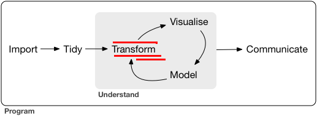
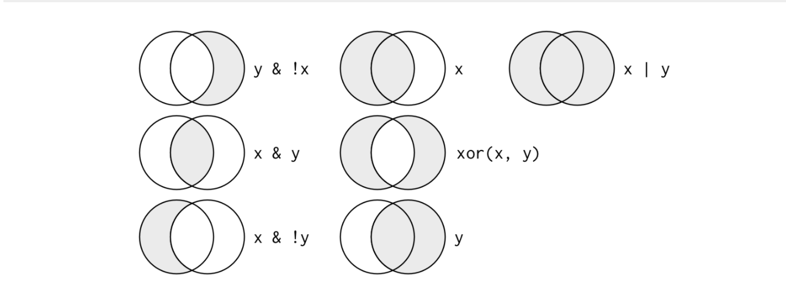

```{r setup, include=FALSE}
library(learnr)
library(gradethis)
library(learnrhash)
library(ggplot2)
gradethis::gradethis_setup()
knitr::opts_chunk$set(exercise.checker = gradethis::grade_learnr)
```

```{r stormtrooper, fig.margin = TRUE, echo = FALSE, fig.width=3, out.width = "100%", fig.cap="Ilustración por Emilio Morones."}

```

## Prerequisitos

```{r prerequisites, echo=TRUE}
library(nycflights13)
library(tidyverse)
# O bien library(dplyr)
```

Para explorar las funciones principales del paquete `dplyr` utilizaremos la base de datos `flights` 

```{r db_1, echo=TRUE}
flights
```

Existen diferentes tipos de variables:

* `int` números enteros.
* `dbl` números reales.
* `chr` texto.
* `dttm` fecha - hora.
* `lgl` lógico.
* `fctr` factor, variables categóricas.
* `date` fecha.


### Funciones básicas de `dplyr`

  * `filter()` elige observaciones por sus valores.
  * `arrange()` reordena los renglones.
  * `select()` selecciona variables.
  * `mutate()` genera nuevas variables, generalmente son funciones de variables existentes.
  * `summarise()` colapsa muchos valores para tener un resumen.

Estas funciones se pueden utilizar en conjunto con la función `group_by()`.

Argumentos:

1. `data.frame`.
2. Instrucciones que hacer con los datos.

Resultados:

Un nuevo `data.frame`.

## Filtrar renglones con filter()

```{r filter_1, echo=TRUE}
filter(flights, month == 1, day == 1)
```
Operadores comparativos: `>` (mayor a),`>=` (mayor o igual a),`<` (menor a),`<=` (menor o igual a),`!=` (diferente),`==` (igual)

Cuidados:
```{r operadores_1, echo=TRUE}
sqrt(2) ^ 2 == 2
1 / 49 * 49 == 1
```

Utilizar función near()
```{r near_1, echo=TRUE}
near(sqrt(2) ^ 2,  2)
near(1 / 49 * 49, 1)
```

### Operadores lógicos


```{r operaciones_1, echo=TRUE}
filter(flights, month == 11 | month == 12)
```

```{r operaciones_2, echo=TRUE}
filter(flights, month %in% c(11,12))
```

Algunas veces filtros complicados se pueden simplificar con la ley De Morgan:

* `!(x & y)` es lo mismo a `!x | !y`
* `!(x | y)` es lo mismo a `!x & !y`

Por ejemplo:
```{r operaciones_3, echo=TRUE}
filter(flights, !(arr_delay > 120 | dep_delay > 120))
filter(flights, arr_delay <= 120, dep_delay <= 120)
```

### Valores faltantes
Algo que podría hacer a `R` un tanto mañoso es el trato de los valores faltantes. Casi cualquier operación que involucre valores faltantes también será desconocido.

```{r na_1, echo=TRUE}
NA > 1
1 == NA
NA + 1
NA / 1
NA == NA
```

```{r na_2, echo=TRUE}
is.na(NA)
```

```{r na_3, echo=TRUE}
bd <-  tibble(x = c(1:3, NA))
filter(bd, x > 2)
filter(bd, x > 2 | is.na(x))
```

### Ejercicios

1. Encuentra todos los vuelos que:

1.1 Que tuvieron un retraso de llegada de 2 horas o más
```{r ejercicio1, exercise=TRUE}
filter(flights, ___)
```
<div id="ejercicio1-hint">
**Hint:** Usa la variable *arr_delay*
</div>
```{r ejercicio1-solution}
filter(flights, arr_delay >= 120)
```
```{r ejercicio1-check}
grade_this_code()
```

1.2 Volaron a Houston (IAH o HOU)
```{r ejercicio2, exercise=TRUE}
filter(flights, ___)
```
<div id="ejercicio2-hint">
**Hint:** Usa la variable *dest*    
</div>    
```{r ejercicio2-solution}
filter(flights, dest == "IAH" | dest == "HOU")
```
```{r ejercicio2-check}
grade_this_code()
```

1.3 Fueron operados por United, American, o Delta
```{r ejercicio3, exercise=TRUE}
filter(flights, ___)
```

<div id="ejercicio3-hint">
**Hint:** Usa la variable **carrier**
</div>

```{r ejercicio3-solution}
filter(flights, carrier %in% c("AA", "DL", "UA"))
```

```{r ejercicio3-check}
grade_this_code()
```

1.4 Salieron en Julio, Agosto y Septiembre
```{r ejercicio4, exercise=TRUE}
filter(flights, ___)
```

<div id="ejercicio4-hint">
**Hint:** Usa la variable **month**
</div>

```{r ejercicio4-solution}
filter(flights, month >= 7, month <= 9)
```

```{r ejercicio4-check}
grade_this_code()
```

1.5 LLegaron más de dos horas tarde pero no salieron tarde
```{r ejercicio5, exercise=TRUE}
filter(flights, ___)
```

<div id="ejercicio5-hint">
**Hint:** Usa la variable **arr_delay** y **dep_delay**
</div>

```{r ejercicio5-solution}
filter(flights, arr_delay > 120, dep_delay <= 0)
```

```{r ejercicio5-check}
grade_this_code()
```

1.6 Salieron al menos una hora tarde pero recuperaron 30 minutos de vuelo
```{r ejercicio6, exercise=TRUE}
filter(flights, ___)
```

<div id="ejercicio6-hint">
**Hint:** Usa la variable **dep_delay** y usa la diferencia entre **arr_delay** y esta. 
</div>

```{r ejercicio6-solution}
filter(flights, dep_delay >= 60, dep_delay - arr_delay > 30)
```

```{r ejercicio6-check}
grade_this_code()
```

1.7 Salieron de la media noche a las 6am (incluyéndo)
```{r ejercicio7, exercise=TRUE}
filter(flights, ___)
```

<div id="ejercicio7-hint">
**Hint:** Usa la variable **dep_delay** y usa la diferencia entre **arr_delay** y esta. 
</div>

```{r ejercicio7-solution}
filter(flights, dep_time <= 600 | dep_time == 2400)
```

```{r ejercicio7-check}
grade_this_code()
```

2 Otra función muy útil de `dplyr` es `between()`.`

```{r quiz1, echo = FALSE}
quiz(caption = "Responde",
  question_text(
  "¿Qué hace? ¿Podrías utilizarlo para simplificar el código para responder las preguntas anteriores?",
  answer(NULL, correct = TRUE),
  incorrect = "Lo estaremos revisando! Gracias!",
  try_again_button = "Modifica tu respuesta",
  allow_retry = TRUE
)
)
```

3 ¿Cuántos vuelos no tienen información en la variable `dep_time`?
```{r ejercicio8, exercise=TRUE}
filter(flights, ___)
```

<div id="ejercicio8-hint">
**Hint:** Usa la función `is.na()` en la variable necesaria. 
</div>

```{r ejercicio8-solution}
filter(flights, is.na(dep_time))
```

```{r ejercicio8-check}
grade_this_code()
```

```{r quiz2, echo = FALSE}
quiz(caption = "Responde",
  question_text(
  "¿Qué otras variables faltan? ¿Qué podrían representar estos renglones?",
  answer(NULL, correct = TRUE),
  incorrect = "Lo estaremos revisando! Gracias!",
  try_again_button = "Modifica tu respuesta",
  allow_retry = TRUE
)
)
```

4
```{r quiz3, echo = FALSE}
quiz(caption = "Responde",
  question_text(
  "¿Por qué `NA ^ 0`, `NA | TRUE`, `FALSE & NA` no son valores faltantes? ¿Podrías descubrir una regla general? (NA * 0 tiene truco)",
  answer(NULL, correct = TRUE),
  incorrect = "Lo estaremos revisando! Gracias!",
  try_again_button = "Modifica tu respuesta",
  allow_retry = TRUE
)
)
```


## Seleccionar columnas con `select()`

Es común que manejemos datos con cientos de variables. Seleccionar las variables que realmente interesan es la tarea de select

```{r select1, echo=TRUE}
select(flights, year, month, day)
select(flights, year:day)
select(flights, -(year:day))
```

Hay más funciones que se pueden utilizar dentro de `select()` como:

* `starts_with()` variables que empiezan con cierto patrón
* `ends_with()` variables que terminan con cierto patrón
* `contains()` variables que contienen cierto patrón
* `matches()` variables que coinciden con expresiones regulares (más adelante profundizaré)
* `num_range("x", 1:3)` que coincida con `x1`, `x2` y `x3`

Revisa `?select` para mayor detalle

También es posible renombrar variables al seleccionarlas. Esto es poco útil ya el resultado final contendría sólo las variables seleccionadas. Si el objetivo es renombrar variables utiliza `rename()`

```{r select2, echo=TRUE}
select(flights, tail_num = tailnum)
rename(flights, tail_num = tailnum)
```

Podrías utilizar la función `everything()` para cambiar el orden de las variables

```{r select3, echo=TRUE}
select(flights, time_hour, air_time, everything())
```

Otra forma de cambiar el orden de las columnas es con `relocate()` 
 
```{r select4, echo=TRUE}
relocate(flights, time_hour, dep_time, .before = year)
```

Revisa `?relocate` para mayor detalle.
  
### Ejercicios

1 ¿Cuántas formas se te ocurren para seleccionar las variables `dep_time`, `dep_delay`, `arr_time` y `arr_delay` de `flights`?

```{r ejercicio13, exercise=TRUE}
arrange(flights, ___)
```

2 ¿Qué pasa si incluyes el nombre de una variable múltiples veces en un sólo `select()`?

```{r ejercicio14, exercise=TRUE}
select(flights, year, month, day, year, year)
```

3 ¿Qué hace la función `any_of()`? ¿Cómo podría ayudar al tener el siguiente vector?

```{r, ejercicio15, exercise=TRUE}
vars <- c("year", "month", "day", "dep_delay", "arr_delay")
select(flights, any_of(vars))
```

4 ¿Te sorpende el resultado del siguiente código?

```{r}
select(flights, contains("TIME"))
```

```{r quiz4, echo = FALSE}
quiz(caption = "Responde",
  question_text(
  "¿Cuál es el tratamiento de las funciones adicionales con las mayúsculas por defecto? ¿Cómo podrías cambiarlo?",
  answer(NULL, correct = TRUE),
  incorrect = "Lo estaremos revisando! Gracias!",
  try_again_button = "Modifica tu respuesta",
  allow_retry = TRUE
)
)
```

## Agrega nuevas variables con `mutate()`

Cuando creamos nuevas columnas con `mutate()` siempre se agregarán al final de la base de datos. Por esto es buena idea seleccionar primero las columnas más relevantes para poder visualizar los resultados del `mutate()`

```{r mutate1, echo=TRUE}
flights_sml <- select(flights, 
  year:day, 
  ends_with("delay"), 
  distance, 
  air_time
)

mutate(flights_sml,
  gain = dep_delay - arr_delay,
  speed = distance / air_time * 60
)
```

Nota que puedes hacer referencia a las columnas que acabas de crear

```{r mutate2, echo=TRUE}
mutate(flights_sml,
  gain = dep_delay - arr_delay,
  hours = air_time / 60,
  gain_per_hour = gain / hours
)
```

Si sólo quieres mantener las columnas que acabas de transformar utiliza `transmute()`

```{r transmutate1, echo=TRUE}
transmute(flights,
  gain = dep_delay - arr_delay,
  hours = air_time / 60,
  gain_per_hour = gain / hours
)
```

### Funciones útiles para crear variables

La propiedad fundamental de las funciones es que debe estar vecotrizadas, es decir, tomar valores de un vector como entrada y como salida debe ser otro vector del mismo tamaño. Hay una gama muy grande de funciones que pueden ser utilizadas pero entre las más comunes son las siguientes:

**operaciones aritméticas**: `+`, `-`, `*`, `/`, `^` . También son útiles al usarlas en conjunto con funciones agregadoras por ejemplo `x / sum(x)` para calcular la proporción del total, `y - mean(y)` calcula la diferencia de cada valor de la variable `y` con respecto a la media de la variable `y`

**Operaciones modulares**: `%/%` (el número entero al hacer una división) y `%%` el residuo.

```{r transmutate2, echo=TRUE}
transmute(flights,
  dep_time,
  hour = dep_time %/% 100,
  minute = dep_time %% 100
)
```

**Logaritmos**: `log()`, `log2()`, `log10()`. Son útiles para tratar con datos que tienen magnitudes muy diferentes. Convierten una relación multiplicativa en aditiva (esto lo clarificaremos en la sección de modelaje). `log2()` es recomendable porque es fácil de interpretar: una diferencia de 1 en la escla logarítmica corresponde al doble en la escala original, una diferencia de -1 corresponde a la mitad en la escala original.

**Compensaciones** : `lead()` y `lag()` (ej. `x - lag(x)` diferencias entre valores) (ej2. `x != lag(x)` enconotrar los valores cuando cambian). 

```{r ejercicio16, echo=TRUE}
(x <- 1:10)
lag(x)
lead(x)
```

**Operaciones cumulativas**: `cumsum()`, `cumprod()`, `cummin()`, `cummax()`, `cummean()`

```{r ejercicio17, echo=TRUE}
cumsum(x)
cummean(x)
```

**Comparaciones lógicas**: `<`, `<=`, `>`, `!=`, `==`

**Ranking**: investiga qué hacen las siguientes funciones `min_rank()`, `dense_rank()`, `percent_rank()`, `cume_dist()`, `ntile()`

```{r ejercicio18, echo=TRUE}
y <- c(1, 2, 2, NA, 3, 4)
min_rank(y)
min_rank(desc(y))
row_number(y)
dense_rank(y)
percent_rank(y)
cume_dist(y)
```

### Ejercicios

1 `dep_time` y `sched_dep_time` son fáciles de ver pero difíciles de computar porque no son números continuos. Conviértelos a una representación más amigable de minutos desde la media noche.

```{r ejercicio19, exercise=TRUE}
mutate(flights,
  dep_time_mins = (dep_time %/% ___ * ___ + dep_time %% ___) %% ___,
  sched_dep_time_mins = (sched_dep_time %/% ___ * ___ +
  ched_dep_time %% ___) %% ___
)
```

<div id="ejercicio19-hint">
**Hint:** Usa la función necesaria junto con la definición de la variable para convertirlo. 
</div>

```{r ejercicio19-solution}
mutate(flights,
  dep_time_mins = (dep_time %/% 100 * 60 + dep_time %% 100) %% 1440,
  sched_dep_time_mins = (sched_dep_time %/% 100 * 60 +
  ched_dep_time %% 100) %% 1440
)
```

```{r ejercicio19-check}
grade_this_code()
```

2 Compara `air_time` con `arr_time - dep_time`. 
```{r ejercicio20, exercise=TRUE}
mutate(flights,
    dep_time = (dep_time %/% 100 * 60 + dep_time %% 100) %% 1440,
    arr_time = (arr_time %/% 100 * 60 + arr_time %% 100) %% 1440,
    air_time_diff = air_time - arr_time + dep_time
  )
```

```{r quiz5, echo = FALSE}
quiz(caption = "Responde",
  question_text(
  "¿Qué esperas ver? ¿Qué ves en realidad? ¿Qué debes cambiar?",
  answer(NULL, correct = TRUE),
  incorrect = "Lo estaremos revisando! Gracias!",
  try_again_button = "Modifica tu respuesta",
  allow_retry = TRUE
)
)
```

3 Compara `dep_time`, `sched_dep_time` y `dep_delay`. ¿Cómo esperas que esos 3 números se relacionen?
```{r ejercicio21, exercise=TRUE}
mutate(flights,
    dep_time_min = (___ %/% 100 * 60 + ___ %% 100) %% 1440,
    sched_dep_time_min = (___ %/% 100 * 60 +
      sched_dep_time %% 100) %% 1440,
    dep_delay_diff = ___ - ___ + ___
  )
```

<div id="ejercicio21-hint">
**Hint:** Usa la función necesaria junto con la definición de la variable para convertirla. 
</div>

```{r ejercicio21-solution}
mutate(flights,
    dep_time_min = (dep_time %/% 100 * 60 + dep_time %% 100) %% 1440,
    sched_dep_time_min = (sched_dep_time %/% 100 * 60 +
      sched_dep_time %% 100) %% 1440,
    dep_delay_diff = dep_delay - dep_time_min + sched_dep_time_min
  )
```

```{r ejercicio21-check}
grade_this_code()
```

4 Encuentra los vuelos más retrasados utilizando alguna función de ranking. ¿Cómo quieres manejar los empates? Lee cuidadosamente la documentación `min_rank()`
```{r ejercicio22, exercise=TRUE}
mutate(flights,  
        dep_delay_min_rank = min_rank(desc(____)),
        dep_delay_row_number = row_number(desc(___)),
        dep_delay_dense_rank = dense_rank(desc(___))
 )
```

<div id="ejercicio22-hint">
**Hint:** Usa la función `min_rank()` junto con la definición de la variable para convertirla. 
</div>

```{r ejercicio22-solution}
mutate(flights,
        dep_delay_min_rank = min_rank(desc(dep_delay)),
        dep_delay_row_number = row_number(desc(dep_delay)),
        dep_delay_dense_rank = dense_rank(desc(dep_delay))
)
```

```{r ejercicio22-check}
grade_this_code()
```

5 ¿Cuál es el resultado de `1:3 + 1:10`.
```{r ejercicio23, exercise=TRUE}
1:3 + 1:10
```

```{r quiz6, echo = FALSE}
quiz(caption = "Responde",
  question_text(
  "¿Por qué?",
  answer(NULL, correct = TRUE),
  incorrect = "Lo estaremos revisando! Gracias!",
  try_again_button = "Modifica tu respuesta",
  allow_retry = TRUE
)
)
```

6 
```{r quiz7, echo = FALSE}
quiz(caption = "Responde",
  question_text(
  "¿Qué funciones trigonométricas provee R?",
  answer(NULL, correct = TRUE),
  incorrect = "Lo estaremos revisando! Gracias!",
  try_again_button = "Modifica tu respuesta",
  allow_retry = TRUE
)
)
```


##  Resúmenes por grupos utilizando `summarise()`

El último verbo clave es `summarise()`. Colapsa una marco de datos en un solo renglón:

```{r summarise1, echo=TRUE}
summarise(flights, delay = mean(dep_delay, na.rm = TRUE))
```

Más adelante ahondaremos en el parámetro `na.rm = TRUE`

`summarise()` no es tan útil a menos que se utilice en conjunto con `group_by()`. Esto hace que la unidad de análisis cambie a los grupos que selecciones. Por ejemplo:

```{r summarise2, echo=TRUE}
by_day <- group_by(flights, year, month, day)
summarise(by_day, delay = mean(dep_delay, na.rm = TRUE))
```

Estas últimas herramientas son las que utilizarás más comúnmente cuando trabajes con `dplyr`. Antes de continuar quisiera hacer un paréntesis acerca del "pipe".

### Combinar múltiples operacioines con el pipe

Imagina que queremos explorar las relaciones entre la distancia y el retraso promedio para cada destino. Utilizando el conocimiento que ahora tienes de `dplyr` y `ggplot`:

```{r summarise3, echo=TRUE}
by_dest <- group_by(flights, dest)
delay <- summarise(by_dest,
  count = n(),
  dist = mean(distance, na.rm = TRUE),
  delay = mean(arr_delay, na.rm = TRUE)
)

delay <- filter(delay, count > 20, dest != "HNL")

ggplot(data = delay, mapping = aes(x = dist, y = delay)) +
  geom_point(aes(size = count), alpha = 1/3) +
  geom_smooth(se = FALSE)
```

Los pasos que seguí para preparar los datos fueron los siguientes:

1 Agrupar los vuelos por destino

2 Resumir y computar la distancia, el retraso promedio y el número de vuelos.

3 Filtrar para remover puntos ruidosos y el aeropuerto de Honolulu, que está casi al doble de distancia que el aeropuerto más cercano a éste.

Es frustrante esta estrategia porque tenemos que guardar cada paso intermedio en un objeto. Nombrar objetos es difícil, así que esto alenta tu análisis.

Una forma diferente de resolverlo es utilizando el pipe, `%>%`:

```{r summarise4, echo=TRUE}
delays <- flights %>% 
  group_by(dest) %>% 
  summarise(
    count = n(),
    dist = mean(distance, na.rm = TRUE),
    delay = mean(arr_delay, na.rm = TRUE)
  ) %>% 
  filter(count > 20, dest != "HNL")
```

Es much más fácil de leer: agrupas, luego resumes, luego filtras.

### Valores faltantes

¿Qué pasa si no escribimos el argumento `na.rm` en el ejemplo anterior?

```{r summarise5, echo=TRUE}
flights %>% 
  group_by(year, month, day) %>% 
  summarise(mean = mean(dep_delay))
```

Obtenemos muchos valores faltantes. Esto es porque las funciones de agregación obedecen la regla usual de los valores faltantes: si hay algún valor faltante como entrada, el resultado también faltará. Afortunadamente todas las funciones de agregación tienen el argumento `na.rm` que remueve los valores faltantes previamente a la computación

```{r summarise6, echo=TRUE}
flights %>% 
  group_by(year, month, day) %>% 
  summarise(mean = mean(dep_delay, na.rm = TRUE))
```

En este caso, donde hay valores faltantes representa a los vuelos cancelados. También podríamos resolver el problema al remover los vuelos cancelados y guardar este conjunto de datos para reutilizarlo después

```{r summarise7, echo=TRUE}
not_cancelled <- flights %>% 
  filter(!is.na(dep_delay), !is.na(arr_delay))

not_cancelled %>% 
  group_by(year, month, day) %>% 
  summarise(mean = mean(dep_delay))
```

### Conteos

Una buena práctica cuando realizas cualquier aggregación es incluir un conteo de observaciones (`n()`) or grupo o un conteo de valores no faltantes (`sum(!is.na(x))`). De esta forma puedes revisar que no estes haciendo conclusiones basadas en muy pocos datos. Por ejemplo, veamos los aviones (identificados por `tailnum`) que tienen el  promedio de retraso más alto:

```{r summarise8, echo=TRUE}
delays <- not_cancelled %>% 
  group_by(tailnum) %>% 
  summarise(
    delay = mean(arr_delay)
  )

ggplot(data = delays, mapping = aes(x = delay)) + 
  geom_freqpoly(binwidth = 10)
```

Hay aviones que tienen un promedio de retraso de 300 minutos. Podemos ver mayor detalle si hacemos una gráfica de dispersión del número de vuelos vs. retraso promedio por avión.

```{r summarise9, echo=TRUE}
delays <- not_cancelled %>% 
  group_by(tailnum) %>% 
  summarise(
    delay = mean(arr_delay, na.rm = TRUE),
    n = n()
  )

ggplot(data = delays, mapping = aes(x = n, y = delay)) + 
  geom_point(alpha = 1/10)
```

Por lo general, cuando graficas el promedio (o cualquier otro resumen estadístico) vs el tamaño del grupo, verás que la variación decrece mientras el tamaño incrementa.

Usualmente es útil filtrar los grupos con el menor número de observaciones para poder ver mejor el patrón y menos la variación extrema de los grupos pequeños.

```{r summarise10, echo=TRUE}
delays %>% 
  filter(n > 25) %>% 
  ggplot(mapping = aes(x = n, y = delay)) + 
    geom_point(alpha = 1/10)
```

## Funciones de resúmenes útiles

**Medidas de localización**: `mean()`, `median()`. La media es la suma dividida por el total de observaciones. La mediana es el valor en donde el 50% de los valores estan por encima y por debajo.

A veces es útil combinar las agregaciones con filtros lógicos (posteriormente los veremos)

```{r summarise11, echo=TRUE} 
not_cancelled %>% 
  group_by(year, month, day) %>% 
  summarise(
    avg_delay1 = mean(arr_delay),
    avg_delay2 = mean(arr_delay[arr_delay > 0]) # the average positive delay
  )
```

**Medidas de dispersión**: `sd()`, `IQR()`, `mad()`. La desviación estandard es la medida estandard de dispersión. El rango interquartílico y la mediana absoluta de desviación son equivalentes robustos, que podrían ser más útiles cuando tengas más valores atípicos.

¿Por qué la distancia a ciertos destinos son más variables que otros?

```{r summarise12, echo=TRUE}
not_cancelled %>% 
  group_by(dest) %>% 
  summarise(distance_sd = sd(distance)) %>% 
  arrange(desc(distance_sd))
```

**Medidas de rango**: `min()`, `quantile(x,0.25)`, `max()`. Los cuantiles generaliza el concepto de mediana. Por ejemplo, el cuantil 0.25 encontrará el valor `x` que es mayor al 25% de los valores y menor al 75% restante.

¿Cuándo es que el primer vuelo y el último salen todos los días?

```{r summarise13, echo=TRUE}
not_cancelled %>% 
  group_by(year, month, day) %>% 
  summarise(
    first = min(dep_time),
    last = max(dep_time)
  )
```

**Medias de posición**: `first()`, `nth(x, 2)`, `last(x)`. Esto funciona de forma muy similar a `x[1]`, `x[2]`, y  `x[length(x)]`.

```{r summarise133, echo=TRUE}
not_cancelled %>% 
  group_by(year, month, day) %>% 
  summarise(
    first_dep = first(dep_time), 
    last_dep = last(dep_time)
  )
```

También es posible lograr la misma tarea pero con todas las observaciones utilizando la función `filter()`

```{r summarise14, echo=TRUE}
not_cancelled %>% 
  group_by(year, month, day) %>% 
  mutate(r = min_rank(desc(dep_time))) %>% 
  filter(r %in% range(r))
```

**Conteos**: Hemos visto que utilizar `n()`, que no recibe argumentos, regresa el tamaño del grupo actual. Para contar el número de datos sin valores faltantes utilizamos, `sum(!is.na(x))`. Para contar el número de categorías únicas podemos utilizar `n_distinct()`

```{r summarise15, echo=TRUE}
not_cancelled %>% 
  group_by(dest) %>% 
  summarise(carriers = n_distinct(carrier)) %>% 
  arrange(desc(carriers))
```

Los conteos son tan útiles que dplyr ofrece una función en particular

```{r summarise16, echo=TRUE}
not_cancelled %>% 
  count(dest)
```

Opcionalmente puedes proveer una variable de peso. Por ejemplo, podemos sumar el total de millas que voló un avión:

```{r summarise17, echo=TRUE}
not_cancelled %>% 
  count(tailnum, wt = distance)
```

**Conteos y proporciones de valores lógicos**: `sum(x>10)`, `mean(y == 0)`. Cuando se utilizan como funciones numéricas, TRUE se convierte en 1 y FALSE en 0. Esto le da una dimensión diferente a `sum()` (da el número de TRUE en x) y `mean()`(da la proporción)

¿Cuántos vuelos salieron antes de las 5am por día?

```{r summarise18, echo=TRUE}
not_cancelled %>% 
  group_by(year, month, day) %>% 
  summarise(n_early = sum(dep_time < 500))
```

¿Qué proporción de vuelos se retrasaron por más de una hora por día?

```{r summarise19, echo=TRUE}
not_cancelled %>% 
  group_by(year, month, day) %>% 
  summarise(hour_prop = mean(arr_delay > 60))
```

### Agrupando por múltiples variables

Cada vez que realizas un resumen se remueve un nivel de las variables de grupos

```{r ejercicio24, echo=TRUE}
daily <- group_by(flights, year, month, day)
(per_day   <- summarise(daily, flights = n()))
(per_month <- summarise(per_day, flights = sum(flights)))
(per_year  <- summarise(per_month, flights = sum(flights)))
```

En este caso funciona bien sumar consecutivamente y da el resultado correcto. Hacer esta progresión no es lo mismo cuando queremos calcular promedios, medianas, varianzas, etc. Tendríamos que penar en los pesos con medias y varianzas y no es posible realizarlo con la mediana. En otras palabras, la suma de grupos es efectivamente la suma de todo,, pero la mediana de de las medianas de un grupo no es la mediana global.

Si quieres desagrupar sólo utiliza la función `ungroup()`

```{r summarise20, echo=TRUE}
daily %>% 
  ungroup() %>%             
  summarise(flights = n())  
```

### Ejercicios 1

1 Intenta obtener el mismo resultado que dan los siguientes códigos `not_cncelled %>% count(dest)` y `not_cancelled %>% count(tailnum, wt = distnace)` (sin utilizar la función `count()`)
```{r ejercicio25, exercise=TRUE}
not_cancelled <- flights %>%
  filter(!is.na(dep_delay), !is.na(arr_delay))

not_cancelled %>%
  group_by(___) %>%
  summarise(n = length(___))
```

<div id="ejercicio25-hint">
**Hint:** Agrupa por la variable **dest** y haz resumen por la longitud de **dest**.
</div>

```{r ejercicio25-solution}
not_cancelled <- flights %>%
  filter(!is.na(dep_delay), !is.na(arr_delay))

not_cancelled %>%
  group_by(dest) %>%
  summarise(n = length(dest))
```

```{r ejercicio25-check}
grade_this_code()
```
  
2 La definición de vuels cancelados es (`is.na(dep_delay) | is.na(arr_delay)`) no es óptima, ligeramente. ¿Por qué? ¿Cuál es la columna más importante?

```{r ejercicio26, exercise=TRUE}
filter(flights, !is.na(___), is.na(___)) %>%
  select(___, ___, ___, ___, ___)
```

<div id="ejercicio26-hint">
**Hint:** Filtra por la variable que necesitas cuyos valores son encontrados.
</div>

```{r ejercicio26-solution}
filter(flights, !is.na(dep_delay), is.na(arr_delay)) %>%
  select(dep_time, arr_time, sched_arr_time, dep_delay, arr_delay)
```

```{r ejercicio26-check}
grade_this_code()
```

3 Revisa el número de vuelos cancelados por día. ¿Existe algún patrón? ¿Está la proporción de vuelos cancelados relacionado con el retraso promedio?
```{r ejercicio27, exercise=TRUE}
   flights %>%
  mutate(cancelled = (is.na(___) | is.na(___))) %>%
  group_by(year, ___, day) %>%
  summarise(
    cancelled_num = sum(___),
    flights_num = n(),
  )
```

<div id="ejercicio27-hint">
**Hint:** Crea una variable para los no encontrados en ciertas variables agrupa por esas y cuenta.
</div>

```{r ejercicio27-solution}
  flights %>%
  mutate(cancelled = (is.na(arr_delay) | is.na(dep_delay))) %>%
  group_by(year, month, day) %>%
  summarise(
    cancelled_num = sum(cancelled),
    flights_num = n(),
  )
```

```{r ejercicio27-check}
grade_this_code()
```

4 ¿Qué aerolínea tiene los peores retrasos? Reto: podrías descubrir el efecto de malos aeropuertos vs. malas aerolíneas? ¿Por qué o por qué no?
```{r ejercicio28, exercise=TRUE}
  flights %>%
  group_by(___) %>%
  summarise(arr_delay = mean(___, na.rm = TRUE)) %>%
  arrange(desc(___))
```

<div id="ejercicio28-hint">
**Hint:**  Piensa en `flights %>% group_by(carrier, dest) %>% summarise(n())`.
</div>

```{r ejercicio28-solution}
  flights %>%
  group_by(carrier) %>%
  summarise(arr_delay = mean(arr_delay, na.rm = TRUE)) %>%
  arrange(desc(arr_delay))
```

```{r ejercicio28-check}
grade_this_code()
```

5 ¿Qué hace el argumento `sort` en la función `count()`?
```{r ejercicio29, exercise=TRUE}
flights %>%
  count(___, sort = ___)
```

<div id="ejercicio29-hint">
**Hint:** Haz un count a la variable y activa sort.
</div>

```{r ejercicio29-solution}
flights %>%
  count(dest, sort = TRUE)
```

```{r ejercicio29-check}
grade_this_code()
```

## Mutates y filters agrupados
Encontrar los peores miembros de un grupo

```{r mutatefilter1, echo=TRUE}
flights_sml %>% 
  group_by(year, month, day) %>%
  filter(rank(desc(arr_delay)) < 10)
```

Encontrar grupos que son mayores a un umbral

```{r mutatefilter2, echo=TRUE}
popular_dests <- flights %>% 
  group_by(dest) %>% 
  filter(n() > 365)
popular_dests
```

Computar las métricas por grupo

```{r mutatefilter3, echo=TRUE}
popular_dests %>% 
  filter(arr_delay > 0) %>% 
  mutate(prop_delay = arr_delay / sum(arr_delay)) %>% 
  select(year:day, dest, arr_delay, prop_delay)
```

Funciones que trabajan naturalmente con mutates y filters agrupados se conocen como funciones ventana. Lee la siguiente documentación `vignette("window-functions")`

### Ejercicios 2

1 ¿Qué avión (`tailnum`) tiene el peor record de llegadas a tiempo? (proporción de vuelos no retrasados o cancelados o media del retraso de llegada)

```{r ejercicio30, exercise=TRUE}
flights %>%
  filter(!is.na(___)) %>%
  mutate(on_time = !is.na(___) & (___ <= 0)) %>%
  group_by(___) %>%
  summarise(on_time = mean(___), n = n()) %>%
  filter(min_rank(___) == 1)

```

<div id="ejercicio30-hint">
**Hint:** Comienza filtrando los encontrados en `talium` y fíjate como se relacionan `arr_time` y `arr_delay`.
</div>

```{r ejercicio30-solution}
flights %>%
  filter(!is.na(tailnum)) %>%
  mutate(on_time = !is.na(arr_time) & (arr_delay <= 0)) %>%
  group_by(tailnum) %>%
  summarise(on_time = mean(on_time), n = n()) %>%
  filter(min_rank(on_time) == 1)
```

```{r ejercicio30-check}
grade_this_code()
```

2 ¿En qué hora deberías tomar un vuelo para evitar retrasos lo más posible?
```{r ejercicio31, exercise=TRUE}
flights %>%
  group_by(___) %>%
  summarise(arr_delay = mean(___, na.rm = TRUE)) %>%
  arrange(___)
```

<div id="ejercicio31-hint">
**Hint:** Comienza agrupando por `hour` y haz un resumen por el promedio de `arr_delay`.
</div>

```{r ejercicio31-solution}
flights %>%
  group_by(hour) %>%
  summarise(arr_delay = mean(arr_delay, na.rm = TRUE)) %>%
  arrange(arr_delay)
```

```{r ejercicio31-check}
grade_this_code()
```

3 Para cada destino, calcula l total de minutos retrasados. Para cada vuelo, calcula la proporción del total de retraso para su destino.
```{r ejercicio32, exercise=TRUE}
flights %>%
  filter(___ > 0) %>%
  group_by(___) %>%
  mutate(
    arr_delay_total = sum(___),
    arr_delay_prop = arr_delay / arr_delay_total
  ) %>%
  select(dest, month, day, dep_time, carrier, flight,
    arr_delay, arr_delay_prop) %>%
  arrange(dest, desc(arr_delay_prop))
```

<div id="ejercicio32-hint">
**Hint:** Comienza filtrando por `arr_delay` y agrupa por `dest`, después crea una nueva variable `arr_delay_total` con la suma de otra variable.
</div>

```{r ejercicio32-solution}
flights %>%
  filter(arr_delay > 0) %>%
  group_by(dest) %>%
  mutate(
    arr_delay_total = sum(arr_delay),
    arr_delay_prop = arr_delay / arr_delay_total
  ) %>%
  select(dest, month, day, dep_time, carrier, flight,
         arr_delay, arr_delay_prop) %>%
  arrange(dest, desc(arr_delay_prop))
```

```{r ejercicio32-check}
grade_this_code()
```

4 Los retrasos normalmente estan correlacionados en el tiempo, es decir, a pesar de que el problema que causó el retraso inicial se resolvió, los vuelos posteriores se retrasan para permitir que los vuelos retrasados salgan. Utiliza `lag()`, explora cómo el retraso de un vuelo está relacionado al retraso del vuelo que seguía.
```{r ejercicio33, exercise=TRUE}
flights %>%
  arrange(origin, month, day, dep_time) %>%
  group_by(origin) %>%
  mutate(dep_delay_lag = lag(___)) %>%
  filter(!is.na(___), !is.na(___))
```

<div id="ejercicio33-hint">
**Hint:** Aplica la función anterior a la variable `dep_delay` y posteriormente fíltrala.
</div>

```{r ejercicio33-solution}
flights %>%
  arrange(origin, month, day, dep_time) %>%
  group_by(origin) %>%
  mutate(dep_delay_lag = lag(dep_delay)) %>%
  filter(!is.na(dep_delay), !is.na(dep_delay_lag))
```

```{r ejercicio33-check}
grade_this_code()
```

5 Ve cada destino. Podrías encontrar vuelos que son sospechosamente rápidos? (es decir, vuelos que representan datos erróneos). Calcula el tiempo en aire de un vuelo relativo al vuelo más corto a ese destino. ¿Qué vuelos fueron más retrasados en el aire?

```{r ejercicio34, exercise=TRUE}
flights %>%
  filter(!is.na(air_time)) %>%
  group_by(dest, origin) %>%
  mutate(
    air_time_mean = mean(___),
    air_time_sd = sd(___),
    n = n()
  ) %>%
  ungroup() %>%
  mutate(air_time_standard = (___ - ___) / (___ + 1))
```

<div id="ejercicio34-hint">
**Hint:** Aplica la función promedio a la nueva variable `air_time`.
</div>

```{r ejercicio34-solution}
flights %>%
  filter(!is.na(air_time)) %>%
  group_by(dest, origin) %>%
  mutate(
    air_time_mean = mean(air_time),
    air_time_sd = sd(air_time),
    n = n()
  ) %>%
  ungroup() %>%
  mutate(air_time_standard = (air_time - air_time_mean) / (air_time_sd + 1))
```

```{r ejercicio34-check}
grade_this_code()
```

6 Encuentra todos los destinos que existen vuelos de al menos dos compañías. Usa esa información para rankearlos.
```{r ejercicio35, exercise=TRUE}
flights %>%
   group_by(___) %>%
   mutate(n_carriers = n_distinct(___)) %>%
   filter(n_carriers > 1) %>%
   group_by(____) %>%
   summarize(n_dest = n_distinct(___)) %>%
   arrange(desc(n_dest))
```

<div id="ejercicio35-hint">
**Hint:** Agrupa la función por `dest` y crea una variable por los distintos.
</div>

```{r ejercicio35-solution}
flights %>%
   group_by(dest) %>%
   mutate(n_carriers = n_distinct(carrier)) %>%
   filter(n_carriers > 1) %>%
   group_by(carrier) %>%
   summarize(n_dest = n_distinct(dest)) %>%
   arrange(desc(n_dest))
```

```{r ejercicio35-check}
grade_this_code()
```

7 Para cada avión, cuenta el número de vuelos  anteriores al primer retraso mayor a 1 hora.
```{r ejercicio36, exercise=TRUE}
flights %>%
  select(tailnum, year, month,day, dep_delay) %>%
  filter(!is.na(___)) %>%
  arrange(tailnum, year, month, day) %>%
  group_by(___) %>%
  mutate(cumulative_hr_delays = cumsum(___ > 60)) %>%
  summarise(total_flights = sum(___ < 1)) %>%
  arrange(total_flights)

```

<div id="ejercicio36-hint">
**Hint:** Filtra a los encontrados de `talium` y agrupa por estos.
</div>

```{r ejercicio36-solution}
flights %>%
  select(tailnum, year, month,day, dep_delay) %>%
  filter(!is.na(dep_delay)) %>%
  arrange(tailnum, year, month, day) %>%
  group_by(tailnum) %>%
  mutate(cumulative_hr_delays = cumsum(dep_delay > 60)) %>%
  summarise(total_flights = sum(cumulative_hr_delays < 1)) %>%
  arrange(total_flights)
```

```{r ejercicio36-check}
grade_this_code()
```

## Envía tus respuestas

### Material de referencia
Hadley Wickham y Garrett Grolemund, "R for Data Science: Import, Tidy, Transform, Visualize, and Model Data" O'REILLY [`R for Data Science`](https://r4ds.had.co.nz/)


```{r context="server"}
learnrhash::encoder_logic()
```

```{r encode, echo=FALSE}
learnrhash::encoder_ui(
  ui_before = shiny::div(
    "Si ha completado este tutorial y está satisfecho con todos sus",
     "soluciones, haga clic en el botón de abajo para generar su hash y",
     "envíalo usando el siguiente formulario:",
    shiny::tags$br()
  )
)
```

Enviar hash al siguiente link -> [__Aqui__](https://docs.google.com/spreadsheets/d/1eXNEGrumywfCt4xop5ygcJGxbXI5kfNdiHOztiGspoA/edit?usp=sharing)

```{r stormtrooper2, echo = FALSE}

```