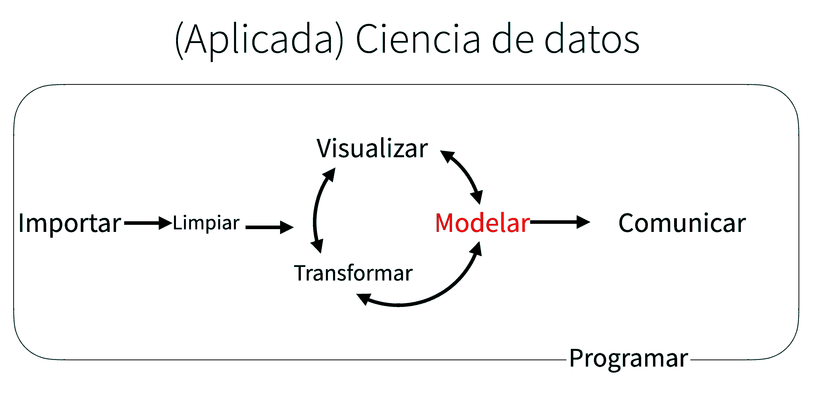

```{r setup, include=FALSE}
library(learnr)
library(gradethis)
library(learnrhash)
library(tidyverse)
library(ggplot2)
require("maps")
gradethis::gradethis_setup()
knitr::opts_chunk$set(exercise.checker = gradethis::grade_learnr)
```

<style type="text/css">
  body{
  font-size: 13pt;
}
</style>

```{r stormtrooper_i, fig.margin = TRUE, echo = FALSE, fig.width=3, out.width = "100%"}

```

## Introducción

Ahora que estás equipado con potentes herramientas de programación, finalmente podemos volver al modelado. Utilizarás sus nuevas herramientas de programación y gestión de datos para adaptarse a muchos modelos y comprender cómo funcionan. 

El enfoque de este curso es la exploración, no la confirmación o la inferencia formal. Pero aprenderás algunas herramientas básicas que lo ayudarán a comprender la variación dentro de tus modelos.


El objetivo de un modelo es proporcionar un resumen simple de baja dimensión de un conjunto de datos. Idealmente, el modelo capturará verdaderas "señales" (es decir, patrones generados por el fenómeno de interés) e ignorará el "ruido" (es decir, la variación aleatoria que no le interesa). 

Aquí solo cubrimos **modelos predictivos** que, como su nombre indica, generan predicciones. Hay otro tipo de modelo que no vamos a discutir: **modelos de descubrimiento de datos**. Estos modelos no hacen predicciones, sino que lo ayudan a descubrir relaciones interesantes dentro de los datos. (Estas dos categorías de modelos a veces se denominan supervisados y no supervisados, pero la terminología no es particularmente esclarecedora).

Desarrollarás una intuición sobre cómo funcionan los modelos estadísticos y le brindará una familia de herramientas útiles que le permitirán utilizar modelos para comprender mejor sus datos:


  * En los **conceptos básicos** de modelación, aprenderás cómo funcionan los modelos de forma mecánica, centrándose en la importante familia de modelos lineales. Aprenderás herramientas generales para obtener información sobre lo que le dice un modelo predictivo sobre sus datos, centrándose en conjuntos de datos simulados simples.

  * En la **construcción de modelos**, aprenderás a usar modelos para extraer patrones conocidos en datos reales. Una vez que hayas reconocido un patrón importante, es útil hacerlo explícito en un modelo, porque entonces podrá ver más fácilmente las señales más sutiles que quedan.

  * En **varios modelos**, aprenderá a usar muchos modelos simples para ayudar a comprender conjuntos de datos complejos. Esta es una técnica poderosa, pero para acceder a ella, necesitará combinar herramientas de modelado y programación.

Estos temas son notables por lo que no incluyen: ninguna herramienta para evaluar modelos cuantitativamente. Eso es deliberado: cuantificar con precisión un modelo requiere un par de grandes ideas que simplemente no tenemos el espacio para cubrir aquí. 

Por ahora, dependerá de la evaluación cualitativa y de su escepticismo natural. En Obtener más información sobre los modelos, te indicaremos otros recursos en los que puede obtener más información.

### Generación de hipótesis vs confirmación de hipótesis

En esta sección, vamos a utilizar modelos como herramienta de exploración, completando las herramientas para EDA que se presentaron anteriormente. No es así como se suelen enseñar los modelos, pero como verás, los modelos son una herramienta importante: herramienta de exploración. 

Tradicionalmente, el enfoque del modelado está en la inferencia o para confirmar que una hipótesis es cierta. Hacer esto correctamente no es complicado, pero es difícil. Hay un par de ideas que debe comprender para hacer inferencias correctamente:

  * Cada observación puede usarse para exploración o confirmación, no ambas.

  * Puedes utilizar una observación tantas veces como desees para la exploración, pero solo puede utilizarla una vez para la confirmación. Tan pronto como utilices una observación dos veces, pasará de la confirmación a la exploración.

Esto es necesario porque para confirmar una hipótesis debe utilizar datos independientes de los datos que utilizaste para generar la hipótesis. De lo contrario, será demasiado optimista. No hay absolutamente nada de malo en la exploración, pero nunca debe vender un análisis exploratorio como un análisis confirmatorio porque es fundamentalmente engañoso.

Si realmente desea realizar un análisis confirmatorio, un enfoque es dividir sus datos en tres partes antes de comenzar el análisis:

  * El 60% de sus datos va a un conjunto de entrenamiento (o exploración). Puede hacer lo que quiera con estos datos: visualizarlos y ajustar toneladas de modelos a ellos.

  * El 20% se destina a un conjunto de consultas. Puede utilizar estos datos para comparar modelos o visualizaciones a mano, pero no puede utilizarlos como parte de un proceso automatizado.

  * El 20% se retiene para una prueba. Solo puede usar estos datos UNA VEZ, para probar su modelo final.

Esta partición le permite explorar los datos de entrenamiento, generando ocasionalmente hipótesis candidatas que verifica con el conjunto de consultas. Cuando esté seguro de que tiene el modelo correcto, puede verificarlo una vez con los datos de prueba.

(Tenga en cuenta que incluso cuando realice un modelo confirmatorio, deberá realizar una EDA. Si no realiza ninguna EDA, permanecerá ciego a los problemas de calidad con sus datos).

## Conceptos básicos de modelos

### Introducción

El objetivo de un modelo es proporcionar un resumen simple de baja dimensión de un conjunto de datos. En el contexto de esta sección, usaremos modelos para dividir datos en patrones y residuos. Los patrones sólidos ocultarán tendencias más sutiles, por lo que usaremos modelos para ayudar a despegar capas de estructura a medida que exploramos un conjunto de datos.

Sin embargo, antes de que podamos comenzar a utilizar modelos en conjuntos de datos reales e interesantes, es necesario comprender los conceptos básicos de cómo funcionan los modelos. Por esa razón, esta sección solo usa conjuntos de datos simulados. Estos conjuntos de datos son muy simples y nada interesantes, pero lo ayudarán a comprender la esencia del modelado antes de aplicar las mismas técnicas a los datos reales.

<p style="text-align:center">Hay dos partes en un modelo.</p>


**Primero** Define una familia de modelos que expresan un patrón preciso, pero genérico, que desea capturar. 
  
**Por ejemplo**: El patrón puede ser una línea recta o una curva cuadrática. Expresará la familia del modelo como una ecuación como `y = a_1 * x + a_2 o y = a_1 * x ^ a_2`. Aquí, `x` e `y` son variables conocidas de sus datos, y `a_1` y `a_2` son parámetros que pueden variar para capturar diferentes patrones.

  **A continuación**, genera un modelo ajustado encontrando el modelo de la familia más cercano a tus datos. Esto toma la familia de modelos genéricos y la hace específica, como `y = 3 * x + 7 o y = 9 * x ^ 2`.

Es importante comprender que un modelo ajustado es solo el modelo más cercano de una familia de modelos. Eso implica que tienes el "mejor" modelo (según algunos criterios); no implica que tenga un buen modelo y ciertamente no implica que el modelo sea "verdadero". George Box lo expresa bien en su famoso aforismo:

    Todos los modelos son incorrectos, pero algunos son útiles.

Vale la pena leer el contexto más completo de la cita:

    Ahora bien, sería muy notable si cualquier sistema existente en el mundo real pudiera ser representado exactamente por un modelo simple. Sin embargo, los modelos parsimoniosos elegidos astutamente a menudo proporcionan aproximaciones notablemente útiles. Por ejemplo, la ley PV = RT que relaciona la presión P, el volumen V y la temperatura T de un gas "ideal" a través de una constante R no es exactamente cierta para ningún gas real, pero con frecuencia proporciona una aproximación útil y, además, su estructura es informativa ya que surge de una visión física del comportamiento de las moléculas de gas.

Para un modelo de este tipo, no es necesario plantearse la pregunta "¿Es el modelo verdadero?". Si la "verdad" va a ser la "verdad total", la respuesta debe ser "No". La única pregunta de interés es "¿Es el modelo esclarecedor y útil?".

El objetivo de un modelo no es descubrir la verdad, sino descubrir una aproximación simple que aún sea útil.

### Requisitos previos

En esta sección usaremos el paquete `modelr` que envuelve las funciones de modelado de la base R para que funcionen de forma natural en un ` %>% ` **pipe**

```{r prerequistes, echo=TRUE}
library(tidyverse)

library(modelr)
options(na.action = na.warn)
```

### Un modelo simple

Echemos un vistazo al conjunto de datos simulado `sim1`, incluido con el paquete `modelr`. Contiene dos variables continuas, `x` e `y`. Vamos a trazarlos para ver cómo se relacionan:

```{r simple-model-1, echo=TRUE}
ggplot(sim1, aes(x, y)) +
   geom_point()
```

Puedes ver un patrón fuerte en los datos. Usemos un modelo para capturar ese patrón y hacerlo explícito. Nuestro trabajo es proporcionar la forma básica del modelo.

En este caso, la relación parece lineal, es decir, `y = a_0 + a_1 * x`. 

Comencemos por tener una idea de cómo se ven los modelos de esa familia generando algunos al azar y superponiéndolos en los datos. Para este caso simple, podemos usar `geom_abline()` que toma una pendiente e intercepta como parámetros. Más adelante aprenderemos técnicas más generales que funcionan con cualquier modelo.

```{r simple-model-2, echo=TRUE}
models <- tibble(
  a1 = runif(250, -20, 40),
  a2 = runif(250, -5, 5)
)

ggplot(sim1, aes(x, y)) + 
  geom_abline(aes(intercept = a1, slope = a2), data = models, alpha = 1/4) +
  geom_point() 
```

Hay 250 modelos en esta trama, **¡pero muchos son realmente malos!** Necesitamos encontrar los buenos modelos haciendo precisa nuestra intuición de que un buen modelo está **cerca** de los datos. 

Necesitamos una forma de cuantificar la distancia entre los datos y un modelo. Luego, podemos ajustar el modelo encontrando el valor de `a_0` y `a_1` que generan el modelo con la menor distancia de estos datos.

Un lugar fácil para comenzar es encontrar la distancia vertical entre cada punto y el modelo, como en el siguiente diagrama. (Ten en cuenta que he cambiado ligeramente los valores de `x` para que pueda ver las distancias individuales).

```{r stormtrooper_2, fig.margin = TRUE, echo = FALSE, fig.width=3, out.width = "90%"}
knitr::include_graphics("images/unnamed-chunk-3-1.png")
```

Esta distancia es solo la diferencia entre el valor de y dado por el modelo (**la predicción**) y el valor de y real en los datos (**la respuesta**).

Para calcular esta distancia, primero convertimos nuestra familia de modelos en una función R. Esto toma los parámetros del modelo y los datos como entradas, y da los valores predichos por el modelo como salida:

```{r simple-model-3, echo=TRUE}
model1 <- function(a, data) {
  a[1] + data$x * a[2]
}

model1(c(7, 1.5), sim1)
```

A continuación, necesitamos alguna forma de calcular una distancia total entre los valores predichos y reales. En otras palabras, la gráfica de arriba muestra 30 distancias: ¿cómo colapsamos eso en un solo número?

Una forma común de hacer esto en las estadísticas es utilizar la **La desviación de la raíz cuadrática media o el error cuadrático medio**. Calculamos la diferencia entre lo real y lo pronosticado, los cuadramos, los promediamos y sacamos la raíz cuadrada. Esta distancia tiene muchas propiedades matemáticas atractivas, de las que no vamos a hablar aquí. ¡Tendrás que creer en mi palabra!

```{r simple-model-4, echo=TRUE}
measure_distance <- function(mod, data) {
  diff <- data$y - model1(mod, data)
  sqrt(mean(diff ^ 2))
}

measure_distance(c(7, 1.5), sim1)
```

Ahora podemos usar `purrr` para calcular la distancia para todos los modelos definidos anteriormente. Necesitamos una función auxiliar porque nuestra función de distancia espera el modelo como un vector numérico de longitud 2.

```{r simple-model-5, echo=TRUE}
library(purrr)
sim1_dist <- function(a1, a2) {
  measure_distance(c(a1, a2), sim1)
}

models <- models %>% 
  mutate(dist = purrr::map2_dbl(a1, a2, sim1_dist))
models
```

A continuación, superpongamos los 10 mejores modelos a los datos. Hemos coloreado los modelos por `-dist`: esta es una manera fácil de asegurarse de que los mejores modelos (es decir, los que tienen la distancia más pequeña) obtengan los colores más brillantes.

```{r simple-model-6, echo=TRUE}
ggplot(sim1, aes(x, y)) + 
  geom_point(size = 2, colour = "grey30") + 
  geom_abline(
    aes(intercept = a1, slope = a2, colour = -dist), 
    data = filter(models, rank(dist) <= 10)
  )
```

También podemos pensar en estos modelos como observaciones, y visualizar con una gráfica de dispersión de `a1` vs `a2`, nuevamente coloreado por `-dist`. Ya no podemos ver directamente cómo se compara el modelo con los datos, pero podemos ver muchos modelos a la vez. Nuevamente, he resaltado los 10 mejores modelos, esta vez dibujando círculos rojos debajo de ellos.

```{r simple-model-7, echo=TRUE}
ggplot(models, aes(a1, a2)) +
  geom_point(data = filter(models, rank(dist) <= 10), size = 4, colour = "red") +
  geom_point(aes(colour = -dist))
```

En lugar de probar muchos modelos aleatorios, podríamos ser más sistemáticos y generar una cuadrícula de puntos espaciados uniformemente (esto se llama búsqueda de cuadrícula). Elegí los parámetros de la cuadrícula aproximadamente al observar dónde estaban los mejores modelos en el gráfico de arriba.

```{r simple-model-8, echo=TRUE}
grid <- expand.grid(
  a1 = seq(-5, 20, length = 25),
  a2 = seq(1, 3, length = 25)
  ) %>% 
  mutate(dist = purrr::map2_dbl(a1, a2, sim1_dist))

grid %>% 
  ggplot(aes(a1, a2)) +
  geom_point(data = filter(grid, rank(dist) <= 10), size = 4, colour = "red") +
  geom_point(aes(colour = -dist))
```

Cuando superpone los 10 mejores modelos sobre los datos originales, todos se ven bastante bien:

```{r simple-model-9, echo=TRUE}
ggplot(sim1, aes(x, y)) + 
  geom_point(size = 2, colour = "grey30") + 
  geom_abline(
    aes(intercept = a1, slope = a2, colour = -dist), 
    data = filter(grid, rank(dist) <= 10)
  )
```

Podrías imaginarte haciendo iterativamente la cuadrícula cada vez más fina hasta que te acercaras al mejor modelo. Pero hay una mejor manera de abordar ese problema: 

  *   Una herramienta de minimización numérica llamada búsqueda de **Newton-Raphson**. 
  
La intuición de **Newton-Raphson** es bastante simple: eliges un punto de partida y miras a tu alrededor en busca de la pendiente más empinada. A continuación, esquías por esa pendiente un poco y luego repites una y otra vez, hasta que no puedas bajar más. En R, podemos hacer eso con `optim()`:

```{r simple-model-10, echo=TRUE}
best <- optim(c(0, 0), measure_distance, data = sim1)
best$par

ggplot(sim1, aes(x, y)) + 
  geom_point(size = 2, colour = "grey30") + 
  geom_abline(intercept = best$par[1], slope = best$par[2])
```

No se te preocupes demasiado por los detalles de cómo funciona `optim()`. Es la intuición lo que es importante aquí. Si tiene una función que define la distancia entre un modelo y un conjunto de datos, un algoritmo que puede minimizar esa distancia modificando los parámetros del modelo, puede encontrar el mejor modelo. Lo bueno de este enfoque es que funcionará para cualquier familia de modelos para los que pueda escribir una ecuación.

Hay un enfoque más que podemos utilizar para este modelo, porque es un caso especial de una familia más amplia: los modelos lineales.

Un modelo lineal tiene la forma general `y = a_1 + a_2 * x_1 + a_3 * x_2 + ... + a_n * x_ (n - 1)`. 

Entonces, este modelo simple es equivalente a un modelo lineal general donde `n` es `2` y `x_1` es `x`. 

R tiene una herramienta diseñada específicamente para ajustar modelos lineales llamada `lm()`. `lm()` tiene una forma especial de especificar la familia de modelos: fórmulas. Las fórmulas se ven como `y ~ x`, que `lm()` se traducirá en una función como `y = a_1 + a_2 * x`. 

Podemos ajustar el modelo y mirar el resultado:

```{r simple-model-11, echo=TRUE}
sim1_mod <- lm(y ~ x, data = sim1)
coef(sim1_mod)
```

¡Estos son exactamente los mismos valores que obtuvimos con `optim()`!

Detrás de escena `lm()` no usa `optim()` sino que aprovecha la estructura matemática de los modelos lineales. Usando algunas conexiones entre geometría, cálculo y álgebra lineal, `lm()` en realidad encuentra el modelo más cercano en un solo paso, usando un algoritmo sofisticado. Este enfoque es más rápido y garantiza que existe un mínimo global.

### Ejercicios

1 - Una desventaja del modelo lineal es que es sensible a valores inusuales porque la distancia incorpora un término al cuadrado. Ajusta un modelo lineal a los datos simulados a continuación y visualiza los resultados. Vuelva a ejecutar varias veces para generar diferentes conjuntos de datos simulados. ¿Qué notas sobre el modelo?

```{r simple-model-12, echo=TRUE}
sim1a <- tibble(
  x = rep(1:10, each = 3),
  y = x * 1.5 + 6 + rt(length(x), df = 2)
)
```

2 - Una forma de hacer que los modelos lineales sean más robustos es utilizar una medida de distancia diferente. Por ejemplo, en lugar de la distancia de la raíz cuadrada media, puede usar la distancia media absoluta:

```{r simple-model-13, echo=TRUE}
measure_distance <- function(mod, data) {
  diff <- data$y - model1(mod, data)
  mean(abs(diff))
}

```

Utiliza `optim()` para ajustar este modelo a los datos simulados anteriores y compárelo con el modelo lineal.

3 - Un desafío al realizar la optimización numérica es que solo está garantizado encontrar un óptimo local. ¿Cuál es el problema de optimizar un modelo de tres parámetros como este?

```{r simple-model-14, echo=TRUE}
model1 <- function(a, data) {
  a[1] + data$x * a[2] + a[3]
}
```

## Visualización de modelos

Para modelos simples, como el anterior, puede averiguar qué patrón captura el modelo estudiando cuidadosamente la familia del modelo y los coeficientes ajustados. Y si alguna vez tomas un curso de estadística sobre modelado, es probable que dediques mucho tiempo a hacerlo.

Aquí, sin embargo, vamos a tomar un rumbo diferente. Nos centraremos en comprender un modelo observando sus predicciones. Esto tiene una gran ventaja: cada tipo de modelo predictivo hace predicciones (de lo contrario, ¿de qué serviría?), Por lo que podemos usar el mismo conjunto de técnicas para comprender cualquier tipo de modelo predictivo.

También es útil ver lo que el modelo no captura, los llamados residuos que quedan después de restar las predicciones de los datos. Los residuos son poderosos porque nos permiten utilizar modelos para eliminar patrones llamativos y poder estudiar las tendencias más sutiles que quedan.

### Predicciones

Para visualizar las predicciones de un modelo, comenzamos generando una cuadrícula de valores espaciados uniformemente que cubre la región donde se encuentran nuestros datos. La forma más sencilla de hacerlo es usar `modelr::data_grid()`. Su primer argumento es un marco de datos, y para cada argumento subsiguiente encuentra las variables únicas y luego genera todas las combinaciones:

```{r viz-model-1, echo=TRUE}
grid <- sim1 %>% 
  data_grid(x) 
grid
```

(Esto se volverá más interesante cuando comencemos a agregar más variables a nuestro modelo).

A continuación, agregamos predicciones. Usaremos `modelr::add_predictions()` que toma un dataframe y un modelo. Agrega las predicciones del modelo a una nueva columna en el marco de datos:

```{r viz-model-2, echo=TRUE}
grid <- grid %>% 
  add_predictions(sim1_mod) 
grid
```

(También puedes usar esta función para agregar predicciones a su conjunto de datos original).

A continuación, graficamos las predicciones. Quizás se pregunte acerca de todo este trabajo adicional en comparación con solo usar `geom_abline()`. Pero la ventaja de este enfoque es que funcionará con cualquier modelo en R, desde el más simple hasta el más complejo. 

Solo estás limitado por tus habilidades de visualización. Para obtener más ideas sobre cómo visualizar tipos de modelos más complejos, puedes probar http://vita.had.co.nz/papers/model-vis.html.

```{r viz-model-3, echo=TRUE}
ggplot(sim1, aes(x)) +
  geom_point(aes(y = y)) +
  geom_line(aes(y = pred), data = grid, colour = "red", size = 1)
```

### Residuos

La otra cara de las predicciones son los **residuos**. Las predicciones le indican el patrón que ha capturado el modelo y los residuales le indican qué se ha perdido el modelo. Los residuos son solo las distancias entre los valores observados y predichos que calculamos anteriormente.

Agregamos residuos a los datos con `add_residuals()`, que funciona de manera muy similar a `add_predictions()`.

Sin embargo, ten en cuenta que usamos el conjunto de datos original, no una cuadrícula fabricada. Esto se debe a que para calcular los residuos necesitamos valores de `y` reales.

```{r viz-model-4, echo=TRUE}
sim1 <- sim1 %>% 
  add_residuals(sim1_mod)
sim1
```

Hay algunas formas diferentes de entender lo que nos dicen los residuos sobre el modelo. Una forma es simplemente dibujar un polígono de frecuencia para ayudarnos a comprender la dispersión de los residuos:

```{r viz-model-5, echo=TRUE}
ggplot(sim1, aes(resid)) + 
  geom_freqpoly(binwidth = 0.5)
```

Esto ayuda a calibrar la calidad del modelo: ¿a qué distancia están las predicciones de los valores observados? Ten en cuenta que el promedio del residual siempre será 0.

A menudo, querrás volver a crear gráficos utilizando los residuos en lugar del predictor original. Verás mucho de eso en la siguiente sección.

```{r viz-model-6, echo=TRUE}
ggplot(sim1, aes(x, resid)) + 
  geom_ref_line(h = 0) +
  geom_point() 
```

Esto parece un ruido aleatorio, lo que sugiere que nuestro modelo ha hecho un buen trabajo al capturar los patrones en el conjunto de datos.

### Ejercicios

1 - En lugar de usar `lm()` para ajustar una línea recta, puede usar `loess()` para ajustar una curva suave. Repita el proceso de ajuste del modelo, generación de cuadrículas, predicciones y visualización en `sim1` usando `loess()` en lugar de `lm()`. ¿Cómo se compara el resultado con `geom_smooth()`?

2 - `add_predictions()` está emparejado con `collect_predictions()` y `spread_predictions()`. ¿En qué se diferencian estas tres funciones?

3 - ¿Qué hace `geom_ref_line()`? ¿De qué paquete viene? ¿Por qué es útil e importante mostrar una línea de referencia en los gráficos que muestran los residuos?

4 - ¿Por qué querrías mirar un polígono de frecuencia de residuos absolutos? ¿Cuáles son los pros y los contras en comparación con observar los residuos sin procesar?

## Fórmulas y familias de modelos

Has visto fórmulas antes al usar `facet_wrap()` y `facet_grid()`. En R, las fórmulas proporcionan una forma general de obtener un **comportamiento especial**. En lugar de evaluar los valores de las variables de inmediato, los capturan para que puedan ser interpretados por la función.

La mayoría de las funciones de modelado en R utilizan una conversión estándar de fórmulas a funciones. 

Ya has visto una conversión simple: `y ~ x` se traduce en `y = a_1 + a_2 * x`. 

Si deseas ver lo que realmente hace R, puede usar la función `model_matrix()`.

Toma un dataframe y una fórmula y devuelve un tibble que define la ecuación del modelo: cada columna en la salida está asociada con un coeficiente en el modelo, la función es siempre `y = a_1 * out1 + a_2 * out_2`.

Para el caso más simple de `y ~ x1`, esto nos muestra algo interesante:

```{r viz-model-7, echo=TRUE}
df <- tribble(
  ~y, ~x1, ~x2,
  4, 2, 5,
  5, 1, 6
)

model_matrix(df, y ~ x1)
```

La forma en que R agrega la intersección al modelo es simplemente teniendo una columna llena de unos. De forma predeterminada, R siempre agregará esta columna. Si no lo desea, debe eliminarlo explícitamente con `-1`:

```{r viz-model-8, echo=TRUE}
model_matrix(df, y ~ x1 - 1)
```

La matriz del modelo crece de una manera nada sorprendente cuando agrega más variables al modelo:

```{r viz-model-9, echo=TRUE}
model_matrix(df, y ~ x1 + x2)
```

Esta notación de fórmula a veces se denomina **notación de Wilkinson-Rogers** y fue descrita inicialmente en Descripción simbólica de modelos factoriales para análisis de varianza, por G. N. Wilkinson y C. E. Rogers https://www.jstor.org/stable/2346786.

Vale la pena investigar y leer el artículo original si deseas comprender todos los detalles del álgebra de modelado.

Las siguientes secciones amplían el funcionamiento de esta notación de fórmula para variables categóricas, interacciones y transformaciones.

### Variables categóricas

Generar una función a partir de una fórmula es sencillo cuando el predictor es continuo, pero las cosas se complican un poco cuando el predictor es categórico. 

Imagina que tienes una fórmula como `y ~ sex`, donde el `sex` puede ser masculino o femenino. 

No tiene sentido convertir eso a una fórmula como `y = x_0 + x_1 * sex` porque el `sex` no es un número, ¡no puedes multiplicarlo! En cambio, lo que hace R es convertirlo en `y = x_0 + x_1 * sex_male` donde `sex_male` es uno si el sexo es masculino y cero en caso contrario:

```{r categori-model-1, echo=TRUE}
df <- tribble(
  ~ sex, ~ response,
  "male", 1,
  "female", 2,
  "male", 1
)
model_matrix(df, response ~ sex)
```

Quizás te preguntes por qué R tampoco crea una columna de sexo femenino. El problema es que crearía una columna que es perfectamente predecible en función de las otras columnas (es decir, `sexfemale = 1 - sexmale`).

Desafortunadamente, los detalles exactos de por qué esto es un problema están más allá del alcance de esta sección, pero básicamente crea una familia de modelos que es demasiado flexible y tendrá infinitos modelos que están igualmente cerca de los datos.

Sin embargo, afortunadamente, si se enfoca en visualizar predicciones, no necesita preocuparse por la parametrización exacta. Veamos algunos datos y modelos para concretarlo. Aquí está el conjunto de datos `sim2` de `modelr`:

```{r categori-model-2, echo=TRUE}
ggplot(sim2) + 
  geom_point(aes(x, y))
```

Podemos ajustarle un modelo y generar predicciones:

```{r categori-model-3, echo=TRUE}
mod2 <- lm(y ~ x, data = sim2)

grid <- sim2 %>% 
  data_grid(x) %>% 
  add_predictions(mod2)
grid
```

Efectivamente, un modelo con una `x` categórica predecirá el valor medio para cada categoría.

(¿Por qué? Porque la media minimiza la distancia cuadrática media de la raíz). Es fácil de ver si superponemos las predicciones sobre los datos originales:

```{r categori-model-4, echo=TRUE}
ggplot(sim2, aes(x)) + 
  geom_point(aes(y = y)) +
  geom_point(data = grid, aes(y = pred), colour = "red", size = 4)
```

No puedes hacer predicciones sobre niveles que no observó. A veces, lo hará por accidente, por lo que es bueno reconocer este mensaje de error:

```{r, error=TRUE}
tibble(x = "e") %>% 
  add_predictions(mod2)
```   

### Interacciones (continuas y categóricas)

¿Qué sucede cuando combinas una variable continua y una categórica? `sim3` contiene un predictor categórico y un predictor continuo. Podemos visualizarlo con una trama simple:

```{r interac-model-1, echo=TRUE}
ggplot(sim3, aes(x1, y)) + 
  geom_point(aes(colour = x2))
```

Hay dos modelos posibles que podría ajustar a estos datos:

```{r interac-model-2, echo=TRUE}
mod1 <- lm(y ~ x1 + x2, data = sim3)
mod2 <- lm(y ~ x1 * x2, data = sim3)
```

Cuando agrega variables con `+`, el modelo estimará cada efecto independientemente de todos los demás. Es posible ajustar la llamada interacción usando `*`. Por ejemplo, `y ~ x1 * x2` se traduce en `y = a_0 + a_1 * x1 + a_2 * x2 + a_12 * x1 * x2`.

Ten en cuenta que siempre que utilices `*`, tanto la interacción como los componentes individuales se incluyen en el modelo.

Para visualizar estos modelos necesitamos dos nuevos trucos:

  * Tenemos dos predictores, por lo que necesitamos dar `data_grid()` ambas variables. Encuentra todos los valores únicos de `x1` y `x2` y luego genera todas las combinaciones.

  * Para generar predicciones de ambos modelos simultáneamente, podemos usar `collect_predictions()` que agrega cada predicción como una fila. El complemento de `collect_predictions()` es `spread_predictions()` que agrega cada predicción a una nueva columna.

Juntos esto nos da:

```{r interac-model-21, echo=TRUE}
grid <- sim3 %>% 
  data_grid(x1, x2) %>% 
  gather_predictions(mod1, mod2)
grid
```

Podemos visualizar los resultados para ambos modelos en una gráfica usando facetas:

```{r interac-model-3, echo=TRUE}
ggplot(sim3, aes(x1, y, colour = x2)) + 
  geom_point() + 
  geom_line(data = grid, aes(y = pred)) + 
  facet_wrap(~ model)
```

Ten en cuenta que el modelo que usa `+` tiene la misma pendiente para cada línea, pero diferentes intersecciones. El modelo que usa `*` tiene una pendiente e intersección diferentes para cada línea.

¿Qué modelo es mejor para estos datos? Podemos echar un vistazo a los residuos. Aquí he facetado tanto por modelo como por `x2` porque hace que sea más fácil ver el patrón dentro de cada grupo. 
```{r interac-model-4, echo=TRUE}
sim3 <- sim3 %>% 
  gather_residuals(mod1, mod2)

ggplot(sim3, aes(x1, resid, colour = x2)) + 
  geom_point() + 
  facet_grid(model ~ x2)
``` 
  
Hay poco patrón obvio en los residuos de ``mod2`. Los residuos de `mod1` muestran que el modelo claramente ha perdido algún patrón en `b`, y menos, pero todavía está presente el patrón en `c` y `d`.

Quizás se pregunte si existe una forma precisa de saber cuál de `mod1` o `mod2` es mejor. Lo hay, pero requiere mucha formación matemática, y realmente no nos importa. Aquí, estamos interesados en una evaluación cualitativa de si el modelo ha capturado o no el patrón que nos interesa.

### Interacciones (Dos continuas)

Echemos un vistazo al modelo equivalente para dos variables continuas. Inicialmente, las cosas proceden de manera casi idéntica al ejemplo anterior:

```{r interac-model-5, echo=TRUE}
mod1 <- lm(y ~ x1 + x2, data = sim4)
mod2 <- lm(y ~ x1 * x2, data = sim4)

grid <- sim4 %>% 
  data_grid(
    x1 = seq_range(x1, 5), 
    x2 = seq_range(x2, 5) 
  ) %>% 
  gather_predictions(mod1, mod2)
grid
```

Ten en cuenta mi uso de `seq_range()` dentro de `data_grid()`. En lugar de usar cada valor único de `x`, vamos a usar una cuadrícula espaciada regularmente de cinco valores entre los números mínimo y máximo. 

Probablemente no sea muy importante aquí, pero es una técnica útil en general. Hay otros dos argumentos útiles para `seq_range()`:

  * `pretty = TRUE` generará una secuencia "bonita", es decir, algo que se ve bien para el ojo humano. Esto es útil si deseas producir tablas de salida:
  
```{r interac-model-6, echo=TRUE}
seq_range(c(0.0123, 0.923423), n = 5)

seq_range(c(0.0123, 0.923423), n = 5, pretty = TRUE)
```

  * `trim = 0.1` recortará el `10%` de los valores finales. Esto es útil si las variables tienen una distribución de cola larga y desea enfocarse en generar valores cerca del centro:

```{r interac-model-7, echo=TRUE}
x1 <- rcauchy(100)
seq_range(x1, n = 5)

seq_range(x1, n = 5, trim = 0.10)

seq_range(x1, n = 5, trim = 0.25)

seq_range(x1, n = 5, trim = 0.50)
```
  
  * `expand = 0.1` es en cierto sentido lo opuesto a `trim()` expande el rango en un `10%`.
  
```{r interac-model-8, echo=TRUE}
x2 <- c(0, 1)
seq_range(x2, n = 5)

seq_range(x2, n = 5, expand = 0.10)

seq_range(x2, n = 5, expand = 0.25)

seq_range(x2, n = 5, expand = 0.50)
```

A continuación, intentemos visualizar ese modelo. Tenemos dos predictores continuos, por lo que puede imaginar el modelo como una superficie 3D. Podríamos mostrar eso usando `geom_tile()`:

```{r interac-model-9, echo=TRUE}
ggplot(grid, aes(x1, x2)) + 
  geom_tile(aes(fill = pred)) + 
  facet_wrap(~ model)
```

¡Eso no sugiere que los modelos sean muy diferentes! Pero eso es en parte una ilusión: nuestros ojos y cerebros no son muy buenos para comparar con precisión tonos de color. En lugar de mirar la superficie desde la parte superior, podríamos mirarla desde cualquier lado, mostrando múltiples cortes:

```{r interac-model-10, echo=TRUE}
ggplot(grid, aes(x1, pred, colour = x2, group = x2)) + 
  geom_line() +
  facet_wrap(~ model)

ggplot(grid, aes(x2, pred, colour = x1, group = x1)) + 
  geom_line() +
  facet_wrap(~ model)
```
  
Esto le muestra que la interacción entre dos variables continuas funciona básicamente de la misma manera que para una variable categórica y continua. Una interacción dice que no hay un desplazamiento fijo: debe considerar ambos valores de `x1` y `x2` simultáneamente para predecir `y`.

Puede ver que incluso con solo dos variables continuas, obtener buenas visualizaciones es difícil. Pero eso es razonable: ¡no debería esperar que sea fácil entender cómo interactúan tres o más variables simultáneamente! 

Pero, nuevamente, nos ahorramos un poco porque usamos modelos para la exploración y usted puede construir su modelo gradualmente con el tiempo. El modelo no tiene que ser perfecto, solo tiene que ayudarlo a revelar un poco más sobre sus datos.

Pasé algún tiempo mirando los residuos para ver si podía averiguar si `mod2` lo hizo mejor que `mod1`.

Creo que sí, pero es bastante sutil. Tendrá la oportunidad de trabajar en ello en los ejercicios.

### Transformaciones

También puede realizar transformaciones dentro de la fórmula del modelo. Por ejemplo, `log (y) ~ sqrt (x1) + x2` se transforma en `log (y) = a_1 + a_2 * sqrt (x1) + a_3 * x2`.

Si su transformación incluye `+`, `*`, `^` o `-`, deberá envolverla en `I()` para que R no la trate como parte de la especificación del modelo. 

Por ejemplo, `y ~ x + I (x ^ 2)` se traduce en `y = a_1 + a_2 * x + a_3 * x ^ 2`. Si olvida `I()` y especifica `y ~ x ^ 2 + x`, R calculará `y ~ x * x + x`.

`x * x` significa la interacción de `x` consigo mismo, que es lo mismo que `x`. R descarta automáticamente las variables redundantes para que `x + x` se convierta en x, lo que significa que `y ~ x ^ 2 + x` especifica la función `y = a_1 + a_2 * x`. ¡Probablemente eso no sea lo que pretendías!

Nuevamente, si te confunde acerca de lo que está haciendo tu modelo, siempre puedes usar `model_matrix()` para ver exactamente qué ecuación `lm()` encaja:

```{r interac-model-11, echo=TRUE}
df <- tribble(
  ~y, ~x,
   1,  1,
   2,  2, 
   3,  3
)

model_matrix(df, y ~ x^2 + x)

model_matrix(df, y ~ I(x^2) + x)
```

Las transformaciones son útiles porque puede usarlas para aproximar funciones no lineales. Si has tomado una clase de cálculo, es posible que haya oído hablar del teorema de Taylor, que dice que puede aproximar cualquier función suave con una suma infinita de polinomios.

Eso significa que puede usar una función polinomial para acercarse arbitrariamente a una función suave ajustando una ecuación como `y = a_1 + a_2 * x + a_3 * x ^ 2 + a_4 * x ^ 3`.

Escribir esa secuencia a mano es tedioso, por lo que R proporciona una función auxiliar: `poly()`:

```{r interac-model-12, echo=TRUE}
model_matrix(df, y ~ poly(x, 2))
```

Sin embargo, hay un problema importante con el uso de `poly()`: fuera del rango de los datos, los polinomios se disparan rápidamente al infinito positivo o negativo. Una alternativa más segura es utilizar la spline natural, `splines::ns()`.

```{r interac-model-13, echo=TRUE}
library(splines)
model_matrix(df, y ~ ns(x, 2))
```

Veamos cómo se ve cuando intentamos aproximar una función no lineal:

```{r interac-model-14, echo=TRUE}
sim5 <- tibble(
  x = seq(0, 3.5 * pi, length = 50),
  y = 4 * sin(x) + rnorm(length(x))
)

ggplot(sim5, aes(x, y)) +
  geom_point()
```

Vamos a ajustar cinco modelos a estos datos.

```{r interac-model-15, echo=TRUE}
mod1 <- lm(y ~ ns(x, 1), data = sim5)
mod2 <- lm(y ~ ns(x, 2), data = sim5)
mod3 <- lm(y ~ ns(x, 3), data = sim5)
mod4 <- lm(y ~ ns(x, 4), data = sim5)
mod5 <- lm(y ~ ns(x, 5), data = sim5)

grid <- sim5 %>% 
  data_grid(x = seq_range(x, n = 50, expand = 0.1)) %>% 
  gather_predictions(mod1, mod2, mod3, mod4, mod5, .pred = "y")

ggplot(sim5, aes(x, y)) + 
  geom_point() +
  geom_line(data = grid, colour = "red") +
  facet_wrap(~ model)
```

Tenga en cuenta que la extrapolación fuera del rango de los datos es claramente mala. Ésta es la desventaja de aproximar una función con un polinomio. Pero este es un problema muy real con todos los modelos: el modelo nunca puede decirle si el comportamiento es verdadero cuando comienza a extrapolar fuera del rango de los datos que ha visto. 

### Ejercicios

1 - Lo que sucede si repite el análisis de SIM2 usando un modelo sin una intersección. ¿Qué pasa con la ecuación modelo? ¿Qué pasa con las predicciones?

2 - Usa `Model_Matrix()` para explorar las ecuaciones generadas para los modelos que apto para `SIM3` y `SIM4`. ¿Por qué es `*` una buena taquigrafía para la interacción?

3  - Usando los principios básicos, convertir las fórmulas en los siguientes dos modelos en funciones. (Pista: Comience con la conversión de la variable categórica en variables 0-1).

```{r interac-model-152, echo=TRUE}
mod1 <- lm(y ~ x1 + x2, data = sim3)
mod2 <- lm(y ~ x1 * x2, data = sim3)
```

4 - Para `SIM4`, ¿cuál de `mod1` y `mod2` es mejor? Creo que `MOD2` hace un trabajo ligeramente mejor para eliminar los patrones, pero es bastante sutil. ¿Puedes llegar a una gráfica para apoyar mi reclamo?


### Valores faltantes

Los valores faltantes, obviamente, no pueden transmitir ninguna información sobre la relación entre las variables, por lo que las funciones de modelado dejarán caer las filas que contengan valores faltantes. El comportamiento predeterminado de R es eliminarlos en silencio, pero `opcions(na.action = na.warn)` (ejecutarse en los requisitos previos), asegúrese de obtener una advertencia.

```{r interac-model-16, echo=TRUE}
df <- tribble(
  ~x, ~y,
  1, 2.2,
  2, NA,
  3, 3.5,
  4, 8.3,
  NA, 10
)

mod <- lm(y ~ x, data = df)
```
Para suprimir la advertencia, configure `na.action = na.exclude`:

```{r interac-model-17, echo=TRUE}
mod <- lm(y ~ x, data = df, na.action = na.exclude)
```

Siempre puedes ver exactamente cuántas observaciones se utilizaron con `nobs()`:

```{r interac-model-18, echo=TRUE}
nobs(mod)
```

### Otras familias modelos

Este capítulo se ha centrado exclusivamente en la clase de modelos lineales, que asume una relación de la forma `y = A_1 * x1 + A_2 * X2 + ... + A_N * XN`. Además, los modelos lineales asumen además que los residuos tienen una distribución normal, a la que no hemos hablado. Hay un gran conjunto de clases modelo que extienden el modelo lineal de varias maneras interesantes. Algunos de ellos son:

  * **Modelos lineales generalizados**, por ejemplo. `stats::glm()`. Los modelos lineales asumen que la respuesta es continua y el error tiene una distribución normal. Los modelos lineales generalizados extienden modelos lineales para incluir respuestas no continuas (por ejemplo, datos binarios o conteos). Trabajan definiendo una métrica a distancia en función de la idea estadística de probabilidad.

  * **Modelos aditivos generalizados**, por ejemplo. `glmnet::glmnet()`, extienda los modelos lineales generalizados para incorporar funciones de suavidad arbitraria. Eso significa que puede escribir una fórmula como `y ~ s(x)` que se convierte en una ecuación como `y = f(x)` y deje que `gam()` estime lo que es esa función (sujeto a algunas restricciones de suavidad para hacer que el problema sea tratado).

  * **Modelos lineales penalizados**, por ejemplo. `glmnet::glmnet()`, agregue un término de penalización a la distancia que penaliza los modelos complejos (según lo definido por la distancia entre el vector de parámetro y el origen). Esto tiende a hacer modelos que generalizan mejor a los nuevos conjuntos de datos de la misma población.

  * **Modelos lineales robustos**, por ejemplo. `MASS::rlm()`, modifica la distancia a los puntos de peso descendente que están muy lejos. Esto los hace menos sensibles a la presencia de valores atípicos, a un costo de ser tan bueno cuando no hay valores atípicos.

  * **Árboles**, por ejemplo. `rpart::rpart()`, ataca el problema de una manera completamente diferente a los modelos lineales. Se ajustan a un modelo constante sabio de piezas, dividiendo los datos en piezas progresivamente más pequeñas y más pequeñas. Los árboles no son terriblemente efectivos por sí mismos, pero son muy poderosos cuando se usan en agregados por modelos como **random forests** (por ejemplo, `randomForest::randomForest()`) o **gradient boosting machines** (por ejemplo, `xgboost::xgboost`).

Todos estos modelos funcionan de manera similar desde una perspectiva de programación. Una vez que haya dominado modelos lineales, debe encontrar fácil dominar los mecánicos de estas otras clases de modelos. Ser un modelador experto es una mezcla de algunos principios generales buenos y tener una gran caja de herramientas de técnicas. Ahora que ha aprendido algunas herramientas generales y una clase útil de modelos, puede continuar y aprender más clases de otras fuentes.

## Construir un modelo

En la sección anterior, aprendiste cómo funcionan los modelos lineales y aprendiste algunas herramientas básicas para comprender lo que un modelo le dice sobre tus datos. La sección anterior se centró en conjuntos de datos simulados. Este capítulo se enfocará en datos reales y te mostrará cómo puede construir progresivamente un modelo para ayudarlo a comprender los datos.

Aprovecharemos el hecho de que puede pensar en un modelo que particione tus datos en patrones y residuos. 

Encontraremos patrones con visualización, luego los haremos concretos y precisos con un modelo.

Luego, repetiremos el proceso, pero reemplazaremos la variable de respuesta anterior con los residuos del modelo. El objetivo es pasar del conocimiento implícito en los datos y su cabeza al conocimiento explícito en un modelo cuantitativo. 

Esto hace que sea más fácil de aplicar a nuevos dominios y más fácil de usar para otros.

Para conjuntos de datos muy grandes y complejos, esto supondrá mucho trabajo. 


Ciertamente, existen enfoques alternativos: un enfoque más de aprendizaje automático es simplemente centrarse en la capacidad predictiva del modelo. Estos enfoques tienden a producir cajas negras: el modelo hace un muy buen trabajo al generar predicciones, pero no sabes por qué.

Este es un enfoque totalmente razonable, pero dificulta la aplicación de su conocimiento del mundo real al modelo. Eso, a su vez, dificulta evaluar si el modelo seguirá funcionando a largo plazo, a medida que cambien los fundamentos. Para la mayoría de los modelos reales, espero que utilice alguna combinación de este enfoque y un enfoque automatizado más clásico.

Es un desafío saber cuándo detenerse. Debe averiguar cuándo su modelo es lo suficientemente bueno y cuándo es poco probable que una inversión adicional valga la pena. Me gusta particularmente esta cita del usuario de reddit Broseidon241:

Hace mucho tiempo, en la clase de arte, mi maestra me dijo: 
    
    “Un artista necesita saber cuándo está terminada una obra. No se puede ajustar algo a la perfección, envuélvalo. Si no le gusta, hágalo de nuevo. De lo contrario, comience algo nuevo ”.
    
Más adelante en la vida, escuché 

    “Una costurera pobre comete muchos errores. Una buena costurera trabaja duro para corregir esos errores. Una gran costurera no tiene miedo de tirar la prenda y empezar de nuevo ".
    – Broseidon241, https://www.reddit.com/r/datascience/comments/4irajq

### Prerrequisitos

Usaremos las mismas herramientas que en el capítulo anterior, pero agregaremos algunos conjuntos de datos reales: vuelos de `nycflights13`. También necesitaremos lubridate para trabajar con la fecha/hora en los vuelos.

```{r build-1, echo=TRUE}
library(tidyverse)
library(modelr)
options(na.action = na.warn)

library(nycflights13)
library(lubridate)    
```

### ¿Qué afecta la cantidad de vuelos diarios?

Trabajemos en un proceso similar para un conjunto de datos que parece aún más simple a primera vista: la cantidad de vuelos que salen de Nueva York por día. 

Este es un conjunto de datos realmente pequeño, solo 365 filas y 2 columnas, y no vamos a terminar con un modelo completamente realizado, pero como verá, los pasos a lo largo del camino nos ayudarán a comprender mejor los datos. Comencemos contando el número de vuelos por día y visualizándolo con `ggplot2`.

```{r build-2, echo=TRUE}
daily <- flights %>% 
  mutate(date = make_date(year, month, day)) %>% 
  group_by(date) %>% 
  summarise(n = n())

daily
```

```{r build-3, echo=TRUE}
ggplot(daily, aes(date, n)) + 
  geom_line()
```

### Día de la semana

Comprender la tendencia a largo plazo es un desafío porque hay un efecto de día de la semana muy fuerte que domina los patrones más sutiles. Comencemos observando la distribución de los números de vuelo por día de la semana:

```{r build-4, echo=TRUE}
daily <- daily %>% 
  mutate(wday = wday(date, label = TRUE))

ggplot(daily, aes(wday, n)) + 
  geom_boxplot()
```

Hay menos vuelos los fines de semana porque la mayoría de los viajes son por negocios. El efecto es particularmente pronunciado el sábado: a veces puede salir el domingo para una reunión del lunes por la mañana, pero es muy raro que se vaya el sábado, ya que preferiría estar en casa con su familia.

Una forma de eliminar este patrón fuerte es usar un modelo. Primero, ajustamos el modelo y mostramos sus predicciones superpuestas a los datos originales:

```{r build-5, echo=TRUE}
mod <- lm(n ~ wday, data = daily)

grid <- daily %>% 
  data_grid(wday) %>% 
  add_predictions(mod, "n")

ggplot(daily, aes(wday, n)) + 
  geom_boxplot() +
  geom_point(data = grid, colour = "red", size = 4)
```

A continuación, calculamos y visualizamos los residuos:

```{r build-6, echo=TRUE}
daily <- daily %>% 
  add_residuals(mod)
daily %>% 
  ggplot(aes(date, resid)) + 
  geom_ref_line(h = 0) + 
  geom_line()
```

Observa el cambio en el eje `y`: ahora estamos viendo la desviación del número esperado de vuelos, dado el día de la semana. Esta gráfica es útil porque ahora que hemos eliminado gran parte del gran efecto del día de la semana, podemos ver algunos de los patrones más sutiles que quedan:

  * 1 - Nuestro modelo parece fallar a partir de junio: todavía puede ver un patrón regular fuerte que nuestro modelo no ha capturado. Dibujar una gráfica de línea para cada día de la semana hace que la causa sea más fácil de ver:
  
```{r build-7, echo=TRUE}
  ggplot(daily, aes(date, resid, colour = wday)) + 
  geom_ref_line(h = 0) + 
  geom_line()
```

  * Nuestro modelo no puede predecir con precisión la cantidad de vuelos el sábado: durante el verano hay más vuelos de los que esperamos y durante el otoño hay menos. Veremos cómo podemos mejorar para capturar este patrón en la siguiente sección.
  
  * 2 - Hay algunos días con muchos menos vuelos de los esperados:

```{r build-8, echo=TRUE}
daily %>% 
  filter(resid < -100)
```

  * Si estás familiarizado con los días festivos estadounidenses, puedes ver el día de Año Nuevo, el 4 de julio, el Día de Acción de Gracias y la Navidad. Hay otros que no parecen corresponder a festivos. Trabajarás en ellos en uno de los ejercicios.
  
  * 3 - Parece haber una tendencia a largo plazo más suave en el transcurso de un año. Podemos resaltar esa tendencia con `geom_smooth()`:
  
```{r build-9, echo=TRUE}
  daily %>% 
  ggplot(aes(date, resid)) + 
  geom_ref_line(h = 0) + 
  geom_line(colour = "grey50") + 
  geom_smooth(se = FALSE, span = 0.20)
```

Hay menos vuelos en enero (y diciembre) y más en verano (mayo-septiembre). No podemos hacer mucho con este patrón cuantitativamente, porque solo tenemos un año de datos. 

Pero podemos usar nuestro conocimiento del dominio para generar una lluvia de ideas sobre posibles explicaciones.

### Efecto sábado estacional

Primero, abordemos nuestro fracaso en predecir con precisión la cantidad de vuelos el sábado. Un buen lugar para comenzar es volver a los números brutos, centrándose en los sábados:

```{r build-10, echo=TRUE}
daily %>% 
  filter(wday == "sáb") %>% 
  ggplot(aes(date, n)) + 
    geom_point() + 
    geom_line() +
    scale_x_date(NULL, date_breaks = "1 month", date_labels = "%b")
```

(Hemos utilizado puntos y líneas para aclarar qué son datos y qué es interpolación).

Se sospecha que este patrón se debe a las vacaciones de verano: mucha gente se va de vacaciones en verano y no le importa viajar los sábados por vacaciones. Mirando esta gráfica, podríamos suponer que las vacaciones de verano son desde principios de junio hasta finales de agosto.

Eso parece coincidir bastante bien con los términos escolares del estado: las vacaciones de verano en 2013 fueron del 26 de junio al 9 de septiembre.

¿Por qué hay más vuelos los sábados en primavera que en otoño? Le pregunté a algunos amigos estadounidenses y me sugirieron que es menos común planificar las vacaciones familiares durante el otoño debido a las grandes fiestas de Acción de Gracias y Navidad. No tenemos los datos para saberlo con certeza, pero parece una hipótesis de trabajo plausible.

Creemos una variable de "término" que capture aproximadamente los tres términos escolares y verifiquemos nuestro trabajo con una gráfica:

```{r build-11, echo=TRUE}
term <- function(date) {
  cut(date, 
    breaks = ymd(20130101, 20130605, 20130825, 20140101),
    labels = c("primavera", "verano", "otoño") 
  )
}

daily <- daily %>% 
  mutate(term = term(date)) 

daily %>% 
  filter(wday == "sáb") %>% 
  ggplot(aes(date, n, colour = term)) +
  geom_point(alpha = 1/3) + 
  geom_line() +
  scale_x_date(NULL, date_breaks = "1 month", date_labels = "%b")
```

(Modificamos manualmente las fechas para obtener buenos descansos en la gráfica.

Usar una visualización para ayudarte a comprender lo que está haciendo tu función es una técnica muy poderosa y general).

Es útil ver cómo esta nueva variable afecta a los otros días de la semana:

```{r build-12, echo=TRUE}
daily %>% 
  ggplot(aes(wday, n, colour = term)) +
    geom_boxplot()
```

Parece que hay una variación significativa entre los términos, por lo que es razonable ajustar un efecto de día de la semana por separado para cada término. Esto mejora nuestro modelo, pero no tanto como podríamos esperar:

```{r build-122, echo=TRUE}
mod1 <- lm(n ~ wday, data = daily)
mod2 <- lm(n ~ wday * term, data = daily)

daily %>% 
  gather_residuals(without_term = mod1, with_term = mod2) %>% 
  ggplot(aes(date, resid, colour = model)) +
    geom_line(alpha = 0.75)
```

Nuestro modelo está encontrando el efecto medio, pero tenemos muchos valores atípicos importantes, por lo que la media tiende a estar muy lejos del valor típico.

Podemos aliviar este problema utilizando un modelo que sea robusto al efecto de valores atípicos: `MASS::rlm()`. Esto reduce en gran medida el impacto de los valores atípicos en nuestras estimaciones y proporciona un modelo que hace un buen trabajo al eliminar el patrón del día de la semana:

```{r build-13, echo=TRUE}
mod3 <- MASS::rlm(n ~ wday * term, data = daily)

daily %>% 
  add_residuals(mod3, "resid") %>% 
  ggplot(aes(date, resid)) + 
  geom_hline(yintercept = 0, size = 2, colour = "white") + 
  geom_line()
```

Ahora es mucho más fácil ver la tendencia a largo plazo y los valores atípicos positivos y negativos.

### Variables calculadas

Si está experimentando con muchos modelos y muchas visualizaciones, es una buena idea agrupar la creación de variables en una función para que no haya posibilidad de aplicar accidentalmente una transformación diferente en diferentes lugares. Por ejemplo, podríamos escribir:

```{r build-132, echo=TRUE}
compute_vars <- function(data) {
  data %>% 
    mutate(
      term = term(date), 
      wday = wday(date, label = TRUE)
    )
}
```

Otra opción es poner las transformaciones directamente en la fórmula del modelo:

```{r build-14, echo=TRUE}
wday2 <- function(x) wday(x, label = TRUE)
mod3 <- lm(n ~ wday2(date) * term(date), data = daily)
```

Cualquiera de los dos enfoques es razonable. Hacer explícita la variable transformada es útil si desea verificar su trabajo o usarlos en una visualización. Pero no puede usar fácilmente transformaciones (como splines) que devuelven varias columnas. Incluir las transformaciones en la función del modelo facilita un poco la vida cuando se trabaja con muchos conjuntos de datos diferentes porque el modelo es autónomo.

### Época del año: un enfoque alternativo

En la sección anterior usamos nuestro conocimiento de dominio (cómo el período escolar de EE. UU. Afecta los viajes) para mejorar el modelo. Una alternativa a utilizar nuestro conocimiento explícitamente en el modelo es dar a los datos más espacio para hablar. Podríamos usar un modelo más flexible y permitir que capture el patrón que nos interesa. Una tendencia lineal simple no es adecuada, por lo que podríamos intentar usar una spline natural para ajustar una curva suave a lo largo del año:

```{r build-15, echo=TRUE}
library(splines)
mod <- MASS::rlm(n ~ wday * ns(date, 5), data = daily)

daily %>% 
  data_grid(wday, date = seq_range(date, n = 13)) %>% 
  add_predictions(mod) %>% 
  ggplot(aes(date, pred, colour = wday)) + 
    geom_line() +
    geom_point()
```

Vemos un patrón fuerte en el número de vuelos de los sábados. Esto es tranquilizador, porque también vimos ese patrón en los datos sin procesar. Es una buena señal cuando recibe la misma señal desde diferentes enfoques.


### Aprende más sobre los modelos

Solo hemos arañado la superficie absoluta del modelado, pero esperamos que haya obtenido algunas herramientas simples pero de propósito general que puede usar para mejorar sus propios análisis de datos. ¡Está bien empezar de forma sencilla! Como has visto, incluso los modelos muy simples pueden marcar una diferencia dramática en su capacidad para descubrir interacciones entre variables.

 Me acerco al modelado desde una perspectiva algo diferente a la mayoría de los demás, y se le dedica relativamente poco espacio. El modelaje realmente merece un curso por sí solo, por lo que le recomiendo que lea al menos uno de estos tres libros:

  * **Modelado estadístico**: un nuevo enfoque de Danny Kaplan, http://project-mosaic-books.com/?page_id=13. Este libro proporciona una suave introducción al modelado, donde desarrolla su intuición, herramientas matemáticas y habilidades de R en paralelo. El libro reemplaza un curso tradicional de “introducción a la estadística”, proporcionando un plan de estudios actualizado y relevante para la ciencia de datos.

  * **Una introducción al aprendizaje estadístico**: de Gareth James, Daniela Witten, Trevor Hastie y Robert Tibshirani, http://www-bcf.usc.edu/~gareth/ISL/ (disponible en línea de forma gratuita). Este libro presenta una familia de técnicas de modelado modernas conocidas colectivamente como aprendizaje estadístico. Para una comprensión aún más profunda de las matemáticas detrás de los modelos, lea el clásico Elementos de aprendizaje estadístico de Trevor Hastie, Robert Tibshirani y Jerome Friedman, https://web.stanford.edu/~hastie/Papers/ESLII.pdf (también disponible en línea de forma gratuita).

  * **Modelado predictivo aplicado** : de Max Kuhn y Kjell Johnson, http://appliedpredictivemodeling.com. Este libro es un complemento del paquete de intercalaciones y proporciona herramientas prácticas para abordar los desafíos del modelado predictivo de la vida real.

### Ejercicios

  * 1 - Use sus habilidades de investigación de Google para pensar en por qué hubo menos vuelos de los esperados el 20 de enero, el 26 de mayo y el 1 de septiembre. (Pista: todos tienen la misma explicación). ¿Cómo se generalizarían estos días a otro año?
  
  * 2 - ¿Qué representan los tres días con altos residuos positivos? ¿Cómo se generalizarían estos días a otro año?

```{r build-16, echo=TRUE}
daily %>% 
  slice_max(n = 3, resid)
```

  * 3 - Crea una nueva variable que divida la variable `wday` en términos, pero solo para los sábados, es decir, debería tener `jue`, `vie`, pero `sáb-verano`, `sáb-primavera`, `sáb-otoño`. ¿Cómo se compara este modelo con el modelo con cada combinación de `wday` y `term`?

  * 4- Crea una nueva variable `wday` que combine el día de la semana, el plazo (para los sábados) y los días festivos. ¿Cómo se ven los residuos de ese modelo?

  * 5 - ¿Qué sucede si ajusta un efecto de día de la semana que varía según el mes (es decir, ` n ~ wday * month`)? ¿Por qué esto no es muy útil?

  * 6 - ¿Cómo esperaría que se vea el modelo `n ~ wday + ns(date, 5)`? Sabiendo lo que sabe sobre los datos, ¿por qué esperaría que no fueran particularmente efectivos?

  * 7 - Presumimos que las personas que se van los domingos tienen más probabilidades de ser viajeros de negocios que necesitan estar en algún lugar el lunes. Explore esa hipótesis al ver cómo se descompone en función de la distancia y el tiempo: si es cierto, esperaría ver más vuelos los domingos por la noche a lugares que están lejos.

  * 8 - Es un poco frustrante que el domingo y el sábado estén en extremos separados de la trama. Escribe una pequeña función para establecer los niveles del factor para que la semana comience el lunes.
  
  
## Enviar Ejercicios

### Material de referencia
Hadley Wickham y Garrett Grolemund, "R for Data Science: Import, Tidy, Transform, Visualize, and Model Data" O'REILLY [`R for Data Science`](https://r4ds.had.co.nz/)


```{r context="server"}
learnrhash::encoder_logic()
```

```{r encode, echo=FALSE}
learnrhash::encoder_ui(
  ui_before = shiny::div(
    "Si ha completado este tutorial y está satisfecho con todos sus",
     "soluciones, haga clic en el botón de abajo para generar su hash y",
     "envíalo usando el siguiente formulario:",
    shiny::tags$br()
  )
)
```

Enviar hash al siguiente link -> [__Aqui__](https://docs.google.com/spreadsheets/d/1eXNEGrumywfCt4xop5ygcJGxbXI5kfNdiHOztiGspoA/edit?usp=sharing)

```{r stormtrooper3, echo = FALSE}
knitr::include_graphics("images/morant.jpg")
```

