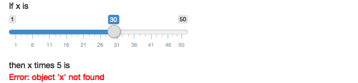
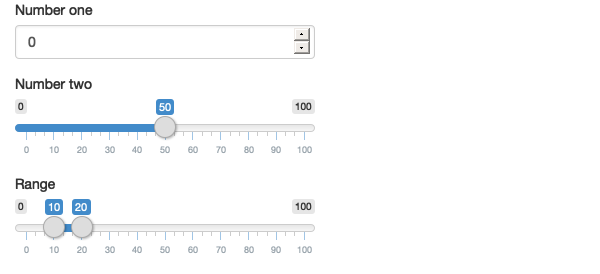
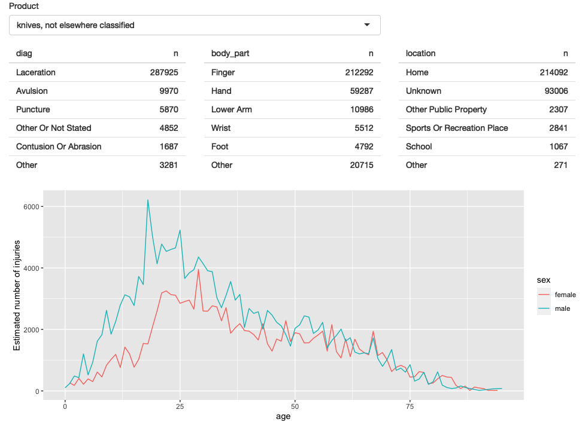

```{r setup, include=FALSE}
library(learnr)
library(gradethis)
library(learnrhash)
library(tidyverse)
library(vroom)
gradethis::gradethis_setup()
```

<style type="text/css">
  body{
  font-size: 12pt;
}
</style>

```{r stormtrooper_i, fig.margin = TRUE, echo = FALSE, fig.width=3, out.width = "100%"}
knitr::include_graphics("images/data-science-model.png")
```

## Introducción

### ¿Qué es Shiny?

Shiny es un paquete de R que te permite crear fácilmente aplicaciones web, interactivas interactivas.

Shiny te permite tomar tu trabajo en R y exponerlo a través de un navegador web para que cualquiera pueda usarlo. Shiny te hace lucir increíble haciendo que sea fácil producir aplicaciones web pulidas con una cantidad mínima de dolor.

En el pasado, la creación de aplicaciones web fue difícil para la mayoría de los usuarios de R porque:

  * Necesita un profundo conocimiento de las tecnologías web como HTML, CSS y JavaScript.

Hacer aplicaciones interactivas complejas requiere un análisis cuidadoso de los flujos de interacción para asegurarse de que cuando cambie una entrada, solo se actualizan las salidas relacionadas.

Shiny hace que sea significativamente más fácil para el programador R crear aplicaciones web por:

  * Proporcionar un conjunto cuidadosamente curado de funciones de interfaz de usuario (UI para cortas) que generan el HTML, CSS y JavaScript necesarios para tareas comunes. Esto significa que no necesita conocer los detalles de HTML / CSS / Javascript hasta que desee ir más allá de lo básico que Shiny le proporciona.

  * Se presenta un nuevo estilo de programación llamado programación reactiva que rastrea automáticamente las dependencias de las piezas de código. Esto significa que cada vez que cambias una entrada, Shiny puede averiguar automáticamente cómo hacer la cantidad más pequeña de trabajo para actualizar todas las salidas relacionadas.

La gente usa Shiny para:

  * Crear tableros de control que rastreen importantes indicadores de rendimiento de alto nivel, al tiempo que facilitan la profundización de las métricas que necesitan más investigación.

  * Reemplazar cientos de páginas de PDF con aplicaciones interactivas que permiten al usuario saltar a la pieza exacta de los resultados que se preocupan.

  * Comunicar modelos complejos a una audiencia no técnica con visualizaciones informativas y análisis de sensibilidad interactiva.

  * Proporcionar análisis de datos para flujos de trabajo comunes, reemplazando las solicitudes de correo electrónico con una aplicación Shiny que permite a las personas cargar sus propios datos y realizar análisis estándar. Puede hacer que los análisis de R sofisticados estén disponibles para los usuarios sin habilidades de programación.


En resumen, Shiny te brinda la posibilidad de transmitir algunas de tus superpoderes de R a cualquier persona que pueda usar la web.

## Tu primer Shiny App

En esta sección, crearemos una aplicación Shiny simple. Comenzaremos mostrándote la plantilla mínima necesaria para una aplicación Shiny, y luego aprenderás cómo iniciarla y detenerla.

A continuación, aprenderá los dos componentes clave de cada aplicación Shiny: 

  * La **UI** (abreviatura de interfaz de usuario) que define cómo se ve tu aplicación. 
  
  * La función del **servidor** que define cómo funciona Tu aplicación. 
  
Shiny usa la **programación reactiva** para actualizar automáticamente las salidas cuando cambian las entradas, por lo que terminaremos la sección aprendiendo el tercer componente importante de las aplicaciones Shiny: **las expresiones reactivas**.

Si aún no has instalado Shiny, instálalo ahora con:

```{r, echo=TRUE, eval=FALSE}
install.packages("Shiny")
```

Si ya has instalado Shiny, usa `packageVersion("shiny")` para comprobar que tiene la versión 1.5.0 o superior. Luego cargue en su sesión actual de R:

```{r, echo=TRUE, eval=FALSE}
library(Shiny)
```

### Crear directorio y archivo de la aplicación

Hay varias formas de crear una aplicación Shiny. La más simple es crear un nuevo directorio para su aplicación y poner un solo archivo llamado `app.R` en él.

Este archivo `app.R` se usará para decirle a Shiny cómo debe verse su aplicación y cómo debe comportarse.

Pruébalo creando un nuevo directorio y agregando un archivo `app.R` que se ve así: 

```{r, echo=TRUE, eval=FALSE}
library(shiny)
ui <- fluidPage(
  "Hola mundo!"
)
server <- function(input, output, session) {
  
}
shinyApp(ui, server)
```

¡Esta es una aplicación Shiny completa, aunque demasiado simple! Mirando de cerca el código anterior, nuestra `app.R` hace cuatro cosas:

  * Llama a la biblioteca para cargar el paquete shiny con `library(shiny)` .

  * Define la interfaz de usuario, la página web HTML con la que interactúan los humanos. En este caso, es una página que contiene las palabras "¡Hola mundo!".

  * Especifica el comportamiento de nuestra aplicación definiendo una función de servidor. Actualmente está vacío, por lo que nuestra aplicación no hace nada, pero volveremos para revisar esto en breve.

  * Ejecuta `shinyApp(ui, server)` para construir e iniciar una aplicación Shiny desde la interfaz de usuario y el servidor.
  
:::{.rmdnote}
**Tip**: Hay dos formas convenientes de crear una nueva aplicación en RStudio:

- Crea un nuevo directorio y un archivo `app.R` que contenga una aplicación básica en un solo paso haciendo clic en **Archivo \| Nuevo proyecto **, luego selecciona **Nuevo directorio** y **Shiny Web Application**.

- Si ya has creado el archivo `app.R`, puede agregar rápidamente el texto estándar de la aplicación escribiendo "shinyapp" y presionando Shift + Tab.
:::

### Ejecutar y Detener 

Hay varias formas de ejecutar esta aplicación:

  * Haga clic en el botón **Run App** en la barra de herramientas del documento.

  * Use un atajo de teclado: Cmd/Ctrl + Shift + Enter.

  * Si no está usando RStudio, puedes usar (`source()`) a todo el documento, o llamar a `shiny::runApp()` con la ruta al directorio que contiene `app.R`.
  

```{r run-app,  fig.align="center", out.width = "70%", echo = FALSE, fig.cap = "El botón Ejecutar aplicación se puede encontrar en la parte superior derecha del panel de origen."}
knitr::include_graphics("images/run-app.png")
```


Elije una de estas opciones y comprueba que ve la misma aplicación que en la imagen siguiente ¡Felicidades! Has creado tu primera aplicación Shiny.


```{r hello-world,  fig.align="center", out.width = "70%", echo = FALSE, fig.cap = "La aplicación shiny muy básica que verá cuando ejecute el código anterior."}
knitr::include_graphics("images/hello-world.png")
```

Antes de cerrar la aplicación, vuelve a RStudio y observe la consola R. Notarás que dice algo como:

```{r, echo=TRUE, eval=FALSE}
#> Listening on http://127.0.0.1:3827
```

Esto le indica la URL donde se puede encontrar su aplicación: 127.0.0.1 es una dirección estándar que significa "esta computadora" y 3827 es un número de puerto asignado al azar. Puede ingresar esa URL en cualquier navegador web compatible2 para abrir otra copia de su aplicación.

Observe también que R está ocupado: el indicador de R no está visible y la barra de herramientas de la consola muestra un icono de señal de alto. Mientras se ejecuta una aplicación Shiny, "bloquea" la consola R. Esto significa que no puede ejecutar nuevos comandos en la consola R hasta que la aplicación Shiny se detenga.

Puede detener la aplicación y devolver el acceso a la consola mediante cualquiera de estas opciones:

  * Haz clic en el icono de la señal de **stop** en la barra de herramientas de la consola R.

  * Haz clic en la consola, luego presione Esc (o presiona Ctrl + C).

Cierra la ventana de la aplicación Shiny.

El flujo de trabajo básico del desarrollo de la aplicación Shiny es escribir un código, iniciar la aplicación, jugar con la aplicación, escribir más código y repetir. 

Si está utilizando RStudio, ni siquiera necesita detener y reiniciar la aplicación para ver los cambios; puede presionar el botón Recargar la aplicación en la caja de herramientas o usar el atajo de teclado Cmd/Ctrl + Shift + Enter.

### Agregar controles de IU

A continuación, agregaremos algunas entradas y salidas a nuestra interfaz de usuario para que no sea tan mínima. Vamos a crear una aplicación muy simple que le muestra todos los dataframes integrados incluidos en el paquete de conjuntos de datos.

Reemplace su `ui` con este código:

```{r, echo=TRUE, eval=FALSE}
ui <- fluidPage(
  selectInput("dataset", label = "Dataset", choices = ls("package:datasets")),
  verbatimTextOutput("summary"),
  tableOutput("table")
)
```

Este ejemplo usa cuatro funciones nuevas:

  * `fluidPage()` es una función de diseño que configura la estructura visual básica de la página.

  * `selectInput()` es un control de entrada que permite al usuario interactuar con la aplicación proporcionando un valor. En este caso, es un cuadro de selección con la etiqueta `dataset` y le permite elegir uno de los conjuntos de datos integrados que vienen con R.

  * `verbatimTextOutput()` y `tableOutput()` son controles de salida que le dicen a Shiny dónde colocar la salida renderizada (entraremos en el cómo en un momento). `verbatimTextOutput()` muestra código y `tableOutput()` muestra tablas.

Las funciones de diseño, las entradas y las salidas tienen diferentes usos, pero son básicamente las mismas bajo las cubiertas: todas son formas elegantes de generar HTML, y si llama a cualquiera de ellos fuera de una aplicación Shiny, verá HTML impreso en la consola.

No tenga miedo de curiosear para ver cómo funcionan estos diferentes diseños y controles debajo.

Continúa y ejecute la aplicación nuevamente. Ahora verás una página que contiene un cuadro de selección. Solo vemos la entrada, no las dos salidas, porque todavía no le hemos dicho a Shiny cómo se relacionan las entradas y las salidas.


```{r basic-ui, echo = FALSE, out.width = "90%", fig.cap="La aplicación de datasets con interfaz de usuario.", message = FALSE}
knitr::include_graphics("images/ui.png")
```

### Adición de comportamiento

A continuación, daremos vida a las salidas definiéndolas en la función del servidor.

Shiny usa programación reactiva para hacer que las aplicaciones sean interactivas, por ahora, solo ten en cuenta que esto implica decirle a Shiny cómo realizar un cálculo, no ordenarle a Shiny que realmente lo haga. Es como la diferencia entre darle una receta a alguien y exigirle que te haga un sándwich.

Le diremos a Shiny cómo completar el `summary` y los resultados de `table` en la aplicación de muestra proporcionando las "recetas" para esos resultados. Reemplace su función `server` vacía con esto:

```{r, echo=TRUE, eval=FALSE}
server <- function(input, output, session) {
  output$summary <- renderPrint({
    dataset <- get(input$dataset, "package:datasets")
    summary(dataset)
  })
  
  output$table <- renderTable({
    dataset <- get(input$dataset, "package:datasets")
    dataset
  })
}
```

El lado izquierdo del operador de asignación (`<-`), salida `output$ID`, indica que está proporcionando la receta para la salida Shiny con esa `ID`.

El lado derecho de la asignación usa una **función de renderización** específica para envolver algún código que proporciones. Cada función de `render{Type}` está diseñada para producir un tipo particular de salida (por ejemplo, texto, tablas y gráficos) y, a menudo, se empareja con una función de `{type}Output`.

Por ejemplo, en esta aplicación, `renderPrint()` se empareja con `verbatimTextOutput()` para mostrar un resumen estadístico con texto de ancho fijo (literal), y `renderTable()` se empareja con `tableOutput()` para mostrar los datos de entrada en una tabla.

Ejecuta la aplicación nuevamente y juegue, observando lo que sucede con la salida cuando cambia una entrada. A continuación muestra lo que deberías ver cuando abre la aplicación.

```{r basic-server,  fig.align="center", echo = FALSE, out.width = "90%", fig.cap="Ahora que proporcionamos una función de servidor que conecta salidas y entradas, tenemos una aplicación completamente funcional.", message = FALSE}
knitr::include_graphics("images/server.png")
```

Observa que el `summary` y la `table` se actualizan cada vez que cambia el conjunto de datos de entrada.

Esta dependencia se crea implícitamente porque nos hemos referido a `input$dataset` dentro de las funciones de salida. `input$dataset` se completa con el valor actual del componente UI con id `dataset`, y hará que las salidas se actualicen automáticamente cada vez que ese valor cambie.

Esta es la esencia de la **reactividad**: las salidas reaccionan automáticamente (recalculan) cuando cambian sus entradas.

### Reducir la duplicación con expresiones reactivas

Incluso en este ejemplo simple, tenemos un código duplicado: la siguiente línea está presente en ambas salidas.

```{r, echo=TRUE, eval=FALSE}
dataset <- get(input$dataset, "package:datasets")
```

En todo tipo de programación, es una mala práctica tener código duplicado; puede ser un desperdicio computacional y, lo que es más importante, aumenta la dificultad de mantener o depurar el código. No es tan importante aquí, pero quería ilustrar la idea básica en un contexto muy simple.

En las secuencias de comandos R tradicionales, utilizamos dos técnicas para tratar el código duplicado: capturamos el valor mediante una variable o capturamos el cálculo con una función. Desafortunadamente, ninguno de estos enfoques funciona aquí, por razones que aprenderás después, y necesitamos un nuevo mecanismo: **expresiones reactivas**.

Creas una expresión reactiva envolviendo un bloque de código en `reactive({...})` y asignándolo a una variable, y usas una expresión reactiva llamándola como una función. Pero si bien parece que estás llamando a una función, una expresión reactiva tiene una diferencia importante: solo se ejecuta la primera vez que se llama y luego almacena en caché su resultado hasta que necesita ser actualizado.

Podemos actualizar nuestro `server()` para usar expresiones reactivas, como se muestra a continuación. La aplicación se comporta de manera idéntica, pero funciona un poco más eficientemente porque solo necesitas recuperar el conjunto de datos una vez, no dos.

```{r, echo=TRUE, eval=FALSE}
server <- function(input, output, session) {
  # Create a reactive expression
  dataset <- reactive({
    get(input$dataset, "package:datasets")
  })

  output$summary <- renderPrint({
    # Use a reactive expression by calling it like a function
    summary(dataset())
  })
  
  output$table <- renderTable({
    dataset()
  })
}
```

Volveremos a la programación reactiva varias veces, pero incluso con un conocimiento superficial de entradas, salidas y expresiones reactivas, es posible crear aplicaciones Shiny bastante útiles.

### Resumen

Haz creado una aplicación sencilla; no es muy interesante ni útil, pero ha visto lo fácil que es construir una aplicación web utilizando sus conocimientos de R existentes. Ahora es un buen momento para obtener una copia de la hoja de trucos Shiny. Este es un gran recurso para ayudar a refrescar la memoria de los componentes principales de una aplicación Shiny


```{r echo = FALSE, out.width = "90%", fig.cap="Shiny cheatsheet, disponible en https://www.rstudio.com/resources/cheatsheets/", message = FALSE}
knitr::include_graphics("images/cheatsheet.png")
```

### Ejercicios

  * 1 - Crea una aplicación que reciba al usuario por su nombre. Aún no conoces todas las funciones que necesita para hacer esto, así que incluímos algunas líneas de código a continuación. Piensa qué líneas usará y luego cópielas y péguelas en el lugar correcto en una aplicación Shiny.

```{r, echo=TRUE, eval=FALSE}
tableOutput("mortgage")

output$greeting <- renderText({
  paste0("Hello ", input$name)
})

numericInput("age", "How old are you?", value = NA)

textInput("name", "What's your name?")

textOutput("greeting")

output$histogram <- renderPlot({
  hist(rnorm(1000))
}, res = 96)
```

  * 2 - Supon que tu amigo quiere diseñar una aplicación que le permita al usuario establecer un número (x) entre 1 y 50, y muestra el resultado de multiplicar este número por 5. Este es su primer intento:

```{r, echo=TRUE, eval=FALSE}
library(shiny)

ui <- fluidPage(
  sliderInput("x", label = "If x is", min = 1, max = 50, value = 30),
  "then x times 5 is",
  textOutput("product")
)

server <- function(input, output, session) {
  output$product <- renderText({ 
    x * 5
  })
}

shinyApp(ui, server)
```

  * Pero lamentablemente tiene un error:
  
```{r echo = FALSE, out.width = "90%", message = FALSE}

```
  
  * ¿Puedes ayudarlos a encontrar y corregir el error?
  
  * 3 - Amplía la aplicación del ejercicio anterior para permitir que el usuario establezca el valor del multiplicador, y, de modo que la aplicación produzca el valor de `x * y`. El resultado final debería verse así:

```{r echo = FALSE, out.width = "90%", message = FALSE}

```

  * 4 - Toma la siguiente aplicación que agrega algunas funciones adicionales a la última aplicación descrita en el último ejercicio. ¿Qué hay de nuevo? ¿Cómo podría reducir la cantidad de código duplicado en la aplicación mediante el uso de una expresión reactiva?
  
```{r, echo=TRUE, eval=FALSE}
library(shiny)

ui <- fluidPage(
  sliderInput("x", "If x is", min = 1, max = 50, value = 30),
  sliderInput("y", "and y is", min = 1, max = 50, value = 5),
  "then, (x * y) is", textOutput("product"),
  "and, (x * y) + 5 is", textOutput("product_plus5"),
  "and (x * y) + 10 is", textOutput("product_plus10")
)

server <- function(input, output, session) {
  output$product <- renderText({ 
    product <- input$x * input$y
    product
  })
  output$product_plus5 <- renderText({ 
    product <- input$x * input$y
    product + 5
  })
  output$product_plus10 <- renderText({ 
    product <- input$x * input$y
    product + 10
  })
}

shinyApp(ui, server)
```

  * 5 - La siguiente aplicación es muy similar a una que viste anteriormente: seleccionas un conjunto de datos de un paquete (esta vez usamos el paquete ggplot2) y la aplicación imprime un `summary` y un gráfico de los datos. También sigue las buenas prácticas y hace uso de expresiones reactivas para evitar la redundancia de código. Sin embargo, hay tres errores en el código que se proporciona a continuación. ¿Puedes encontrarlos y arreglarlos?

```{r, echo=TRUE, eval=FALSE}
library(shiny)
library(ggplot2)

datasets <- c("economics", "faithfuld", "seals")
ui <- fluidPage(
  selectInput("dataset", "Dataset", choices = datasets),
  verbatimTextOutput("summary"),
  tableOutput("plot")
)

server <- function(input, output, session) {
  dataset <- reactive({
    get(input$dataset, "package:ggplot2")
  })
  output$summmry <- renderPrint({
    summary(dataset())
  })
  output$plot <- renderPlot({
    plot(dataset)
  }, res = 96)
}

shinyApp(ui, server)
```


## Conceptos de UI

Ahora que tienes una aplicación básica en tu haber, podemos comenzar a explorar los detalles que hacen que Shiny funcione. Como viste en la sección anterior, Shiny fomenta la separación del código que genera la interfaz de usuario (el **front-end**) del código que impulsa el comportamiento de tu aplicación (el **back-end**).

En esta sección, nos centraremos en la interfaz y le daremos un recorrido rápido de las entradas y salidas HTML proporcionadas por Shiny. Esto te brinda la capacidad de capturar muchos tipos de datos y mostrar muchos tipos de salida R. Todavía no tienes muchas formas de unir las entradas y salidas.

  Aquí nos referiremos principalmente a las entradas y salidas integradas en Shiny. Sin embargo, existe una comunidad rica y vibrante de paquetes de extensión, como `shinyWidgets`, `colorpicker` y `sorttable`.
  
Pueded encontrar una lista completa y mantenida activamente de otros paquetes en https://github.com/nanxstats/awesome-shiny-extensions.

Como de costumbre, comenzaremos cargando el paquete `shiny`:

```{r, echo=TRUE, eval=FALSE}
library(shiny)
```

### Inputs

Como vimos en la sección anterior, utiliza funciones como `sliderInput()`, `selectInput()`, `textInput()` y `numericInput()` para insertar controles de entrada en la especificación de la interfaz de usuario.

Ahora discutiremos la estructura común que subyace a todas las funciones de entrada y brindaremos una descripción general rápida de las entradas integradas en Shiny.

  * **Estructura común**
  
Todas las funciones de entrada tienen el mismo primer argumento: `inputId`. Este es el identificador utilizado para conectar el **front-end** con el **back-end**: si su interfaz de usuario tiene una entrada con ID `name`, la función del servidor accederá a ella con la `input$name`.

El `inputId` tiene dos restricciones:

  * Debe ser una cadena simple que contenga solo letras, números y guiones bajos (¡no se permiten espacios, guiones, puntos u otros caracteres especiales!). Nómbrelo como lo haría con una variable en R.

  * Debe ser único. Si no es único, no tendrá forma de referirse a este control en la función de tu servidor.

La mayoría de las funciones de entrada tienen un segundo parámetro llamado etiqueta. Esto se utiliza para crear una etiqueta legible por humanos para el control. Shiny no impone restricciones a este string, pero deberás pensarlo detenidamente para asegurarte de que los humanos puedan utilizar tu aplicación. El tercer parámetro suele ser el valor, que, cuando es posible, le permite establecer el valor predeterminado. Los demás parámetros son exclusivos del control.

Al crear una entrada, recomiendo proporcionar el `inputId` y los argumentos de etiqueta por posición, y todos los demás argumentos por nombre:

```{r, echo=TRUE, eval=FALSE}
sliderInput("min", "Limit (minimum)", value = 50, min = 0, max = 100)
```

Las siguientes secciones describen las entradas integradas en brillante, agrupadas libremente de acuerdo con el tipo de control que crean. El objetivo es brindarte una visión general rápida de sus opciones, no para describir de manera exhaustiva todos los argumentos. 

Mostrarémos los parámetros más importantes para cada control a continuación, pero deberá leer la documentación para obtener los detalles completos.

### Texto libre

Recoge pequeñas cantidades de texto con `textInput()`, contraseñas con `passwordInput()`, y los párrafos del texto con `textAreaInput()`.

```{r, echo=TRUE, eval=FALSE}
ui <- fluidPage(
  textInput("name", "What's your name?"),
  passwordInput("password", "What's your password?"),
  textAreaInput("story", "Tell me about yourself", rows = 3)
)
```

```{r echo = FALSE, fig.align="center", out.width = "90%", message = FALSE}
knitr::include_graphics("images/free-text.png")
```

Si desea asegurarse de que el texto tenga ciertas propiedades, puede usar `validate()`.

### Entradas numéricas

Para recolectar valores numéricos, crea un cuadro de texto restringido con `numericInput()` o un control deslizante con `sliderInput()`. 

Si suministra un vector numérico de longitud 2 para el valor predeterminado de `SliderInput()`, obtiene un control deslizante de "rango" con dos extremos.

```{r, echo=TRUE, eval=FALSE}
ui <- fluidPage(
  numericInput("num", "Number one", value = 0, min = 0, max = 100),
  sliderInput("num2", "Number two", value = 50, min = 0, max = 100),
  sliderInput("rng", "Range", value = c(10, 20), min = 0, max = 100)
)
```

```{r echo = FALSE, fig.align="center", out.width = "90%", message = FALSE}

```

En general, se recomienda usar solo controles deslizantes para rangos pequeños o casos en los que el valor preciso no sea tan importante. ¡Intentar seleccionar con precisión un número en un pequeño control deslizante es un ejercicio de frustración!

Los controles deslizantes son extremadamente personalizables y hay muchas formas de modificar su apariencia. Consulta `?SliderInput` y https://shiny.rstudio.com/articles/sliders.html para obtener más detalles.


### Fechas

Recopila un solo día con `dateInput()` o un rango de dos días con `dateRangeInput()`. 

Estos proporcionan un selector de calendario conveniente y argumentos adicionales como `datedisabled` y `daysofweekdisabled` le permiten restringir el conjunto de entradas válidas.

```{r, echo=TRUE, eval=FALSE}
ui <- fluidPage(
  dateInput("dob", "When were you born?"),
  dateRangeInput("holiday", "When do you want to go on vacation next?")
)
```

```{r echo = FALSE, fig.align="center", out.width = "90%", message = FALSE}

```

El formato de fecha, el idioma y el día en que comienza la semana se ajustan de forma predeterminada a los estándares de EE.UU.

Si estás creando una aplicación con una audiencia internacional, establezca el formato, el idioma y el inicio de la semana para que las fechas sean naturales para sus usuarios.

### Selectores

Hay dos enfoques diferentes que permiten al usuario elegir entre un conjunto de opciones preespecificado: `selectInput()` y `radioButtons()`.

```{r, echo=TRUE, eval=FALSE}
animals <- c("dog", "cat", "mouse", "bird", "other", "I hate animals")

ui <- fluidPage(
  selectInput("state", "What's your favourite state?", state.name),
  radioButtons("animal", "What's your favourite animal?", animals)
)
```

```{r echo = FALSE, fig.align="center", out.width = "90%", message = FALSE}
knitr::include_graphics("images/limited-choices.png")
```

Los `radioButtons()` tienen dos características interesantes: muestran todas las opciones posibles, lo que las hace adecuadas para listas cortas y, a través de los argumentos `choiceNames`/`choiceValues`, pueden mostrar opciones distintas al texto sin formato.

`choiceNames` determina lo que se muestra al usuario; `choiceValues` determina lo que se devuelve en la función de tu servidor.

```{r, echo=TRUE, eval=FALSE}
ui <- fluidPage(
  radioButtons("rb", "Choose one:",
    choiceNames = list(
      icon("angry"),
      icon("smile"),
      icon("sad-tear")
    ),
    choiceValues = list("angry", "happy", "sad")
  )
)
```

```{r echo = FALSE, fig.align="center", out.width = "90%", message = FALSE}

```

Los menús desplegables creados con `selectInput()` ocupan la misma cantidad de espacio, independientemente del número de opciones, lo que los hace más adecuados para opciones más largas. 

También puede establecer `multiple = TRUE` para permitir que el usuario seleccione varios elementos. 

```{r, echo=TRUE, eval=FALSE}
ui <- fluidPage(
  selectInput(
    "state", "What's your favourite state?", state.name,
    multiple = TRUE
  )
)
```

```{r echo = FALSE,  fig.align="center", out.width = "60%", message = FALSE}
knitr::include_graphics("images/multi-select.png")
```

Si tienes un conjunto muy grande de opciones posibles, es posible que desee utilizar `selectInput()` del "lado del servidor" para que el conjunto completo de opciones posibles no esté incrustado en la interfaz de usuario (lo que puede hacer que la carga sea lenta), sino enviado según sea necesario por el servidor. 

Puedes obtener más información sobre este tema avanzado en https://shiny.rstudio.com/articles/selectize.html#server-side-selectize.

No hay forma de seleccionar varios valores con botones de opción, pero existe una alternativa que es conceptualmente similar: `checkboxGroupInput()`.

```{r, echo=TRUE, eval=FALSE}
ui <- fluidPage(
  checkboxGroupInput("animal", "What animals do you like?", animals)
)
```

```{r echo = FALSE, fig.align="center", out.width = "90%", message = FALSE}

```

Si deseas una sola casilla de verificación para una sola pregunta de sí/no, usa `checkboxInput()`:

```{r, echo=TRUE, eval=FALSE}
ui <- fluidPage(
  checkboxInput("cleanup", "Clean up?", value = TRUE),
  checkboxInput("shutdown", "Shutdown?")
)
```

```{r echo = FALSE,  fig.align="center", out.width = "90%", message = FALSE}

```

### Cargas de archivos

También es posible que el usuario cargue un archivo con `fileInput()`:

```{r, echo=TRUE, eval=FALSE}
ui <- fluidPage(
  fileInput("upload", NULL)
)
```

```{r echo = FALSE, fig.align="center", out.width = "70%", message = FALSE}
knitr::include_graphics("images/upload.png")
```

`fileInput()` requiere un manejo especial en el lado del servidor y se analizará con detalle posteriormente. 

### Botones de acción

Deja que el usuario realice una acción con `actionButton()` o `actionLink()`:

```{r, echo=TRUE, eval=FALSE}
ui <- fluidPage(
  actionButton("click", "Click me!"),
  actionButton("drink", "Drink me!", icon = icon("cocktail"))
)
```

```{r echo = FALSE, fig.align="center", out.width = "70%", message = FALSE}

```

Los enlaces y botones de acciones se emparejan de forma más natural con `observeEvent()` o `eventReactive()` en la función de su servidor. Estas funcioes tienen un posterior tratamiento. 

Puedes personalizar la apariencia usando el argumento de clase usando uno de `btn-primary`, `btn-success`, `btn-info`, `btn-warning` o `btn-danger`. 

También puedes cambiar el tamaño con `btn-lg`, `btn-sm`, `btn-xs`.

Finalmente, puede hacer que los botones abarquen todo el ancho del elemento en el que están incrustados usando `btn-block`.

```{r, echo=TRUE, eval=FALSE}
ui <- fluidPage(
  fluidRow(
    actionButton("click", "Click me!", class = "btn-danger"),
    actionButton("drink", "Drink me!", class = "btn-lg btn-success")
  ),
  fluidRow(
    actionButton("eat", "Eat me!", class = "btn-block")
  )
)
```

```{r echo = FALSE,  fig.align="center", out.width = "70%", message = FALSE}

```

El argumento `class` funciona estableciendo el atributo de clase del HTML subyacente, lo que afecta el estilo del elemento. Para ver otras opciones, puede leer la documentación de Bootstrap, el sistema de diseño CSS utilizado por Shiny: <http://bootstrapdocs.com/v3.3.6/docs/css/#buttons>.

### Ejercicios
  * 1 - Cuando el espacio es escaso, es útil etiquetar los cuadros de texto con un marcador de posición que aparece dentro del área de entrada de texto. ¿Cómo se llama a `textInput()` para generar la interfaz de usuario a continuación?

```{r echo = FALSE,  fig.align="center", out.width = "70%", message = FALSE}
knitr::include_graphics("images/placeholder.png")
```

  * 2 - Lee atentamente la documentación de `sliderInput()` para descubrir cómo crear un control deslizante de fecha, como se muestra a continuación.
  
```{r echo = FALSE,  fig.align="center", out.width = "70%", message = FALSE}
knitr::include_graphics("images/date-slider.png")
```
  
  * 3 - Crea una entrada de control deslizante para seleccionar valores entre 0 y 100 donde el intervalo entre cada valor seleccionable en el control deslizante es 5. Luego, agrega animación al widget de entrada para que cuando el usuario presione reproducir, el widget de entrada se desplaza por el rango automáticamente.
  
  * 4 - Si tienes una lista moderadamente larga en un `selectInput()`, es útil crear subtítulos que dividan la lista en pedazos. Lee la documentación para descubrir cómo. (Sugerencia: el HTML subyacente se llama <optgroup>). 
  
  
###  Salidas

Los resultados en la interfaz de usuario crean marcadores de posición que luego se rellenan con la función del servidor. Al igual que las entradas, las salidas toman una ID única como primer argumento: si la especificación de la interfaz de usuario crea una salida con la ID `plot`, accederás a ella en la función del servidor con la `output$plot`.

Cada función de `output` en el front-end está acoplada con una función de `render` en el back-end. Hay tres tipos principales de resultados, que se corresponden con las tres cosas que suele incluir en un informe: texto, tablas y gráficos. 

Las siguientes secciones le muestran los conceptos básicos de las funciones de salida en el front-end, junto con las funciones de `render` correspondientes en el back-end.
  
### Texto

Salida de texto regular con `textOutput()` y código fijo y salida de consola con `verbatimTextOutput()`.

```{r, echo=TRUE, eval=FALSE}
ui <- fluidPage(
  textOutput("text"),
  verbatimTextOutput("code")
)
server <- function(input, output, session) {
  output$text <- renderText({ 
    "Hello friend!" 
  })
  output$code <- renderPrint({ 
    summary(1:10) 
  })
}
```

```{r echo = FALSE,  fig.align="center", out.width = "70%", message = FALSE}
knitr::include_graphics("images/output-text.png")
```

Ten en cuenta que los `{ }` solo son necesarios en las funciones de renderizado si es necesario ejecutar varias líneas de código. Como aprenderá en breve, debe realizar el menor cálculo posible en sus funciones de renderizado, lo que significa que a menudo puede omitirlas. 

Así es como se vería la función del servidor anterior si se escribiera de manera más compacta:

```{r, echo=TRUE, eval=FALSE}
server <- function(input, output, session) {
  output$text <- renderText("Hello friend!")
  output$code <- renderPrint(summary(1:10))
}
```

Ten en cuenta que hay dos funciones de renderizado que se comportan de forma ligeramente diferente:

  * `renderText()` combina el resultado en una sol string, y generalmente se empareja con `textOutput()`
  * `renderPrint()` imprime el resultado, como si estuviera en una consola R, y normalmente se empareja con `verbatimTextOutput()`.

Podemos ver la diferencia con una aplicación:

```{r, echo=TRUE, eval=FALSE}
ui <- fluidPage(
  textOutput("text"),
  verbatimTextOutput("print")
)
server <- function(input, output, session) {
  output$text <- renderText("hello!")
  output$print <- renderPrint("hello!")
}
```

```{r echo = FALSE, fig.align="center", out.width = "70%", message = FALSE}

```

Esto es equivalente a la diferencia entre `cat()` e `print()` en la base R.

### Tablas

Hay dos opciones para mostrar marcos de datos en tablas:

  * `tableOutput()` y `renderTable()` representan una tabla estática de datos, mostrando todos los datos a la vez.

  * `dataTableOutput()` y `renderDataTable()` representan una tabla dinámica, mostrando un número fijo de filas junto con controles para cambiar qué filas son visibles.

`tableOutput()` es más útil para resúmenes pequeños y fijos (por ejemplo, coeficientes de modelo); `dataTableOutput()` es más apropiado si desea exponer un marco de datos completo al usuario. 

Si deseas un mayor control sobre la salida de `dataTableOutput()`, te recomiendo encarecidamente el paquete `reactable` de Greg Lin.

```{r, echo=TRUE, eval=FALSE}
ui <- fluidPage(
  tableOutput("static"),
  dataTableOutput("dynamic")
)
server <- function(input, output, session) {
  output$static <- renderTable(head(mtcars))
  output$dynamic <- renderDataTable(mtcars, options = list(pageLength = 5))
}
```

```{r echo = FALSE, fig.align="center", out.width = "90%", message = FALSE}
knitr::include_graphics("images/output-table.png")
```

### Gráficas

Puede mostrar cualquier tipo de gráfico R (base, ggplot2 u otro) con `plotOutput()` y `renderPlot()`:

```{r, echo=TRUE, eval=FALSE}
ui <- fluidPage(
  plotOutput("plot", width = "400px")
)
server <- function(input, output, session) {
  output$plot <- renderPlot(plot(1:5), res = 96)
}
```

```{r echo = FALSE, fig.align="center", out.width = "90%", message = FALSE}

```

Por defecto, `plotOutput()` ocupará todo el ancho de su contenedor (más sobre eso en breve) y tendrá 400 píxeles de alto. Puede anular estos valores predeterminados con los argumentos de alto y ancho. Recomendamos establecer siempre `res = 96`, ya que eso hará que sus gráficos Shiny coincidan lo más posible con lo que ve en RStudio.

Los gráficos son especiales porque son salidas que también pueden actuar como entradas.

`plotOutput()` tiene varios argumentos como `click`, `dblclick` y `hover`. Si les pasa una cadena, como `click = "plot_click"`, crearán una entrada reactiva (`input$lot_click`) que puede usar para manejar la interacción del usuario en la gráfica, p. Ej. haciendo clic en la gráfica.

### Descargas

Puedes hacer que el usuario descargue un archivo con `downloadButton()` o `downloadLink()`. Estos requieren nuevas técnicas en la función del servidor las cuales veremos más adelante.

### Ejercicios

  * 1 - ¿Con cuál de `textOutput()` y `verbatimTextOutput()` se debe emparejar cada una de las siguientes funciones de renderizado?

    * a) `renderPrint(summary(mtcars))`
    * b) `renderText("Good morning!")`
    * c) `renderPrint(t.test(1:5, 2:6))`
    * d) `renderText(str(lm(mpg ~ wt, data = mtcars)))`
    
  * 2 - Vuelve a crear la aplicación Shiny de la Sección de **Gráficas**, esta vez configurando la altura en `300px` y el ancho en `700px`. Establezca el texto "alt" de la gráfica para que un usuario con discapacidad visual pueda saber que es una gráfica de dispersión de cinco números aleatorios.

  * 3 - Actualiza las opciones en la llamada a `renderDataTable()` a continuación para que se muestren los datos, pero todos los demás controles estén suprimidos (es decir, elimina los comandos de búsqueda, orden y filtrado). Deberás leer `?RenderDataTable` y revisar las opciones en https://datatables.net/reference/option/.

```{r, echo=TRUE, eval=FALSE}
ui <- fluidPage(
  dataTableOutput("table")
)
server <- function(input, output, session) {
  output$table <- renderDataTable(mtcars, options = list(pageLength = 5))
}
```

  * 4 - Alternativamente, lee sobre reactable y convierte la aplicación anterior para usarla en su lugar. 

### Resumen

Este sección le ha presentado las principales funciones de entrada y salida que componen la interfaz de una aplicación Shiny. Este fue un gran volcado de información, así que no esperes recordar todo después de una sola lectura. En su lugar, vuelve a esta sección cuando esté buscando un componente específico: puede escanear rápidamente las figuras y luego encontrar el código que necesita.

En la próxima sección, pasaremos al **back-end** de una aplicación Shiny: el código R que hace que su interfaz de usuario cobre vida.

## Reactividad: El servidor

En Shiny, expresas la **lógica de tu servidor** mediante **programación reactiva**. La programación reactiva es un paradigma de programación elegante y poderoso, pero puede ser desorientador al principio porque es un paradigma muy diferente al de escribir un guión.

La idea clave de la programación reactiva es especificar un gráfico de dependencias para que cuando cambie una entrada, todas las salidas relacionadas se actualicen automáticamente. Esto simplifica considerablemente el flujo de una aplicación, pero lleva un tiempo entender cómo encaja todo.

Esta sección se proporcionará una introducción suave a la programación reactiva, enseñándote los conceptos básicos de las construcciones reactivas más comunes que usará en las aplicaciones Shiny. 

Comenzaremos con una encuesta de la función del servidor, discutiendo con más detalle cómo funcionan los argumentos de entrada y salida. A continuación, revisaremos la forma más simple de reactividad (donde las entradas se conectan directamente a las salidas) y luego analizaremos cómo las expresiones reactivas le permiten eliminar el trabajo duplicado.

Terminaremos revisando algunos obstáculos comunes que encuentran los usuarios más nuevos de Shiny.

### La función de servidor

Como has visto, las entrañas de cada aplicación Shiny se ven así:

```{r, echo=TRUE, eval=FALSE}
library(shiny)

ui <- fluidPage(
  # interfaz front-end
)

server <- function(input, output, session) {
  # lógica back-end 
}

shinyApp(ui, server)
```


En la sección anterior cubrimos los conceptos básicos de la interfaz de usuario, el objeto de `ui` que contiene el HTML presentado a cada usuario de su aplicación. La interfaz de usuario es simple porque todos los usuarios obtienen el mismo HTML. El `server` es más complicado porque cada usuario necesita obtener una versión independiente de la aplicación; cuando el usuario A mueve un control deslizante, el usuario B no debería ver cambiar sus resultados.

Para lograr esta independencia, Shiny invoca su función `server()` cada vez que se inicia una nueva sesión. Al igual que cualquier otra función de R, cuando se llama a la función de servidor, crea un nuevo entorno local que es independiente de cualquier otra invocación de la función. Esto permite que cada sesión tenga un estado único, además de aislar las variables creadas dentro de la función. Es por eso que casi toda la programación reactiva que harás en Shiny estará dentro de la función del `server`. 

Las funciones del servidor toman tres parámetros: `input`, `output`, y `session`. Debido a que nunca llamas a la función del servidor, nunca crearás estos objetos tu mismo. 

En cambio, son creados por Shiny cuando comienza la sesión, conectándose de nuevo a una sesión específica. Por el momento, nos centraremos en los argumentos de `input` y `output`, y dejaremos la `session` para posteriormente.

### Input

El argumento de `input` es un objeto similar a una lista que contiene todos los datos de entrada enviados desde el navegador, nombrados de acuerdo con el ID de entrada. Por ejemplo, si tu interfaz de usuario contiene un control de entrada numérico con un ID de entrada de `count`, así:

```{r, echo=TRUE, eval=FALSE}
ui <- fluidPage(
  numericInput("count", label = "Number of values", value = 100)
)
```

Luego puede acceder al valor de ese `input` con `input$count`. Inicialmente contendrá el valor 100 y se actualizará automáticamente a medida que el usuario cambie el valor en el navegador.

A diferencia de una lista típica, los objetos de `input` son de solo lectura. Si intenta modificar una `input` dentro de la función del servidor, obtendrá un error:

```{r, echo=TRUE, eval=FALSE}
server <- function(input, output, session) {
  input$count <- 10  
}

shinyApp(ui, server)
#> Error: Can't modify read-only reactive value 'count'
```

Este error se produce porque la entrada refleja lo que está sucediendo en el navegador, y el navegador es la "única fuente de verdad" de Shiny. Si pudieras modificar el valor en R, podría introducir inconsistencias, donde el control deslizante de entrada decía una cosa en el navegador, y `input$count` decía algo diferente en R. ¡Eso haría que la programación fuera un desafío! 

Más adelante, veremos como usar funciones como `updateNumericInput()` para modificar el valor en el navegador, y luego la `input$count` se actualizará en consecuencia.

Una cosa más importante sobre el `input`: es selectiva sobre quién puede leerla. Para leer desde una entrada, debe estar en un **contexto reactivo** creado por una función como `renderText()` o `reactive()`.

Volveremos a esa idea muy pronto, pero es una restricción importante que permite que las salidas se actualicen automáticamente cuando cambia una entrada. Este código ilustra el error que verás si cometes este error:

```{r, echo=TRUE, eval=FALSE}
server <- function(input, output, session) {
  message("The value of input$count is ", input$count)
}

shinyApp(ui, server)
#> Error: Can't access reactive value 'count' outside of reactive consumer.
#> ℹ Do you need to wrap inside reactive() or observer()?
```

###  Output

El `output` es muy similar aL `input`: también es un objeto similar a una lista nombrada de acuerdo con el ID de salida. La principal diferencia es que lo usa para enviar salida en lugar de recibir entrada. Siempre usa el objeto de salida junto con una función de renderizado, como en el siguiente ejemplo simple:


```{r, echo=TRUE, eval=FALSE}
ui <- fluidPage(
  textOutput("greeting")
)

server <- function(input, output, session) {
  output$greeting <- renderText("Hello human!")
}
```

(Tenga en cuenta que la ID se cita en la interfaz de usuario, pero no en el servidor).

La función de render hace dos cosas:

  * Establece un contexto reactivo especial que rastrea automáticamente las entradas que utiliza la salida.

  * Convierte la salida de su código R en HTML adecuado para mostrar en una página web.

Al igual que la entrada, la salida es exigente con la forma en que la usa. Obtendrás un error si:

  * Olvidas la función de renderizado.
  
```{r, echo=TRUE, eval=FALSE}
server <- function(input, output, session) {
  output$greeting <- "Hello human"
}
shinyApp(ui, server)
#> Error: Unexpected character object for output$greeting
#> ℹ Did you forget to use a render function?
```

  * Intentas leer de una salida.
  
```{r, echo=TRUE, eval=FALSE}
server <- function(input, output, session) {
  message("The greeting is ", output$greeting)
}
shinyApp(ui, server)
#> Error: Reading from shinyoutput object is not allowed
```

### Programación reactiva

Una aplicación será bastante aburrida si solo tiene entradas o solo salidas. La verdadera magia de Shiny ocurre cuando tienes una aplicación con ambos. Veamos un ejemplo sencillo:

```{r, echo=TRUE, eval=FALSE}
ui <- fluidPage(
  textInput("name", "What's your name?"),
  textOutput("greeting")
)

server <- function(input, output, session) {
  output$greeting <- renderText({
    paste0("Hello ", input$name, "!")
  })
}
```

Es difícil mostrar cómo funciona esto, pero puede observar la figura siguiente. Si ejecutas la aplicación y escribes en el cuadro de `name`, verá que el saludo se actualiza automáticamente a medida que escribe.


```{r connection, fig.cap="La reactividad significa que las salidas se actualizan automáticamente a medida que cambian las entradas, como en esta aplicación donde escribes  'J', 'o', 'e'. Velo en vivo en https://hadley.shinyapps.io/ms-connection.", echo = FALSE, out.width = "25%", fig.show="hold", fig.align = "center", message = FALSE}


```

Esta es la gran idea en Shiny: no necesitas decirle a una salida cuándo actualizar, porque Shiny lo averigua automáticamente por ti. ¿Como funciona? ¿Qué está sucediendo exactamente en el cuerpo de la función? Pensemos en el código dentro de la función del servidor con más precisión:

```{r, echo=TRUE, eval=FALSE}
output$greeting <- renderText({
  paste0("Hello ", input$name, "!")
})
```

Es fácil leer esto como "pegar 'hola' y el `name` del usuario, luego enviarlo a la `output$greeting`. Pero este modelo mental está equivocado de una manera sutil, pero importante. 

Piénsalo: con este modelo, solo emite la instrucción una vez. Pero Shiny realiza la acción cada vez que actualizamos la `input$name`, por lo que debe haber algo más.

La aplicación funciona porque el código no le dice a Shiny que cree el string y la envíe al navegador, sino que le informa a Shiny cómo podría crear el string si es necesario.

Depende de Shiny cuándo (¡e incluso si!) Se debe ejecutar el código. Es posible que se ejecute tan pronto como se inicie la aplicación, puede que sea un poco más tarde; ¡Puede que se ejecute muchas veces o que nunca se ejecute! 

Esto no implica que Shiny sea caprichoso, solo que es responsabilidad de Shiny decidir cuándo se ejecuta el código, no la tuya. Piense en su aplicación como si le proporcionara recetas a Shiny, no como si le diera comandos.

### Programación imperativa vs declarativa

Esta diferencia entre comandos y recetas es una de las diferencias clave entre dos estilos importantes de programación:

  * En la **programación imperativa**, emite un comando específico y se ejecuta de inmediato. Este es el estilo de programación al que está acostumbrado en sus scripts de análisis: ordena a R que cargue sus datos, los transforme, los visualice y guarde los resultados en el disco.

  * En la **programación declarativa**, usted expresa objetivos de alto nivel o describe limitaciones importantes, y confía en alguien más para decidir cómo y/o cuándo traducir eso en acción. Este es el estilo de programación que usa en Shiny.

Con código imperativo dices “Hazme un sándwich”. Con el código declarativo, dice "Asegúrese de que haya un sándwich en el refrigerador cada vez que mire dentro". El código imperativo es asertivo; el código declarativo es pasivo-agresivo.

La mayoría de las veces, la programación declarativa es tremendamente liberadora: usted describe sus objetivos generales y el software descubre cómo lograrlos sin más intervención. 

La desventaja es el momento ocasional en el que sabe exactamente lo que quiere, pero no puede descubrir cómo enmarcarlo de una manera que el sistema declarativo entienda. El objetivo de este sección del es ayudarte a desarrollar su comprensión de la teoría subyacente para que esto suceda con la menor frecuencia posible.

### Laziness

Una de las fortalezas de la programación declarativa en Shiny es que permite que las aplicaciones sean extremadamente perezosas. Una aplicación Shiny solo hará la cantidad mínima de trabajo necesaria para actualizar los controles de salida que puede ver actualmente. Esta pereza, sin embargo, viene con una desventaja importante que debes tener en cuenta. ¿Puedes detectar lo que está mal con la función del servidor a continuación?

```{r, echo=TRUE, eval=FALSE}
server <- function(input, output, session) {
  output$greting <- renderText({
    paste0("Hello ", input$name, "!")
  })
}
```

Si miras de cerca, es posible que notes que he escrito greting en lugar de greeting. Esto no generará un error en Shiny, pero no hará lo que desea. La salida greting no existe, por lo que el código dentro de `renderText()` nunca se ejecutará.

Si está trabajando en una aplicación Shiny y simplemente no puede entender por qué su código nunca se ejecuta, verifique que la interfaz de usuario y las funciones del servidor estén usando los mismos identificadores.

### El gráfico reactivo

La pereza de Shiny tiene otra propiedad importante. En la mayoría de los códigos R, puedes comprender el orden de ejecución leyendo el código de arriba a abajo. Eso no funciona en Shiny, porque el código solo se ejecuta cuando es necesario.

Para comprender el orden de ejecución, debe mirar el gráfico reactivo, que describe cómo se conectan las entradas y las salidas. El gráfico reactivo de la aplicación anterior es muy simple y se muestra en la imagen siguiente.

```{r echo = FALSE, fig.align="center", out.width = "50%", message = FALSE, fig.cap="El gráfico reactivo muestra cómo se conectan las entradas y salidas."}
knitr::include_graphics("images/graph-1b.png")
```

El gráfico reactivo contiene un símbolo para cada entrada y salida, y conectamos una entrada a una salida cada vez que la salida accede a la entrada. Este gráfico le indica que será necesario volver a calcular `greeting` cada vez que se cambie el `name`. A menudo describiremos esta relación como saludo tiene una dependencia reactiva del nombre.

Tenga en cuenta las convenciones gráficas que usamos para las entradas y salidas: la entrada de `name` encaja naturalmente en la salida de saludo. Podríamos dibujarlos muy juntos, para enfatizar la forma en que encajan; normalmente no lo hacemos porque solo funciona con las aplicaciones más simples.

```{r echo = FALSE, fig.align="center", out.width = "40%", message = FALSE, fig.cap="Las formas utilizadas por los componentes del gráfico reactivo evocan las formas en que se conectan."}

```

El gráfico reactivo es una herramienta poderosa para comprender cómo funciona tu aplicación. A medida que su aplicación se vuelve más complicada, a menudo es útil hacer un bosquejo rápido de alto nivel del gráfico reactivo para recordarle cómo encajan todas las piezas.

A lo largo de esta sección, le mostraremos el gráfico reactivo para ayudarlo a comprender cómo funcionan los ejemplos.

### Expresiones reactivas

Hay un componente más importante que verás en el gráfico reactivo: la expresión reactiva.

Volveremos a las expresiones reactivas en detalle muy pronto; por ahora, piensa en ellos como una herramienta que reduce la duplicación en tu código reactivo al introducir nodos adicionales en el gráfico reactivo.

No necesitamos una expresión reactiva en nuestra aplicación muy simple, pero agregaré una de todos modos para que pueda ver cómo afecta el gráfico reactivo.

```{r, echo=TRUE, eval=FALSE}
server <- function(input, output, session) {
  string <- reactive(paste0("Hello ", input$name, "!"))
  output$greeting <- renderText(string())
}
```

```{r echo = FALSE, fig.align="center", out.width = "40%", message = FALSE, fig.cap="Una expresión reactiva se dibuja con ángulos en ambos lados porque conecta entradas con salidas."}
knitr::include_graphics("images/graph-2b.png")
```

Las expresiones reactivas toman entradas y producen salidas para que tengan una forma que combine características tanto de entradas como de salidas. Con suerte, las formas te ayudarán a recordar cómo encajan los componentes.

### Orden de ejecución

Es importante comprender que el orden en que se ejecuta el código está determinado únicamente por el gráfico reactivo. Esto es diferente de la mayoría de los códigos R donde el orden de ejecución está determinado por el orden de las líneas. Por ejemplo, podríamos cambiar el orden de las dos líneas en nuestra función de servidor simple:

```{r, echo=TRUE, eval=FALSE}
server <- function(input, output, session) {
  output$greeting <- renderText(string())
  string <- reactive(paste0("Hello ", input$name, "!"))
}
```

Podría pensar que esto produciría un error porque `output$greeting` se refiere a una expresión reactiva, `string`, que aún no se ha creado. Pero recuerde que Shiny es perezoso, por lo que el código solo se ejecuta cuando se inicia la sesión, después de que se ha creado el `string`.

En cambio, este código produce el mismo gráfico reactivo que el anterior, por lo que el orden en el que se ejecuta el código es exactamente el mismo. Organizar tu código de esta manera es confuso para los humanos y es mejor evitarlo. 

En su lugar, asegúrete de que las expresiones reactivas y las salidas solo se refieran a las cosas definidas anteriormente, no a las siguientes. Esto hará que tu código sea más fácil de entender.

Este concepto es muy importante y diferente a la mayoría de los demás códigos R, así que lo diremos de nuevo: el orden en el que se ejecuta el código reactivo está determinado solo por el gráfico reactivo, no por su diseño en la función del servidor.

### Ejercicios

  * 1 - Dada esta interfaz de usuario:

```{r, echo=TRUE, eval=FALSE}
ui <- fluidPage(
  textInput("name", "What's your name?"),
  textOutput("greeting")
)
```

  * Corrije los errores simples que se encuentran en cada una de las tres funciones del servidor a continuación. Primero intente detectar el problema con solo leer el código; luego ejecute el código para asegurarse de haberlo solucionado.

```{r, echo=TRUE, eval=FALSE}
server1 <- function(input, output, server) {
  input$greeting <- renderText(paste0("Hello ", name))
}

server2 <- function(input, output, server) {
  greeting <- paste0("Hello ", input$name)
  output$greeting <- renderText(greeting)
}

server3 <- function(input, output, server) {
  output$greting <- paste0("Hello", input$name)
}
```

  * 2 - Dibuja el grafo reactivo para las siguientes funciones de servidor:

```{r, echo=TRUE, eval=FALSE}
server1 <- function(input, output, session) {
  c <- reactive(input$a + input$b)
  e <- reactive(c() + input$d)
  output$f <- renderText(e())
}
server2 <- function(input, output, session) {
  x <- reactive(input$x1 + input$x2 + input$x3)
  y <- reactive(input$y1 + input$y2)
  output$z <- renderText(x() / y())
}
server3 <- function(input, output, session) {
  d <- reactive(c() ^ input$d)
  a <- reactive(input$a * 10)
  c <- reactive(b() / input$c) 
  b <- reactive(a() + input$b)
}
```

  * 3 - ¿Por qué fallará este código?
  
```{r, echo=TRUE, eval=FALSE}
var <- reactive(df[[input$var]])
range <- reactive(range(var(), na.rm = TRUE))
```
  
  * ¿Por qué los nombres de range() y var() son malos para `reactive`? 

## Expresiones reactivas

Hemos repasado rápidamente las expresiones reactivas un par de veces, por lo que es de esperar que tenga una idea de lo que podrían hacer. Ahora nos sumergiremos en más detalles y mostraremos por qué son tan importantes al crear aplicaciones reales.

Las expresiones reactivas son importantes porque brindan a Shiny más información para que pueda hacer menos recálculos cuando cambian las entradas, lo que hace que las aplicaciones sean más eficientes y facilitan que los humanos entiendan la aplicación al simplificar el gráfico reactivo. Las expresiones reactivas tienen una variedad de entradas y salidas:

  * Al igual que los `inputs`, puede utilizar los resultados de una expresión reactiva en una salida.

  * Al igual que los `output`, las expresiones reactivas dependen de las entradas y saben automáticamente cuándo necesitan actualizarse.

Esta dualidad significa que necesitamos un vocabulario nuevo: usarémos productores para referirme a entradas y expresiones reactivas, y consumidores para referirnos a expresiones y salidas reactivas. La figura siguiente muestra esta relación con un diagrama de Venn.

```{r echo = FALSE, fig.align="center", out.width = "90%", message = FALSE, fig.cap="Las entradas y expresiones son productores reactivos; las expresiones y las salidas son consumidores reactivos."}
knitr::include_graphics("images/producers-consumers.png")
```

Necesitaremos una aplicación más compleja para ver los beneficios de usar expresiones reactivas. Primero, estableceremos el escenario definiendo algunas funciones R regulares que usaremos para impulsar nuestra aplicación.

### La motivación

Imagina que quieres comparar dos conjuntos de datos simulados con un gráfico y una prueba de hipótesis. Hice un poco de experimentación y se me ocurrieron las siguientes funciones: `freqpoly()` visualiza las dos distribuciones con polígonos de frecuencia que vimos en clases anteriores, y `t_test()` usa una prueba t para comparar medias y resume los resultados con un `string`:

```{r, echo=TRUE}
library(ggplot2)

freqpoly <- function(x1, x2, binwidth = 0.1, xlim = c(-3, 3)) {
  df <- data.frame(
    x = c(x1, x2),
    g = c(rep("x1", length(x1)), rep("x2", length(x2)))
  )

  ggplot(df, aes(x, colour = g)) +
    geom_freqpoly(binwidth = binwidth, size = 1) +
    coord_cartesian(xlim = xlim)
}

t_test <- function(x1, x2) {
  test <- t.test(x1, x2)
  
  # usa sprintf() para formatear los resultados de t.test() de manera compacta
  sprintf(
    "p value: %0.3f\n[%0.2f, %0.2f]",
    test$p.value, test$conf.int[1], test$conf.int[2]
  )
}
```

Si tienes algunos datos simulados, puedo usar estas funciones para comparar dos variables:

```{r, echo=TRUE, fig.align='center'}
x1 <- rnorm(100, mean = 0, sd = 0.5)
x2 <- rnorm(200, mean = 0.15, sd = 0.9)

freqpoly(x1, x2)
cat(t_test(x1, x2))
```


En un análisis real, probablemente se habría hecho un montón de exploración antes de terminar con estas funciones. Omitiremos esa exploración aquí para que podamos acceder a la aplicación lo más rápido posible. 

Pero extraer el código imperativo en funciones regulares es una técnica importante para todas las aplicaciones Shiny: cuanto más código pueda extraer de su aplicación, más fácil será de entender.

Esta es una buena técnica de ingeniería de software porque ayuda a aislar las preocupaciones: las funciones fuera de la aplicación se enfocan en el cálculo para que el código dentro de la aplicación pueda enfocarse en responder a las acciones del usuario.


### La aplicación

Usaremos estas dos herramientas para explorar rápidamente un montón de simulaciones. Una aplicación Shiny es una excelente manera de hacer esto porque te permite evitar modificar y volver a ejecutar tediosamente el código R. A continuación, envolvemos las piezas en una aplicación Shiny donde puedemos modificar interactivamente las entradas.

Comencemos con la interfaz de usuario. No profundizaremos a lo que hacen exactamente `fluidRow()` y `column()`; pero puedes adivinar su propósito por sus nombres 😄.

La primera fila tiene tres columnas para los controles de entrada (distribution 1, distribution 2 y controles de los gráficos). La segunda fila tiene una columna ancha para el gráfico y una columna estrecha para la prueba de hipótesis.


```{r, echo=TRUE, eval = FALSE, fig.align='center'}
ui <- fluidPage(
  fluidRow(
    column(4, 
      "Distribution 1",
      numericInput("n1", label = "n", value = 1000, min = 1),
      numericInput("mean1", label = "µ", value = 0, step = 0.1),
      numericInput("sd1", label = "σ", value = 0.5, min = 0.1, step = 0.1)
    ),
    column(4, 
      "Distribution 2",
      numericInput("n2", label = "n", value = 1000, min = 1),
      numericInput("mean2", label = "µ", value = 0, step = 0.1),
      numericInput("sd2", label = "σ", value = 0.5, min = 0.1, step = 0.1)
    ),
    column(4,
      "Frequency polygon",
      numericInput("binwidth", label = "Bin width", value = 0.1, step = 0.1),
      sliderInput("range", label = "range", value = c(-3, 3), min = -5, max = 5)
    )
  ),
  fluidRow(
    column(9, plotOutput("hist")),
    column(3, verbatimTextOutput("ttest"))
  )
)
```

La función del servidor combina llamadas a las funciones `freqpoly()` y `t_test()` después de extraer de las distribuciones especificadas:

```{r, echo=TRUE, eval = FALSE, fig.align='center'}
server <- function(input, output, session) {
  output$hist <- renderPlot({
    x1 <- rnorm(input$n1, input$mean1, input$sd1)
    x2 <- rnorm(input$n2, input$mean2, input$sd2)
    
    freqpoly(x1, x2, binwidth = input$binwidth, xlim = input$range)
  }, res = 96)

  output$ttest <- renderText({
    x1 <- rnorm(input$n1, input$mean1, input$sd1)
    x2 <- rnorm(input$n2, input$mean2, input$sd2)
    
    t_test(x1, x2)
  })    
}
```

```{r echo = FALSE, fig.align="center", out.width = "90%", message = FALSE, fig.cap="Una aplicación Shiny que te permite comparar dos distribuciones simuladas con un ttest y un polígono de frecuencia. Vea en vivo en https://hadley.shinyapps.io/ms-case-study-1."}

```

Esta definición de servidor e interfaz de usuario produce la figura anterior, puedes encontrar una versión en vivo en https://hadley.shinyapps.io/ms-case-study-1; Recomendamos abrir la aplicación y jugar rápidamente para asegurarse de que comprende su funcionamiento básico antes de continuar leyendo.

### El grafo reactivo

Comencemos dibujando el grafo reactivo de esta aplicación. Shiny es lo suficientemente inteligente como para actualizar una salida solo cuando las entradas a las que se refiere cambian; no es lo suficientemente inteligente como para ejecutar solo de forma selectiva fragmentos de código dentro de una salida. En otras palabras, las salidas son atómicas: se ejecutan o no como un todo.

Por ejemplo, tome este fragmento del servidor:

```{r, echo=TRUE, eval=FALSE, fig.align='center'}
x1 <- rnorm(input$n1, input$mean1, input$sd1)
x2 <- rnorm(input$n2, input$mean2, input$sd2)
t_test(x1, x2)
```

Como ser humano que lee este código, puede decir que solo necesitamos actualizar `x1` cuando cambia `n1`, `mean1` o `sd1`, y solo necesitamos actualizar `x2` cuando cambia `n2`, `mean2` o `sd2`.

Shiny, sin embargo, solo mira la salida como un todo, por lo que actualizará tanto `x1` como `x2` cada vez que cambie uno de `n1`, `mean1`, `sd1`, `n2`, `mean2` o `sd2`. Esto conduce al grafo reactivo que se muestra a continuación:

```{r echo = FALSE, fig.align="center", out.width = "40%", message = FALSE, fig.cap="El grafo reactivo muestra que cada salida depende de cada entrada"}
knitr::include_graphics("images/case-study-2.png")
```

Notarás que el grafo es muy denso: casi todas las entradas están conectadas directamente a todas las salidas. Esto crea dos problemas:

  * La aplicación es difícil de entender porque hay muchas conexiones. No hay partes de la aplicación que pueda extraer y analizar de forma aislada.

  * La aplicación es ineficiente porque hace más trabajo del necesario. Por ejemplo, si cambia los cortes del gráfico, los datos se vuelven a calcular; si cambia el valor de `n1`, `x2` se actualiza (¡en dos lugares!).

Hay otra falla importante en la aplicación: el polígono de frecuencia y la t-test usan sorteos aleatorios separados. Esto es bastante engañoso, ya que esperaría que estuvieran trabajando con los mismos datos subyacentes.

Afortunadamente, podemos solucionar todos estos problemas mediante el uso de expresiones reactivas para extraer cálculos repetidos.


### Simplificar el grafo

En la función de servidor a continuación, refactorizamos el código existente para extraer el código repetido en dos nuevas expresiones reactivas, `x1` y `x2`, que simulan los datos de las dos distribuciones. Para crear una expresión reactiva, llamamos `reactive()` y asignamos los resultados a una variable. Para usar posteriormente la expresión, llamamos a la variable como si fuera una función.

```{r, echo=TRUE, eval=FALSE, fig.align='center'}
server <- function(input, output, session) {
  x1 <- reactive(rnorm(input$n1, input$mean1, input$sd1))
  x2 <- reactive(rnorm(input$n2, input$mean2, input$sd2))

  output$hist <- renderPlot({
    freqpoly(x1(), x2(), binwidth = input$binwidth, xlim = input$range)
  }, res = 96)

  output$ttest <- renderText({
    t_test(x1(), x2())
  })
}
```

Esta transformación produce el grafo sustancialmente más simple que el anterior. Este grafo más simple facilita la comprensión de la aplicación porque puede comprender los componentes conectados de forma aislada; los valores de los parámetros de distribución solo afectan la salida a través de `x1` y `x2` . 

Esta reescritura también hace que la aplicación sea mucho más eficiente, ya que realiza muchos menos cálculos. Ahora, cuando cambia el ancho de intervalo o el rango, solo cambia el grafo, no los datos subyacentes.

```{r echo = FALSE, fig.align="center", out.width = "40%", message = FALSE, fig.cap="El uso de expresiones reactivas simplifica considerablemente el gráfico, haciéndolo mucho más fácil de entender."}

```


Para enfatizar esta modularidad, la figura de acontinuación dibuja cuadros alrededor de los componentes independientes. Los módulos le permiten extraer código repetido para su reutilización, al tiempo que garantizan que esté aislado de todo lo demás en la aplicación. Los módulos son una técnica extremadamente útil y poderosa para aplicaciones más complejas.

```{r echo = FALSE, fig.align="center", out.width = "40%", message = FALSE, fig.cap="Los módulos refuerzan el aislamiento entre partes de una aplicación."}

```

Es posible que estés familiarizado con la "regla de tres" de la programación: siempre que copie y pegue algo tres veces, debe averiguar cómo reducir la duplicación (normalmente escribiendo una función). Esto es importante porque reduce la cantidad de duplicados en tu código, lo que lo hace más fácil de entender y más fácil de actualizar a medida que cambian sus requisitos.

En Shiny, sin embargo, creo que debería considerar la regla de uno: siempre que copie y pegue algo una vez, debería considerar extraer el código repetido en una expresión reactiva. La regla es más estricta para Shiny porque las expresiones reactivas no solo facilitan que los humanos entiendan el código, sino que también mejoran la capacidad de Shiny para volver a ejecutar el código de manera eficiente.

### ¿Por qué necesitamos expresiones reactivas?

Cuando empieces a trabajar con código reactivo, es posible que se pregunte por qué necesitamos expresiones reactivas. ¿Por qué no puedes utilizar tus herramientas existentes para reducir la duplicación de código: crear nuevas variables y escribir funciones? Desafortunadamente, ninguna de estas técnicas funciona en un entorno reactivo.

Si intentas utilizar una variable para reducir la duplicación, puede escribir algo como esto:

```{r, echo=TRUE, eval=FALSE, fig.align='center'}
server <- function(input, output, session) {
  x1 <- rnorm(input$n1, input$mean1, input$sd1)
  x2 <- rnorm(input$n2, input$mean2, input$sd2)

  output$hist <- renderPlot({
    freqpoly(x1, x2, binwidth = input$binwidth, xlim = input$range)
  }, res = 96)

  output$ttest <- renderText({
    t_test(x1, x2)
  })
}
```


Si ejecutas este código, obtendrá un error porque está intentando acceder a los valores de entrada fuera de un contexto reactivo. Incluso si no recibieras ese error, aún tendrías un problema: `x1` y `x2` solo se calcularían una vez, cuando comience la sesión, no cada vez que se actualice una de las entradas.

Si intenta utilizar una función, la aplicación funcionará:

```{r, echo=TRUE, eval=FALSE, fig.align='center'}
server <- function(input, output, session) { 
  x1 <- function() rnorm(input$n1, input$mean1, input$sd1)
  x2 <- function() rnorm(input$n2, input$mean2, input$sd2)

  output$hist <- renderPlot({
    freqpoly(x1(), x2(), binwidth = input$binwidth, xlim = input$range)
  }, res = 96)

  output$ttest <- renderText({
    t_test(x1(), x2())
  })
}
```

Pero tiene el mismo problema que el código original: cualquier entrada hará que se vuelvan a calcular todas las salidas, y el ttest y el polígono de frecuencia se ejecutarán en muestras separadas. Las expresiones reactivas almacenan automáticamente sus resultados en caché y solo se actualizan cuando cambian sus entradas.

Mientras que las variables calculan el valor solo una vez y las funciones calculan el valor cada vez que se llaman, las expresiones reactivas calculan el valor solo cuando podría haber cambiado.

### Controlar el momento de la evaluación

Ahora que estás familiarizado con las ideas básicas de reactividad, analizaremos dos técnicas más avanzadas que te permiten aumentar o disminuir la frecuencia con la que se ejecuta una expresión reactiva. Aquí mostraremos cómo utilizar las técnicas básicas.

Para explorar las ideas básicas, vamos a simplificar la aplicación de simulación. Usaremos una distribución con un solo parámetro y forzaremos a ambas muestras a compartir la misma `n`. También eliminaremos los controles de la gráfica. Esto produce un objeto de interfaz de usuario y una función de servidor más pequeños:

```{r, echo=TRUE, eval=FALSE, fig.align='center'}
ui <- fluidPage(
  fluidRow(
    column(3, 
      numericInput("lambda1", label = "lambda1", value = 3),
      numericInput("lambda2", label = "lambda2", value = 5),
      numericInput("n", label = "n", value = 1e4, min = 0)
    ),
    column(9, plotOutput("hist"))
  )
)
server <- function(input, output, session) {
  x1 <- reactive(rpois(input$n, input$lambda1))
  x2 <- reactive(rpois(input$n, input$lambda2))
  output$hist <- renderPlot({
    freqpoly(x1(), x2(), binwidth = 1, xlim = c(0, 40))
  }, res = 96)
}
```

```{r echo = FALSE, fig.align="center", out.width = "90%", message = FALSE, fig.cap="Una aplicación más simple que muestra un polígono de frecuencia de números aleatorios extraídos de dos distribuciones de Poisson. Velo en vivo en https://hadley.shinyapps.io/ms-simulation-2."}
knitr::include_graphics("images/simulation-2.png")
```

Esto genera la aplicación que se muestra arriba y el grafo reactivo que se muestra en la siguiente.

```{r echo = FALSE, fig.align="center", out.width = "50%", message = FALSE, fig.cap="El grafo reactivo."}

```

### Invalidación cronometrada

Imagina que quisieramos reforzar el hecho de que esto es para datos simulados resimulando constantemente los datos, de modo que vea una animación en lugar de una gráfica estática. Podemos aumentar la frecuencia de las actualizaciones con una nueva función: `reactiveTimer()`.

`reactiveTimer()` es una expresión reactiva que depende de una entrada oculta: la hora actual. 

Puede usar un `reactiveTimer()` cuando desee que una expresión reactiva se invalide a sí misma con más frecuencia de lo que lo haría de otra manera. Por ejemplo, el siguiente código usa un intervalo de 500 ms para que el gráfico se actualice dos veces por segundo.

Esto es lo suficientemente rápido como para recordarte que está viendo una simulación, sin marearse con cambios rápidos. Este cambio produce el gráfico reactivo que se muestra en la figura a continuación.

```{r echo = FALSE, fig.align="center", out.width = "50%", message = FALSE, fig.cap="reactiveTimer(500) introduce una nueva entrada reactiva que invalida automáticamente cada medio segundo"}
knitr::include_graphics("images/timing-timer.png")
```

```{r, echo=TRUE, eval=FALSE, fig.align='center'}
server <- function(input, output, session) {
  timer <- reactiveTimer(500)
  
  x1 <- reactive({
    timer()
    rpois(input$n, input$lambda1)
  })
  x2 <- reactive({
    timer()
    rpois(input$n, input$lambda2)
  })
  
  output$hist <- renderPlot({
    freqpoly(x1(), x2(), binwidth = 1, xlim = c(0, 40))
  }, res = 96)
}
```

  Observe cómo usamos `timer()` en las expresiones reactivas que calculan `x1()` y `x2()`: lo llamamos, pero no usamos el valor. Esto permite que `x1` y `x2` adopten una dependencia reactiva del temporizador, sin preocuparse por el valor exacto que devuelve.

### Al hacer clic

En el escenario anterior, piensa en lo que sucedería si el código de simulación tardara 1 segundo en ejecutarse. Realizamos la simulación cada 0.5 segundos, por lo que Shiny tendría más y más cosas que hacer y nunca podría ponerse al día. 

El mismo problema puede suceder si alguien hace clic rápidamente en los botones de tu aplicación y el cálculo que está haciendo es relativamente "caro". Es posible crear una gran cantidad de trabajo pendiente para Shiny y, aunque está trabajando en la acumulación, no puede responder a ningún evento nuevo. Esto conduce a una mala experiencia de usuario.

Si esta situación surge en tu aplicación, es posible que desees solicitar al usuario que opte por realizar el costoso cálculo solicitándole que haga clic en un botón. Este es un gran caso de uso para un `actionButton()`: 

```{r, echo=TRUE, eval=FALSE, fig.align='center'}
ui <- fluidPage(
  fluidRow(
    column(3, 
      numericInput("lambda1", label = "lambda1", value = 3),
      numericInput("lambda2", label = "lambda2", value = 5),
      numericInput("n", label = "n", value = 1e4, min = 0),
      actionButton("simulate", "Simulate!")
    ),
    column(9, plotOutput("hist"))
  )
)
```

Para usar el botón de acción, necesitamos aprender una nueva herramienta. Para ver por qué, primero abordemos el problema utilizando el mismo enfoque que el anterior. Como arriba, nos referimos a simular sin usar su valor para tomar una dependencia reactiva de él.

```{r, echo=TRUE, eval=FALSE, fig.align='center'}
server <- function(input, output, session) {
  x1 <- reactive({
    input$simulate
    rpois(input$n, input$lambda1)
  })
  x2 <- reactive({
    input$simulate
    rpois(input$n, input$lambda2)
  })
  output$hist <- renderPlot({
    freqpoly(x1(), x2(), binwidth = 1, xlim = c(0, 40))
  }, res = 96)
}
```

```{r echo = FALSE, fig.align="center", out.width = "90%", message = FALSE, fig.cap="Aplicación con botón de acción. Ve esto en vivo en https://hadley.shinyapps.io/ms-action-button."}

```


Esto produce la aplicación de arriba y el gráfico reactivo de acontinuación. Esto no logra nuestro objetivo porque simplemente introduce una nueva dependencia: `x1()` y `x2()` se actualizarán cuando hagamos clic en el botón de simulación, pero también continuarán actualizándose cuando `lambda1`, `lambda2` o `n` cambien. Queremos reemplazar las dependencias existentes, no agregarlas.

```{r echo = FALSE, fig.align="center", out.width = "50%", message = FALSE, fig.cap="Este grafo reactivo no logra nuestro objetivo; hemos agregado una dependencia en lugar de reemplazar las dependencias existentes."}

```

Para resolver este problema, necesitamos una nueva herramienta: una forma de usar los valores de entrada sin tener una dependencia reactiva de ellos.

Necesitamos `eventReactive()`, que tiene dos argumentos: el primer argumento especifica en qué tomar una dependencia y el segundo argumento especifica qué calcular. Eso permite que esta aplicación solo calcule `x1()`  y `x2()` cuando se hace clic en `simulate`:

```{r, echo=TRUE, eval=FALSE, fig.align='center'}
server <- function(input, output, session) {
  x1 <- eventReactive(input$simulate, {
    rpois(input$n, input$lambda1)
  })
  x2 <- eventReactive(input$simulate, {
    rpois(input$n, input$lambda2)
  })

  output$hist <- renderPlot({
    freqpoly(x1(), x2(), binwidth = 1, xlim = c(0, 40))
  }, res = 96)
}
```

La figura siguiente muestra el nuevo grafo reactivo. Ten en cuenta que, como se desee, `x1` y `x2` ya no tienen una dependencia reactiva de `lambda1`, `lambda2` y `n`: cambiar sus valores no activará el cálculo. Dejamos las flechas en gris muy pálido solo para recordartr que `x1` y `x2` continúan usando los valores, pero ya no toman una dependencia reactiva de ellos.

```{r echo = FALSE, fig.align="center", out.width = "50%", message = FALSE, fig.cap="eventReactive() permite separar las dependencias (flechas negras) de los valores utilizados para calcular el resultado (flechas gris pálido)."}

```

### Observers

Hasta ahora, nos hemos centrado en lo que sucede dentro de la aplicación. Pero a veces es necesario salir de la aplicación y provocar efectos secundarios en otras partes del mundo.

Esto podría ser guardar un archivo en una unidad de red compartida, enviar datos a una API web, actualizar una base de datos o (más comúnmente) imprimir un mensaje de depuración en la consola. Estas acciones no afectan el aspecto de tu aplicación, por lo que no debe utilizar una salida y una función de procesamiento. En su lugar, debe utilizar un observador.

Hay varias formas de crear un observador. Por ahora, vamos a mostrarte cómo usar `observeEvent()`, porque te brinda una herramienta de depuración importante cuando estás aprendiendo Shiny por primera vez.

`observeEvent()` es muy similar a `eventReactive()`. 

Tiene dos argumentos importantes: `eventExpr` y `handlerExpr`. El primer argumento es la entrada o expresión de la que se va a depender; el segundo argumento es el código que se ejecutará. Por ejemplo, la siguiente modificación a `server()` significa que cada vez que se actualice ese nombre, se enviará un mensaje a la consola:

```{r, echo=TRUE, eval=FALSE, fig.align='center'}
ui <- fluidPage(
  textInput("name", "What's your name?"),
  textOutput("greeting")
)

server <- function(input, output, session) {
  string <- reactive(paste0("Hello ", input$name, "!"))
  
  output$greeting <- renderText(string())
  observeEvent(input$name, {
    message("Greeting performed")
  })
}
```

Hay dos diferencias importantes entre `observeEvent()` y `eventReactive()`:

  * No puedes asignar el resultado de `observeEvent()` a una variable, por lo que
  * No puedes consultarlo desde otros consumidores reactivos.

Los observadores y los outputs están estrechamente relacionados. Puedes pensar que los resultados tienen un efecto secundario especial: actualizar el HTML en el navegador del usuario. Para enfatizar esta cercanía, los dibujaremos de la misma manera en el grafo reactivo. Esto produce el siguiente grafo reactivo que se muestra a continuación.

```{r echo = FALSE, fig.align="center", out.width = "50%", message = FALSE, fig.cap="En el grafo reactivo, un observador se ve igual que una salida"}
knitr::include_graphics("images/graph-3.png")
```

###  Resumen

Este sección deberías haber mejorado tu comprensión del backend de las aplicaciones Shiny, el código del `server()` que responde a las acciones del usuario. También has dado los primeros pasos para dominar el paradigma de programación reactiva que sustenta a Shiny. 

Lo que ha aprendido aquí lo llevará muy lejos. La reactividad es extremadamente poderosa, pero también es muy diferente al estilo imperativo de programación en R al que estás más acostumbrado. No te sorprendas si llevas un tiempo asimilar todas las consecuencias.

Esta sección concluye nuestra descripción general de los fundamentos de Shiny. La próximo clase te ayudará a practicar el material que ha visto hasta ahora mediante la creación de una aplicación Shiny más grande diseñada para respaldar un análisis de datos.


## Caso de estudio: lesiones en urgencias

Te hemos presentado un montón de conceptos nuevos en las últimas tres secciones.

Entonces, para ayudarte a asimilar, ahora veremos una aplicación Shiny más rica que explora un conjunto de datos divertido y reúne muchas de las ideas que has visto hasta ahora. Comenzaremos haciendo un pequeño análisis de datos fuera de Shiny, luego lo convertiremos en una aplicación, comenzando de manera simple y luego progresivamente agregando más detalles.

En esta sección, complementaremos Shiny con `vroom` (para lectura rápida de archivos) y `tidyverse` (para análisis de datos generales).

```{r, echo=TRUE, fig.align='center'}
library(shiny)
library(vroom)
library(tidyverse)
```

### Los datos

Vamos a explorar los datos del Sistema Nacional de Vigilancia Electrónica de Lesiones (NEISS), recopilados por la Comisión de Seguridad de Productos de Consumo. Este es un estudio a largo plazo que registra todos los accidentes observados en una muestra representativa de hospitales en los Estados Unidos. Es un conjunto de datos interesante para explorar porque todos ya están familiarizados con el dominio, y cada observación va acompañada de una breve narración que explica cómo ocurrió el accidente. Puedes obtener más información sobre este conjunto de datos en https://github.com/hadley/neiss.

En esta sección, nos centraremos solo en los datos de 2017. Esto mantiene los datos lo suficientemente pequeños (~ 10 MB) para que sean fáciles de almacenar en git, lo que significa que NO es necesario pensar en estrategias sofisticadas para importar los datos rápidamente. Puedes ver el código que utilizaron para crear la muestra https://github.com/hadley/mastering-shiny/blob/master/neiss/data.R.

Si deseaS obtener los datos en tu propia computadora, ejecuta este código:

```{r, echo=TRUE, eval=FALSE, fig.align='center'}
dir.create("neiss")

download <- function(name) {
  url <- "https://github.com/hadley/mastering-shiny/raw/master/neiss/"
  download.file(paste0(url, name), paste0("neiss/", name), quiet = TRUE)
}

download("injuries.tsv.gz")
download("population.tsv")
download("products.tsv")
```

El principal conjunto de datos que usaremos son las lesiones `injuries`, que contiene alrededor de 250.000 observaciones:

```{r, echo=TRUE, fig.align='center'}
injuries <- vroom::vroom("neiss/injuries.tsv.gz")
injuries
```

Cada fila representa un solo accidente con 10 variables:

  * `trmt_date` es la fecha en que se vio a la persona en el hospital (no cuando ocurrió el accidente).

  * ``age`, `sex`, y `race` brindan información demográfica sobre la persona que experimentó el accidente.

  * `body_part` es la ubicación de la lesión en el cuerpo (como el tobillo o la oreja); La variable `location` ubicación es el lugar donde ocurrió el accidente (como el hogar o la escuela).

  * `diag` da el diagnóstico básico de la lesión (como fractura o laceración).

  * `prod_code` es el producto principal asociado con la lesión.

  * La variable `weight` es el peso estadístico que da el número estimado de personas que sufrirían esta lesión si este conjunto de datos se escalara a toda la población de EE.

  * La variable `narrative` es una breve historia sobre cómo ocurrió el accidente.

Lo emparejaremos con otros datadrame para un contexto adicional: `products` nos permiten buscar el nombre del producto en el código del producto, y `population` nos dice la población total de EE. UU. En 2017 para cada combinación de edad y sexo.

```{r, echo=TRUE, fig.align='center'}
products <- vroom::vroom("neiss/products.tsv")
products

population <- vroom::vroom("neiss/population.tsv")
population
```

### Exploración

Antes de crear la aplicación, exploremos un poco los datos. Comenzaremos mirando un producto con una historia interesante: 649, "toilets". Primero, sacaremos las lesiones asociadas con este producto:

```{r, echo=TRUE, fig.align='center'}
selected <- injuries %>% filter(prod_code == 649)
nrow(selected)
```

A continuación, realizaremos algunos resúmenes básicos que analizan la ubicación, la parte del cuerpo y el diagnóstico de las lesiones relacionadas con el inodoro. Ten en cuenta que pondera la variable `weight` para que los recuentos se puedan interpretar como lesiones totales estimadas en todo EE. UU. 

```{r, echo=TRUE, fig.align='center'}
selected %>% count(location, wt = weight, sort = TRUE)


selected %>% count(body_part, wt = weight, sort = TRUE)


selected %>% count(diag, wt = weight, sort = TRUE)
```

Como era de esperar, las lesiones relacionadas con los inodoros ocurren con mayor frecuencia en el hogar. Las partes del cuerpo más comúnmente involucradas posiblemente sugieran que se trata de caídas (ya que la cabeza y la cara no suelen estar involucradas en el uso rutinario del baño), y los diagnósticos parecen bastante variados.

También podemos explorar el patrón según la edad y el sexo. Aquí tenemos suficientes datos de que una tabla no es tan útil, por lo que haremos un gráfico, la figura a continuación, que hace que los patrones sean más obvios.

```{r, echo=TRUE, fig.align='center', fig.cap="Número estimado de lesiones causadas por inodoros, desglosado por edad y sexo."}
summary <- selected %>% 
  count(age, sex, wt = weight)
summary

summary %>% 
  ggplot(aes(age, n, colour = sex)) + 
  geom_line() + 
  labs(y = "Número estimado de lesiones")
```

Vemos un pico para los niños pequeños que alcanza su punto máximo a los 3 años, y luego un aumento (particularmente para las mujeres) a partir de la mediana edad, y una disminución gradual después de los 80. Es sospecho que el pico se debe a que los niños generalmente usan el baño de pie y el aumento para las mujeres se debe a la osteoporosis (es decir, sospechamos que las mujeres y los hombres tienen lesiones en la misma proporción, pero más mujeres terminan en la sala de emergencias porque tienen un mayor riesgo de fracturas).

Un problema con la interpretación de este patrón es que sabemos que hay menos personas mayores que jóvenes, por lo que la población disponible para lesionarse es menor. Podemos controlar esto comparando el número de personas lesionadas con la población total y calculando una tasa de lesiones. Aquí utilizamos una tasa por 10,000.

```{r, echo=TRUE, fig.align='center'}
summary <- selected %>% 
  count(age, sex, wt = weight) %>% 
  left_join(population, by = c("age", "sex")) %>% 
  mutate(rate = n / population * 1e4)

summary
```

Al trazar la tasa, figura a continuación, se obtiene una tendencia sorprendentemente diferente después de los 50 años: la diferencia entre hombres y mujeres es mucho menor y ya no vemos una disminución. Esto se debe a que las mujeres tienden a vivir más que los hombres, por lo que a edades más avanzadas hay más mujeres vivas que pueden resultar heridas por los inodoros.

```{r, echo=TRUE, fig.align='center', fig.cap="Tasa estimada de lesiones por cada 10.000 personas, desglosada por edad y sexo."}
summary %>% 
  ggplot(aes(age, rate, colour = sex)) + 
  geom_line(na.rm = TRUE) + 
  labs(y = "Lesiones por cada 10.000 personas")
```

(Ten en cuenta que las tasas solo aumentan hasta los 80 años porque no pude encontrar datos de población para las edades mayores de 80).

Finalmente, podemos mirar algunas de las narrativas. Examinarlos es una forma informal de verificar nuestras hipótesis y generar nuevas ideas para una mayor exploración. Aquí sacamos una muestra aleatoria de 10:

```{r, echo=TRUE, fig.align='center'}
selected %>% 
  sample_n(10) %>% 
  pull(narrative)
```

Habiendo hecho esta exploración para un producto, sería muy bueno si pudiéramos hacerlo fácilmente para otros productos, sin tener que volver a escribir el código. ¡Así que hagamos una aplicación Shiny!

### Prototipo

Al crear una aplicación compleja, recomendamos encarecidamente comenzar de la manera más simple posible, para que pueda confirmar el funcionamiento de la mecánica básica antes de comenzar a hacer algo más complicado. Aquí comenzaremos con una entrada (el código de producto), tres tablas y un gráfico.

Al diseñar un primer prototipo, el desafío está en hacerlo “lo más simple posible”.

Existe una tensión entre hacer que los conceptos básicos funcionen rápidamente y planificar el futuro de la aplicación. Cualquiera de los dos extremos puede ser malo: si diseña de manera demasiado estrecha, más tarde dedicará mucho tiempo a reelaborar tu aplicación; Si diseña con demasiada rigurosidad, dedicará mucho tiempo a escribir código que luego terminará en el piso de corte. Para ayudar a lograr el equilibrio correcto, a menudo hacemos algunos bocetos en lápiz y papel para explorar rápidamente la interfaz de usuario y el gráfico reactivo antes de comprometernos con el código.

Aquí decidimos tener una fila para las entradas (aceptando que probablemente agregaremos más entradas antes de que esta aplicación esté lista), una fila para las tres tablas (dando a cada tabla 4 columnas, 1/3 del ancho de 12 columnas), y luego una fila para el gráfico:

```{r, echo=TRUE, fig.align='center'}
prod_codes <- setNames(products$prod_code, products$title)

ui <- fluidPage(
  fluidRow(
    column(6,
      selectInput("code", "Product", choices = prod_codes)
    )
  ),
  fluidRow(
    column(4, tableOutput("diag")),
    column(4, tableOutput("body_part")),
    column(4, tableOutput("location"))
  ),
  fluidRow(
    column(12, plotOutput("age_sex"))
  )
)
```

Todavía no hemos hablado de `fluidRoW()` y `column()`, pero deberías poder adivinar lo que hacen a partir del contexto. También ten en cuenta el uso de `setNames()` en las opciones `selectInput()`: esto muestra el nombre del producto en la interfaz de usuario y devuelve el código del producto al servidor.

La función del servidor es relativamente sencilla. Primero convertimos las variables seleccionadas y de resumen creadas en la sección anterior en expresiones reactivas. Este es un patrón general razonable: crea variables en tu análisis de datos para descomponer el análisis en pasos y para evitar volver a calcular las cosas varias veces, y las expresiones reactivas juegan el mismo papel en las aplicaciones Shiny.

A menudo, es una buena idea dedicar un poco de tiempo a limpiar tu código de análisis antes de iniciar su aplicación Shiny, para que pueda pensar en estos problemas en el código R normal, antes de agregar la complejidad adicional de la reactividad.

```{r, echo=TRUE, fig.align='center'}
server <- function(input, output, session) {
  selected <- reactive(injuries %>% filter(prod_code == input$code))

  output$diag <- renderTable(
    selected() %>% count(diag, wt = weight, sort = TRUE)
  )
  output$body_part <- renderTable(
    selected() %>% count(body_part, wt = weight, sort = TRUE)
  )
  output$location <- renderTable(
    selected() %>% count(location, wt = weight, sort = TRUE)
  )

  summary <- reactive({
    selected() %>%
      count(age, sex, wt = weight) %>%
      left_join(population, by = c("age", "sex")) %>%
      mutate(rate = n / population * 1e4)
  })

  output$age_sex <- renderPlot({
    summary() %>%
      ggplot(aes(age, n, colour = sex)) +
      geom_line() +
      labs(y = "Estimated number of injuries")
  }, res = 96)
}
```

Ten en cuenta que crear el reactivo de resumen no es estrictamente necesario aquí, ya que solo lo utiliza un único consumidor reactivo. Pero es una buena práctica mantener el procesamiento y el graficado por separado, ya que facilita la comprensión del flujo de la aplicación y facilita la generalización en el futuro.

En la figura a continuación se muestra una captura de pantalla de la aplicación resultante. Puedes probar una versión en vivo de la aplicación en https://hadley.shinyapps.io/ms-prototype/.

```{r echo = FALSE, fig.align="center", out.width = "90%", message = FALSE, fig.cap="Primer prototipo de la aplicación de exploración NEISS."}

```

### Resumir las tablas

Ahora que tenemos los componentes básicos en su lugar y funcionando, podemos mejorar progresivamente nuestra aplicación. El primer problema con esta aplicación es que muestra mucha información en las tablas, donde probablemente solo queramos lo más destacado. Para solucionar este problema, primero debemos averiguar cómo mejorar las tablas.

Elegimos hacer eso con una combinación de funciones `forcats`: convertimo la variable en un factor, ordenamos por la frecuencia de los niveles y luego agrupamos todos los niveles después de los 5 primeros.

```{r, echo=TRUE, fig.align='center'}
injuries %>%
  mutate(diag = fct_lump(fct_infreq(diag), n = 5)) %>%
  group_by(diag) %>%
  summarise(n = as.integer(sum(weight)))
```

Escribimos una pequeña función para automatizar esto para cualquier variable.

También podemo resolver el problema con copiar y pegar, así que no te preocupes si el código parece totalmente extraño.

```{r, echo=TRUE, fig.align='center'}
count_top <- function(df, var, n = 5) {
  df %>%
    mutate({{ var }} := fct_lump(fct_infreq({{ var }}), n = n)) %>%
    group_by({{ var }}) %>%
    summarise(n = as.integer(sum(weight)))
}
```

Luego usamos esto en la función del servidor:

```{r, echo=TRUE, eval=FALSE, fig.align='center'}
output$diag <- renderTable(count_top(selected(), diag), width = "100%")
output$body_part <- renderTable(count_top(selected(), body_part), width = "100%")
output$location <- renderTable(count_top(selected(), location), width = "100%")
```

Hice otro cambio para mejorar la estética de la aplicación: obligué a todas las tablas a ocupar el ancho máximo (es decir, llenar la columna en la que aparecen). Esto hace que la salida sea más agradable desde el punto de vista estético porque reduce la cantidad de variación incidental.

En la a continuación se muestra una captura de pantalla de la aplicación resultante. Puedes probar una versión en vivo de la aplicación en https://hadley.shinyapps.io/ms-polish-tables.

```{r echo = FALSE, fig.align="center", out.width = "90%", message = FALSE, fig.cap="La segunda iteración de la aplicación mejora la visualización al mostrar solo las filas más frecuentes en las tablas de resumen."}

```

### Rate vs Count

Hasta ahora, solo mostramos un gráfico, pero nos gustaría darle al usuario la opción de visualizar el número de lesiones o la tasa estandarizada por población. 

Primero agregamos un control a la interfaz de usuario. Aquí elegímos usar un `selectInput()` porque hace que ambos estados sean explícitos, y sería fácil agregar nuevos estados en el futuro:

```{r, echo=TRUE, eval=FALSE, fig.align='center'}
fluidRow(
    column(8,
      selectInput("code", "Product",
        choices = setNames(products$prod_code, products$title),
        width = "100%"
      )
    ),
    column(2, selectInput("y", "Y axis", c("rate", "count")))
  )
```

(Usamos `rate` de forma predeterminada porque creo que es más seguro; no es necesario comprender la distribución de la población para interpretar correctamente la gráfica).

Luego condicionamos esa entrada al generar la gráfica.

```{r, echo=TRUE, eval=FALSE, fig.align='center'}
output$age_sex <- renderPlot({
    if (input$y == "count") {
      summary() %>%
        ggplot(aes(age, n, colour = sex)) +
        geom_line() +
        labs(y = "Estimated number of injuries")
    } else {
      summary() %>%
        ggplot(aes(age, rate, colour = sex)) +
        geom_line(na.rm = TRUE) +
        labs(y = "Injuries per 10,000 people")
    }
  }, res = 96)
```

En la figura a continuación se muestra una captura de pantalla de la aplicación resultante. Puedes probar una versión en vivo de la aplicación en https://hadley. shinyapps.io/ms-rate-vs-count. 

```{r echo = FALSE, fig.align="center", out.width = "90%", message = FALSE, fig.cap="En esta iteración, le damos al usuario la capacidad de cambiar entre mostrar el count o el rate estandarizado de población en el eje y."}
knitr::include_graphics("images/rate-vs-count.png")
```

### Narrativa

Finalmente, queremos proporcionar alguna forma de acceder a las narrativas porque son muy interesantes y brindan una forma informal de verificar las hipótesis que se te ocurren al mirar las gráficas. En el código R, probamos varias narrativas a la vez, pero no hay razón para hacerlo en una aplicación en la que puedes explorar de forma interactiva.

La solución consta de dos partes. Primero agregamos una nueva fila al final de la interfaz de usuario. Utilizamos un botón de acción para activar una nueva historia y pongo la narrativa en un `textOutput()`:

```{r, echo=TRUE, eval=FALSE, fig.align='center'}
  fluidRow(
    column(2, actionButton("story", "Tell me a story")),
    column(10, textOutput("narrative"))
  )
```

Luego usamos `eventReactive()` para crear un reactive que solo se actualiza cuando se hace clic en el botón o los datos subyacentes cambian.

```{r, echo=TRUE, eval=FALSE, fig.align='center'}
 narrative_sample <- eventReactive(
    list(input$story, selected()),
    selected() %>% pull(narrative) %>% sample(1)
  )
  output$narrative <- renderText(narrative_sample())
```

En la figura a continuación se muestra una captura de pantalla de la aplicación resultante. Puedes probar una versión en vivo de la aplicación en https://hadley.shinyapps.io/ms-narrative.

```{r echo = FALSE, fig.align="center", out.width = "90%", message = FALSE, fig.cap="La iteración final agrega la capacidad de extraer una narrativa aleatoria de las filas seleccionadas."}
knitr::include_graphics("images/narrative.png")
```

### Ejercicios

  * 1 - ¿Qué sucede si inviertes `fct_infreq()` y `fct_lump()` en el código que reduce las tablas de resumen?

  * 2 - Agrega un control de entrada que le permita al usuario decidir cuántas filas mostrar en las tablas de resumen.

  * 3 - Proporciona una forma de recorrer cada narrativa de forma sistemática con botones de avance y retroceso.

  * 4 - **Avanzado**: Haz que la lista de narrativas sea "circular" para que avanzar desde la última narración lo lleve a la primera.

## Realizar ejercicios

### Material de referencia

Hadley Wickham y Garrett Grolemund, "R for Data Science: Import, Tidy, Transform, Visualize, and Model Data" O'REILLY [`R for Data Science`](https://r4ds.had.co.nz/)


```{r context="server"}
learnrhash::encoder_logic()
```

```{r encode, echo=FALSE}
learnrhash::encoder_ui(
  ui_before = shiny::div(
    "Si ha completado este tutorial y está satisfecho con todos sus",
     "soluciones, haga clic en el botón de abajo para generar su hash y",
     "envíalo usando el siguiente formulario:",
    shiny::tags$br()
  )
)
```


Enviar hash al siguiente link -> [__Aqui__](https://docs.google.com/spreadsheets/d/1eXNEGrumywfCt4xop5ygcJGxbXI5kfNdiHOztiGspoA/edit?usp=sharing)

```{r stormtrooper3, echo = FALSE}
knitr::include_graphics("images/morant.jpg")
```


