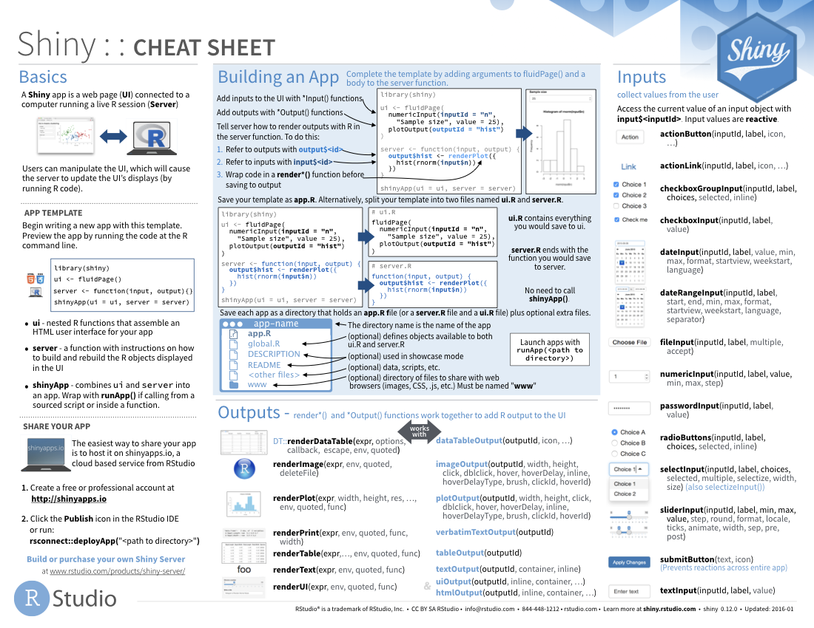

```{r setup, include=FALSE}
library(learnr)
library(gradethis)
library(learnrhash)
library(tidyverse)
gradethis::gradethis_setup()
remotes::install_github("rstudio/gradethis")
```

<style type="text/css">
  body{
  font-size: 13pt;
}
</style>

```{r stormtrooper_i, fig.margin = TRUE, echo = FALSE, fig.width=3, out.width = "100%"}

```

## Introducción

### ¿Qué es Shiny?
Shiny es un paquete de R que te permite crear fácilmente aplicaciones web, interactivas interactivas.

Shiny te permite tomar tu trabajo en R y exponerlo a través de un navegador web para que cualquiera pueda usarlo. Shiny te hace lucir increíble haciendo que sea fácil producir aplicaciones web pulidas con una cantidad mínima de dolor.

En el pasado, la creación de aplicaciones web fue difícil para la mayoría de los usuarios de R porque:

  * Necesita un profundo conocimiento de las tecnologías web como HTML, CSS y JavaScript.

Hacer aplicaciones interactivas complejas requiere un análisis cuidadoso de los flujos de interacción para asegurarse de que cuando cambie una entrada, solo se actualizan las salidas relacionadas.

Shiny hace que sea significativamente más fácil para el programador R crear aplicaciones web por:

  * Proporcionar un conjunto cuidadosamente curado de funciones de interfaz de usuario (UI para cortas) que generan el HTML, CSS y JavaScript necesarios para tareas comunes. Esto significa que no necesita conocer los detalles de HTML / CSS / Javascript hasta que desee ir más allá de lo básico que Shiny le proporciona.

  * Se presenta un nuevo estilo de programación llamado programación reactiva que rastrea automáticamente las dependencias de las piezas de código. Esto significa que cada vez que cambias una entrada, Shiny puede averiguar automáticamente cómo hacer la cantidad más pequeña de trabajo para actualizar todas las salidas relacionadas.

La gente usa Shiny para:

  * Crear paneles de mandos que rastreen importantes indicadores de rendimiento de alto nivel, al tiempo que facilitan la profundización de las métricas que necesitan más investigación.

  * Reemplazar cientos de páginas de PDF con aplicaciones interactivas que permiten al usuario saltar a la pieza exacta de los resultados que se preocupan.

  * Comunicar modelos complejos a una audiencia no técnica con visualizaciones informativas y análisis de sensibilidad interactiva.

  * Proporcionar análisis de datos para flujos de trabajo comunes, reemplazando las solicitudes de correo electrónico con una aplicación Shiny que permite a las personas cargar sus propios datos y realizar análisis estándar. Puede hacer que los análisis de R sofisticados estén disponibles para los usuarios sin habilidades de programación.


En resumen, Shiny te brinda la posibilidad de transmitir algunas de tus superpoderes de R a cualquier persona que pueda usar la web.

## Tu primer Shiny App

En esta sección, crearemos una aplicación Shiny simple. Comenzaremos mostrándote la plantilla mínima necesaria para una aplicación Shiny, y luego aprenderás cómo iniciarla y detenerla.

A continuación, aprenderá los dos componentes clave de cada aplicación Shiny: 

  * La **UI** (abreviatura de interfaz de usuario) que define cómo se ve tu aplicación. 
  
  * La función del **servidor** que define cómo funciona Tu aplicación. 
  
Shiny usa la **programación reactiva** para actualizar automáticamente las salidas cuando cambian las entradas, por lo que terminaremos la sección aprendiendo el tercer componente importante de las aplicaciones Shiny: **las expresiones reactivas**.

Si aún no has instalado Shiny, instálalo ahora con:

```{r, echo=TRUE, eval=FALSE}
install.packages("Shiny")
```

Si ya has instalado Shiny, usa `packageVersion("shiny")` para comprobar que tiene la versión 1.5.0 o superior. Luego cargue en su sesión actual de R:

```{r, echo=TRUE, eval=FALSE}
library(Shiny)
```

### Crear directorio y archivo de la aplicación

Hay varias formas de crear una aplicación Shiny. La más simple es crear un nuevo directorio para su aplicación y poner un solo archivo llamado `app.R` en él.

Este archivo `app.R` se usará para decirle a Shiny cómo debe verse su aplicación y cómo debe comportarse.

Pruébalo creando un nuevo directorio y agregando un archivo `app.R` que se ve así: 

```{r, echo=TRUE, eval=FALSE}
library(shiny)
ui <- fluidPage(
  "Hola mundo!"
)
server <- function(input, output, session) {
  
}
shinyApp(ui, server)
```

¡Esta es una aplicación Shiny completa, aunque demasiado simple! Mirando de cerca el código anterior, nuestra `app.R` hace cuatro cosas:

  * Llama a la biblioteca para cargar el paquete shiny con `library(shiny)` .

  * Define la interfaz de usuario, la página web HTML con la que interactúan los humanos. En este caso, es una página que contiene las palabras "¡Hola mundo!".

  * Especifica el comportamiento de nuestra aplicación definiendo una función de servidor. Actualmente está vacío, por lo que nuestra aplicación no hace nada, pero volveremos para revisar esto en breve.

  * Ejecuta `shinyApp(ui, server)` para construir e iniciar una aplicación Shiny desde la interfaz de usuario y el servidor.
  
:::{.rmdnote}
**Tip**: Hay dos formas convenientes de crear una nueva aplicación en RStudio:

- Crea un nuevo directorio y un archivo `app.R` que contenga una aplicación básica en un solo paso haciendo clic en **Archivo \| Nuevo proyecto **, luego selecciona **Nuevo directorio** y **Shiny Web Application**.

- Si ya has creado el archivo `app.R`, puede agregar rápidamente el texto estándar de la aplicación escribiendo "shinyapp" y presionando Shift + Tab.
:::

### Ejecutar y Detener 

Hay varias formas de ejecutar esta aplicación:

  * Haga clic en el botón **Run App** en la barra de herramientas del documento.

  * Use un atajo de teclado: Cmd/Ctrl + Shift + Enter.

  * Si no está usando RStudio, puedes usar (`source()`) a todo el documento, o llamar a `shiny::runApp()` con la ruta al directorio que contiene `app.R`.
  

```{r run-app, out.width = NULL, echo = FALSE, fig.cap = "El botón Ejecutar aplicación se puede encontrar en la parte superior derecha del panel de origen."}
knitr::include_graphics("images/run-app.png")
```


Elije una de estas opciones y comprueba que ve la misma aplicación que en la imagen siguiente ¡Felicidades! Has creado tu primera aplicación Shiny.


```{r hello-world, out.width = NULL, echo = FALSE, fig.cap = "La aplicación shiny muy básica que verá cuando ejecute el código anterior."}
knitr::include_graphics("images/hello-world.png")
```

Antes de cerrar la aplicación, vuelve a RStudio y observe la consola R. Notarás que dice algo como:

```{r, echo=TRUE, eval=FALSE}
#> Listening on http://127.0.0.1:3827
```

Esto le indica la URL donde se puede encontrar su aplicación: 127.0.0.1 es una dirección estándar que significa "esta computadora" y 3827 es un número de puerto asignado al azar. Puede ingresar esa URL en cualquier navegador web compatible2 para abrir otra copia de su aplicación.

Observe también que R está ocupado: el indicador de R no está visible y la barra de herramientas de la consola muestra un icono de señal de alto. Mientras se ejecuta una aplicación Shiny, "bloquea" la consola R. Esto significa que no puede ejecutar nuevos comandos en la consola R hasta que la aplicación Shiny se detenga.

Puede detener la aplicación y devolver el acceso a la consola mediante cualquiera de estas opciones:

  * Haz clic en el icono de la señal de **stop** en la barra de herramientas de la consola R.

  * Haz clic en la consola, luego presione Esc (o presiona Ctrl + C).

Cierra la ventana de la aplicación Shiny.

El flujo de trabajo básico del desarrollo de la aplicación Shiny es escribir un código, iniciar la aplicación, jugar con la aplicación, escribir más código y repetir. 

Si está utilizando RStudio, ni siquiera necesita detener y reiniciar la aplicación para ver los cambios; puede presionar el botón Recargar la aplicación en la caja de herramientas o usar el atajo de teclado Cmd/Ctrl + Shift + Enter.

### Agregar controles de IU

A continuación, agregaremos algunas entradas y salidas a nuestra interfaz de usuario para que no sea tan mínima. Vamos a crear una aplicación muy simple que le muestra todos los dataframes integrados incluidos en el paquete de conjuntos de datos.

Reemplace su `ui` con este código:

```{r, echo=TRUE, eval=FALSE}
ui <- fluidPage(
  selectInput("dataset", label = "Dataset", choices = ls("package:datasets")),
  verbatimTextOutput("summary"),
  tableOutput("table")
)
```

Este ejemplo usa cuatro funciones nuevas:

  * `fluidPage()` es una función de diseño que configura la estructura visual básica de la página.

  * `selectInput()` es un control de entrada que permite al usuario interactuar con la aplicación proporcionando un valor. En este caso, es un cuadro de selección con la etiqueta `dataset` y le permite elegir uno de los conjuntos de datos integrados que vienen con R.

  * `verbatimTextOutput()` y `tableOutput()` son controles de salida que le dicen a Shiny dónde colocar la salida renderizada (entraremos en el cómo en un momento). `verbatimTextOutput()` muestra código y `tableOutput()` muestra tablas.

Las funciones de diseño, las entradas y las salidas tienen diferentes usos, pero son básicamente las mismas bajo las cubiertas: todas son formas elegantes de generar HTML, y si llama a cualquiera de ellos fuera de una aplicación Shiny, verá HTML impreso en la consola.

No tenga miedo de curiosear para ver cómo funcionan estos diferentes diseños y controles debajo.

Continúa y ejecute la aplicación nuevamente. Ahora verás una página que contiene un cuadro de selección. Solo vemos la entrada, no las dos salidas, porque todavía no le hemos dicho a Shiny cómo se relacionan las entradas y las salidas.


```{r basic-ui, echo = FALSE, out.width = "90%", fig.cap="La aplicación de datasets con interfaz de usuario.", message = FALSE}
knitr::include_graphics("images/ui.png")
```

### Adición de comportamiento

A continuación, daremos vida a las salidas definiéndolas en la función del servidor.

Shiny usa programación reactiva para hacer que las aplicaciones sean interactivas, por ahora, solo ten en cuenta que esto implica decirle a Shiny cómo realizar un cálculo, no ordenarle a Shiny que realmente lo haga. Es como la diferencia entre darle una receta a alguien y exigirle que te haga un sándwich.

Le diremos a Shiny cómo completar el `summary` y los resultados de `table` en la aplicación de muestra proporcionando las "recetas" para esos resultados. Reemplace su función `server` vacía con esto:

```{r, echo=TRUE, eval=FALSE}
server <- function(input, output, session) {
  output$summary <- renderPrint({
    dataset <- get(input$dataset, "package:datasets")
    summary(dataset)
  })
  
  output$table <- renderTable({
    dataset <- get(input$dataset, "package:datasets")
    dataset
  })
}
```

El lado izquierdo del operador de asignación (`<-`), salida `output$ID`, indica que está proporcionando la receta para la salida Shiny con esa `ID`.

El lado derecho de la asignación usa una **función de renderización** específica para envolver algún código que proporciones. Cada función de `render{Type}` está diseñada para producir un tipo particular de salida (por ejemplo, texto, tablas y gráficos) y, a menudo, se empareja con una función de `{type}Output`.

Por ejemplo, en esta aplicación, `renderPrint()` se empareja con `verbatimTextOutput()` para mostrar un resumen estadístico con texto de ancho fijo (literal), y `renderTable()` se empareja con `tableOutput()` para mostrar los datos de entrada en una tabla.

Ejecuta la aplicación nuevamente y juegue, observando lo que sucede con la salida cuando cambia una entrada. A continuación muestra lo que deberías ver cuando abre la aplicación.

```{r basic-server, echo = FALSE, out.width = "90%", fig.cap="Ahora que proporcionamos una función de servidor que conecta salidas y entradas, tenemos una aplicación completamente funcional.", message = FALSE}
knitr::include_graphics("images/server.png")
```

Observa que el `summary` y la `table` se actualizan cada vez que cambia el conjunto de datos de entrada.

Esta dependencia se crea implícitamente porque nos hemos referido a `input$dataset` dentro de las funciones de salida. `input$dataset` se completa con el valor actual del componente UI con id `dataset`, y hará que las salidas se actualicen automáticamente cada vez que ese valor cambie.

Esta es la esencia de la **reactividad**: las salidas reaccionan automáticamente (recalculan) cuando cambian sus entradas.

### Reducir la duplicación con expresiones reactivas

Incluso en este ejemplo simple, tenemos un código duplicado: la siguiente línea está presente en ambas salidas.

```{r, echo=TRUE, eval=FALSE}
dataset <- get(input$dataset, "package:datasets")
```

En todo tipo de programación, es una mala práctica tener código duplicado; puede ser un desperdicio computacional y, lo que es más importante, aumenta la dificultad de mantener o depurar el código. No es tan importante aquí, pero quería ilustrar la idea básica en un contexto muy simple.

En las secuencias de comandos R tradicionales, utilizamos dos técnicas para tratar el código duplicado: capturamos el valor mediante una variable o capturamos el cálculo con una función. Desafortunadamente, ninguno de estos enfoques funciona aquí, por razones que aprenderás después, y necesitamos un nuevo mecanismo: **expresiones reactivas**.

Creas una expresión reactiva envolviendo un bloque de código en `reactive({...})` y asignándolo a una variable, y usas una expresión reactiva llamándola como una función. Pero si bien parece que estás llamando a una función, una expresión reactiva tiene una diferencia importante: solo se ejecuta la primera vez que se llama y luego almacena en caché su resultado hasta que necesita ser actualizado.

Podemos actualizar nuestro `server()` para usar expresiones reactivas, como se muestra a continuación. La aplicación se comporta de manera idéntica, pero funciona un poco más eficientemente porque solo necesitas recuperar el conjunto de datos una vez, no dos.

```{r, echo=TRUE, eval=FALSE}
server <- function(input, output, session) {
  # Create a reactive expression
  dataset <- reactive({
    get(input$dataset, "package:datasets")
  })

  output$summary <- renderPrint({
    # Use a reactive expression by calling it like a function
    summary(dataset())
  })
  
  output$table <- renderTable({
    dataset()
  })
}
```

Volveremos a la programación reactiva varias veces, pero incluso con un conocimiento superficial de entradas, salidas y expresiones reactivas, es posible crear aplicaciones Shiny bastante útiles.

### Resumen

Haz creado una aplicación sencilla; no es muy interesante ni útil, pero ha visto lo fácil que es construir una aplicación web utilizando sus conocimientos de R existentes. Ahora es un buen momento para obtener una copia de la hoja de trucos Shiny. Este es un gran recurso para ayudar a refrescar la memoria de los componentes principales de una aplicación Shiny


```{r echo = FALSE, out.width = "90%", fig.cap="Shiny cheatsheet, disponible en https://www.rstudio.com/resources/cheatsheets/", message = FALSE}

```

### Ejercicios

  * 1 - Crea una aplicación que reciba al usuario por su nombre. Aún no conoces todas las funciones que necesita para hacer esto, así que incluímos algunas líneas de código a continuación. Piensa qué líneas usará y luego cópielas y péguelas en el lugar correcto en una aplicación Shiny.

```{r, echo=TRUE, eval=FALSE}
tableOutput("mortgage")

output$greeting <- renderText({
  paste0("Hello ", input$name)
})

numericInput("age", "How old are you?", value = NA)

textInput("name", "What's your name?")

textOutput("greeting")

output$histogram <- renderPlot({
  hist(rnorm(1000))
}, res = 96)
```

  * 2 - Supon que tu amigo quiere diseñar una aplicación que le permita al usuario establecer un número (x) entre 1 y 50, y muestra el resultado de multiplicar este número por 5. Este es su primer intento:

```{r, echo=TRUE, eval=FALSE}
library(shiny)

ui <- fluidPage(
  sliderInput("x", label = "If x is", min = 1, max = 50, value = 30),
  "then x times 5 is",
  textOutput("product")
)

server <- function(input, output, session) {
  output$product <- renderText({ 
    x * 5
  })
}

shinyApp(ui, server)
```

  * Pero lamentablemente tiene un error:
  
```{r echo = FALSE, out.width = "90%", message = FALSE}
knitr::include_graphics("images/CINCO.png")
```
  
  * ¿Puedes ayudarlos a encontrar y corregir el error?
  
  * 3 - Amplía la aplicación del ejercicio anterior para permitir que el usuario establezca el valor del multiplicador, y, de modo que la aplicación produzca el valor de `x * y`. El resultado final debería verse así:

```{r echo = FALSE, out.width = "90%", message = FALSE}
knitr::include_graphics("images/SEIS.png")
```

  * 4 - Toma la siguiente aplicación que agrega algunas funciones adicionales a la última aplicación descrita en el último ejercicio. ¿Qué hay de nuevo? ¿Cómo podría reducir la cantidad de código duplicado en la aplicación mediante el uso de una expresión reactiva?
  
```{r, echo=TRUE, eval=FALSE}
library(shiny)

ui <- fluidPage(
  sliderInput("x", "If x is", min = 1, max = 50, value = 30),
  sliderInput("y", "and y is", min = 1, max = 50, value = 5),
  "then, (x * y) is", textOutput("product"),
  "and, (x * y) + 5 is", textOutput("product_plus5"),
  "and (x * y) + 10 is", textOutput("product_plus10")
)

server <- function(input, output, session) {
  output$product <- renderText({ 
    product <- input$x * input$y
    product
  })
  output$product_plus5 <- renderText({ 
    product <- input$x * input$y
    product + 5
  })
  output$product_plus10 <- renderText({ 
    product <- input$x * input$y
    product + 10
  })
}

shinyApp(ui, server)
```

  * 5 - La siguiente aplicación es muy similar a una que viste anteriormente: seleccionas un conjunto de datos de un paquete (esta vez usamos el paquete ggplot2) y la aplicación imprime un `summary` y un gráfico de los datos. También sigue las buenas prácticas y hace uso de expresiones reactivas para evitar la redundancia de código. Sin embargo, hay tres errores en el código que se proporciona a continuación. ¿Puedes encontrarlos y arreglarlos?

```{r, echo=TRUE, eval=FALSE}
library(shiny)
library(ggplot2)

datasets <- c("economics", "faithfuld", "seals")
ui <- fluidPage(
  selectInput("dataset", "Dataset", choices = datasets),
  verbatimTextOutput("summary"),
  tableOutput("plot")
)

server <- function(input, output, session) {
  dataset <- reactive({
    get(input$dataset, "package:ggplot2")
  })
  output$summmry <- renderPrint({
    summary(dataset())
  })
  output$plot <- renderPlot({
    plot(dataset)
  }, res = 96)
}

shinyApp(ui, server)
```


## Conceptos de UI

Ahora que tienes una aplicación básica en tu haber, podemos comenzar a explorar los detalles que hacen que Shiny funcione. Como viste en la sección anterior, Shiny fomenta la separación del código que genera la interfaz de usuario (el **front-end**) del código que impulsa el comportamiento de tu aplicación (el **back-end**).

En esta sección, nos centraremos en la interfaz y le daremos un recorrido rápido de las entradas y salidas HTML proporcionadas por Shiny. Esto te brinda la capacidad de capturar muchos tipos de datos y mostrar muchos tipos de salida R. Todavía no tienes muchas formas de unir las entradas y salidas.

  Aquí nos referiremos principalmente a las entradas y salidas integradas en Shiny. Sin embargo, existe una comunidad rica y vibrante de paquetes de extensión, como `shinyWidgets`, `colorpicker` y `sorttable`.
  
Pueded encontrar una lista completa y mantenida activamente de otros paquetes en https://github.com/nanxstats/awesome-shiny-extensions.

Como de costumbre, comenzaremos cargando el paquete `shiny`:

```{r, echo=TRUE, eval=FALSE}
library(shiny)
```

### Inputs

Como vimos en la sección anterior, utiliza funciones como `sliderInput()`, `selectInput()`, `textInput()` y `numericInput()` para insertar controles de entrada en la especificación de la interfaz de usuario.

Ahora discutiremos la estructura común que subyace a todas las funciones de entrada y brindaremos una descripción general rápida de las entradas integradas en Shiny.

  * **Estructura común**
  
Todas las funciones de entrada tienen el mismo primer argumento: `inputId`. Este es el identificador utilizado para conectar el **front-end** con el **back-end**: si su interfaz de usuario tiene una entrada con ID `name`, la función del servidor accederá a ella con la `input$name`.

El `inputId` tiene dos restricciones:

  * Debe ser una cadena simple que contenga solo letras, números y guiones bajos (¡no se permiten espacios, guiones, puntos u otros caracteres especiales!). Nómbrelo como lo haría con una variable en R.

  * Debe ser único. Si no es único, no tendrá forma de referirse a este control en la función de tu servidor.

La mayoría de las funciones de entrada tienen un segundo parámetro llamado etiqueta. Esto se utiliza para crear una etiqueta legible por humanos para el control. Shiny no impone restricciones a este string, pero deberás pensarlo detenidamente para asegurarte de que los humanos puedan utilizar tu aplicación. El tercer parámetro suele ser el valor, que, cuando es posible, le permite establecer el valor predeterminado. Los demás parámetros son exclusivos del control.

Al crear una entrada, recomiendo proporcionar el `inputId` y los argumentos de etiqueta por posición, y todos los demás argumentos por nombre:

```{r, echo=TRUE, eval=FALSE}
sliderInput("min", "Limit (minimum)", value = 50, min = 0, max = 100)
```

Las siguientes secciones describen las entradas integradas en brillante, agrupadas libremente de acuerdo con el tipo de control que crean. El objetivo es brindarte una visión general rápida de sus opciones, no para describir de manera exhaustiva todos los argumentos. 

Mostrarémos los parámetros más importantes para cada control a continuación, pero deberá leer la documentación para obtener los detalles completos.

### Texto libre

Recoge pequeñas cantidades de texto con `textInput()`, contraseñas con `passwordInput()`, y los párrafos del texto con `textAreaInput()`.

```{r, echo=TRUE, eval=FALSE}
ui <- fluidPage(
  textInput("name", "What's your name?"),
  passwordInput("password", "What's your password?"),
  textAreaInput("story", "Tell me about yourself", rows = 3)
)
```

```{r echo = FALSE, out.width = "90%", message = FALSE}

```

Si desea asegurarse de que el texto tenga ciertas propiedades, puede usar `validate()`.

### Entradas numéricas

Para recolectar valores numéricos, crea un cuadro de texto restringido con `numericInput()` o un control deslizante con `sliderInput()`. 

Si suministra un vector numérico de longitud 2 para el valor predeterminado de `SliderInput()`, obtiene un control deslizante de "rango" con dos extremos.

```{r, echo=TRUE, eval=FALSE}
ui <- fluidPage(
  numericInput("num", "Number one", value = 0, min = 0, max = 100),
  sliderInput("num2", "Number two", value = 50, min = 0, max = 100),
  sliderInput("rng", "Range", value = c(10, 20), min = 0, max = 100)
)
```


```{r echo = FALSE, out.width = "90%", message = FALSE}
knitr::include_graphics("images/numeric.png")
```

## Enviar Ejercicios

### Material de referencia

Hadley Wickham y Garrett Grolemund, "R for Data Science: Import, Tidy, Transform, Visualize, and Model Data" O'REILLY [`R for Data Science`](https://r4ds.had.co.nz/)


```{r context="server"}
learnrhash::encoder_logic()
```

```{r encode, echo=FALSE}
learnrhash::encoder_ui(
  ui_before = shiny::div(
    "Si ha completado este tutorial y está satisfecho con todos sus",
     "soluciones, haga clic en el botón de abajo para generar su hash y",
     "envíalo usando el siguiente formulario:",
    shiny::tags$br()
  )
)
```


Enviar hash al siguiente link -> [__Aqui__](https://docs.google.com/spreadsheets/d/1eXNEGrumywfCt4xop5ygcJGxbXI5kfNdiHOztiGspoA/edit?usp=sharing)

```{r stormtrooper3, echo = FALSE}
knitr::include_graphics("images/morant.jpg")
```


