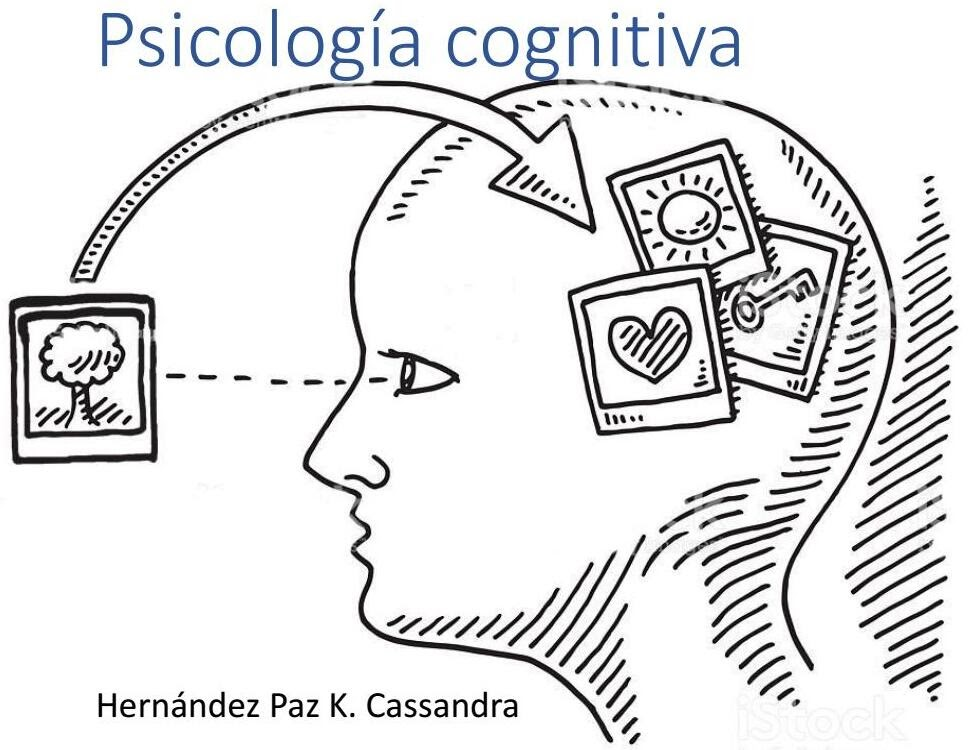
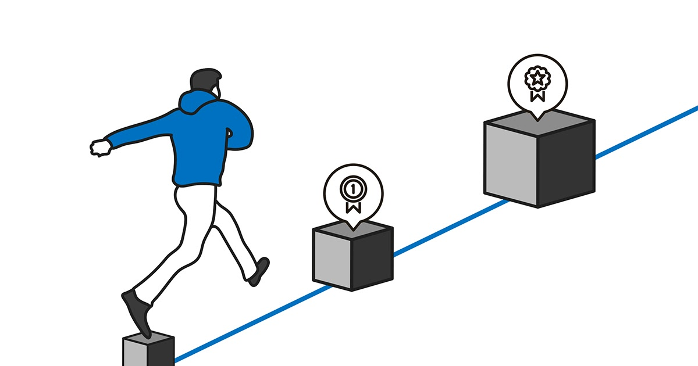

<style type="text/css">
  body{
  font-size: 13pt;
  text-align: justify;
  text-justify: inter-word;
}
</style>

```{r setup, include=FALSE}
library(learnr)
```

```{r fig.margin = TRUE, echo = FALSE, fig.width=3, out.width = "80%", fig.align="center"}

```


## Introducción 

### Ciencia y práctica en la educación

Desafortunadamente la práctica en educación se ejecuta sin tener evidencias científicas de que los métodos funcionan. En lugar de tener fundamentos sólidos nos enfocamos en la intuición en cómo enseñar y cómo aprender con consecuencias negativas.

Es como utilizar la vacuna del coronavirus sin antes tener evidencia científica de que realmente funcione. Henry L. (Roddy) Roediger III reportó que desafortunadamente la práctica en educación en su mayoría no está fundamentada en descubrimientos científicos.

En este curso vamos a revisar los procesos básicos de la percepción, la atención y la memoria según las investigaciones y cómo aplican en la práctica. 

Si la ciencia apoya la efectividad de cierta estrategia de aprendizaje, la debemos adoptar, al mismo tiempo debemos seguir siendo flexibles, por qué la ciencia sigue evolucionando.

¿Tú te pondrías la vacuna aunque no haya sido probada? o peor aún ¿si científicamente está comprobado que no funciona?

```{r fig.margin = TRUE, echo = FALSE, fig.width=3, out.width = "50%", fig.align="center"}

```

La psicología cognitiva se define usualmente como el estudio de la mente, incluyendo procesos como; la percepción, la atención y la memoria (No la confundamos con la neurociencia que se enfoca en como funciona el cerebro) ayuda a entender el aprendizaje al probar hipótesis de estrategias de aprendizaje que fueron desarrolladas por lo que ahora sabemos de la mente.

Una forma diferente de evidencia es la intuición porque nuestro sentir acerca de cómo aprendemos es más convincente que la realidad, por ejemplo, si un estudiante lee y vuelve a leer un libro de texto se volverán cada vez más confiados de que les irá bien en un examen, si otro grupo de estudiantes en lugar de esta estrategia hacen ejercicios, estarán menos confiados en su rendimiento en el examen. 


Porque estos ejercicios pueden sentirse difíciles, pero en realidad, aquellos que tomaron los ejercicios de práctica obtendrán mejores rendimientos que los alumnos que releyeron los libros de texto, por esto, hacerle caso a nuestra intuición de cómo aprendemos puede ser contraproducente.

No sólo nuestra intuición puede ser una mala guía también podemos guiar de mala manera a otros. Los estilos de aprendizaje describen la idea de que los estudiantes aprenden de diferentes formas, entre los estilos más populares están el visual y el verbal, la idea es que algunos aprendan visualmente y otros verbalmente.


Un grupo de científicos en 2008 descubrieron que no existe evidencia para apoyar este punto de vista (pashler, mcdaniel, rohrer & bjork, 2008) maestros de matemáticas elementales de Estados Unidos reconocen la importancia de enseñar matemáticas utilizando los métodos recomendados por la psicología cognitiva a pesar de esto muy pocos acceden a publicaciones científicas relevantes, respondieron a la encuesta que nunca acceden a publicaciones en revistas científicas para mejorar sus habilidades de enseñanza en la práctica. 

De acuerdo a pomerance, greenberg & walsh, 2016, muy pocos cursos de educación para maestros cubren principios de la psicología cognitiva relacionados con el aprendizaje, esto sugiere que las 6 principales estrategias que han recibido la mayor evidencia de formas de aprender basadas en psicología cognitiva no están encontrando un camino para encontrarse con experiencias de aprendizaje en los salones de clase.

  * **Práctica Espaciada**.
  * **Práctica de Recuperación**.
  * **Elaboración**.
  * **Entrelazado**.
  * **Ejemplos Concretos**.
  * **Codificación Dual**.
  
### ¿La investigación es inaccesible a maestros?

la discrepancia entre la investigación y la práctica es más compleja que sólo una comunicación interrumpida, hay tres razones principales:
  
  * 1 - Falta de tiempo y acceso a revistas académicas y la dificultad de interpretar la escritura técnica.
  
  * 2 - Incomodidad con los cambios, hallazgos imprecisos y reluctancia con aceptar hallazgos que no empata con su propia intuición.
  
  * 3 - Baja confianza en investigadores los maestros pueden sentir que los investigadores no tienen consciente lo que realmente sucede en el salón de clases y hacen recomendaciones irrelevantes.

## Percepción

Antes de hablar de aprendizaje tenemos que hablar de percepción esto es porque la percepción determina como entendemos el mundo la percepción envuelve los cinco sentidos, aunque los más relevantes para el aprendizaje sea la vista y el oído, pongamos un ejemplo de oído:

Imagina que vas caminando en el bosque y escuchas un ruido de un crujido, tu reacción va a depender de lo que sepas o intérpretes, puedes pensar en una rama que se rompió y sigues caminando o puedes pensar que están cargando una escopeta y te asustas o tal vez no te asustes porque sabes que hay cazadores cerca y tomaste las medidas de precaución correctas para alejarte de los las áreas designadas para la caza, depende de lo que pienses puedes tener ninguna reacción como que se eleve dramáticamente tu pulso cardíaco o no.

```{r fig.margin = TRUE, echo = FALSE, fig.width=3, out.width = "50%", fig.align="center"}
knitr::include_graphics("images/tres.jpg")
```

Este ejemplo, ilustra que la interpretación de algo (en este caso un sonido) depende de lo que sabemos de él, pero saber que fue una rama en lugar de una escopeta no cambia las ondas del sonido, sólo cambia la forma en que las escuchas, esto es clave para diferenciar la sensibilidad de la percepción.

La sensación son las señales que reciben tus órganos a través de los cinco sentidos mientras que la percepción es la interpretación de esas señales, esto es que la percepción cambia de persona a persona y de situación a situación.

Muchas veces los maestros pueden creer que le están dando a sus alumnos conocimiento y evaluando de una forma neutral e imparcial pero los estudiantes van a traer a la mesa sus propias nociones preconcebidas, reacciones y actitudes al material.

Cuándo hablamos de percepción por lo general se habla de procesar la información de abajo hacia arriba y de arriba hacia abajo, abajo hacia arriba pones el foco en la información que llega que viene de lo que sea que tratas de percibir y tratas de entenderlo sin traer conocimiento previo.

Los bebés recién nacidos por lo general tienen un procesamiento de abajo hacia arriba por ejemplo, si escuchas una alarma se van a mostrar incómodos e incluso empiecen a llorar pero no piensan lo que la alarma significa. El procesamiento de arriba hacia abajo, por el otro lado, requiere traer tu conocimiento previo y así interpretar la información que estás recibiendo.

Tendemos a pensar que cuando vemos algo juntamos las piezas de lo que realmente está (abajo hacia arriba)  sin embargo, utilizamos más procesamientos de arriba hacia abajo de lo que pensamos.

Ejemplo:

```{r fig.margin = TRUE, echo = FALSE, fig.width=3, out.width = "50%", fig.align="center"}

```

Los estudiantes traen diferentes experiencias así como diferentes tipos y niveles de conocimiento al salón de clases y esto va a afectar Cómo percibe la información presentada en el salón de clases

### ¿Cómo juega esto en el salón?

Un estudiante podrá enlazar ideas abstractas a un ejemplo de su vida, esto hará que sea mucho más fácil de recordar, otro estudiante tal vez no tenga una experiencia similar y sólo puede interpretar el concepto de forma más abstracta y le será más difícil de recordar.

```{r fig.margin = TRUE, echo = FALSE, fig.width=3, out.width = "50%", fig.align="center"}

```

Al darnos cuenta que estas diferencias existen desde el principio es un paso importante a tomar para hacer que el conocimiento sea accesible para todos los alumnos. La maldición al conocimiento es el fenómeno de pensar que algo es fácil obvio por el hecho de que ya tienes mucha experiencia.

A veces los maestros carecen de la conciencia de cómo procesa la información un alumno. Esos profesores alguna vez fueron alumnos y no tenían conocimiento de todo lo que ahora enseñan, es difícil para ellos desaprender la información para ponerse en los zapatos del estudiante y experimentar la novedad de aprender estos conceptos.

Una posible solución es disminuir la sobre confianza para pensar en respuestas o explicaciones alternativas (Nickerson 1999)


## Atención

La atención es notoriamente difícil de definir, pero es esencial para que el aprendizaje ocurra. Los recursos de nuestra atención son limitados y por esto  el profesor tiene que estar direccionando a la información más importante o relevante.

```{r fig.margin = TRUE, echo = FALSE, fig.width=3, out.width = "50%", fig.align="center"}

```

La definición más común y aceptada de la atención entre psicólogos cognitivos es:

  * El foco en un estímulo específico o la habilidad de poner el foco en un estímulo específico o lugar.

  * Normalmente se dice que la atención es un recurso con capacidad limitada se puede pensar como un presupuesto como analogía.

Tienes cierta cantidad de dinero y eliges cómo gastarlo, todos tenemos cierta cantidad de atención y la utilizas para realizar diferentes tareas, si haces una tarea muy difícil que requiere de toda tu atención no te quedará mucha para hacer cualquier otra cosa.

La idea de que tenemos recursos limitados para la atención nos limita en la cantidad de información que podemos procesar en cualquier momento.

La cantidad de información que es posible manejar por nuestra atención se le llama carga cognitiva, cuando sobrepasa nuestra capacidad se le llama sobrecarga cognitiva.

La teoría de carga cognitiva de sweller dice que como tenemos recursos limitados para procesar información en un momento, es muy importante evitar sobrecargar la atención con información o material innecesario.


### El mito de la multitarea

Una característica importantísima de la atención es que sólo podemos seleccionar un punto en donde mantendremos el foco de nuestra atención, es prácticamente imposible poner atención a más de una cosa al mismo tiempo.

```{r fig.margin = TRUE, echo = FALSE, fig.width=3, out.width = "50%", fig.align="center"}

```

Podrías protestar que puedes manejar mientras escuchas música y que puedes tener la televisión prendida o la música mientras estudias y que no son una distracción para ti, y tal vez es algo que te has acostumbrado a tener en el fondo y sientes que es algo complementario y que no distrae o interfiere con tus estudios.

 **Déjame decirte que resulta que esta intuición es incorrecta**

Cuando sientes que estás haciendo tareas a la vez, o poniendo atención a más de una cosa, lo que realmente estás haciendo es cambiar de foco de ida y vuelta entre las cosas que crees poner atención al mismo tiempo.

Algo importante a considerar es que mientras cambias tu atención de ida y vuelta, llegan costos importantes, este costo es que se reduce la eficiencia y la la velocidad de reacción en ambas tareas.


### ¿Qué factores lleva la atención hacia el aprendizaje?

La teoría del incremento del rasgo sobresaliente de la atención indica que los recursos de la atención constantemente cambia por lo que algunas cosas sobresalen más que otras.

Ejemplo: Cuenta objetos rojos de tu habitación ¿No es increíble?

Esta sobresaliencia Podría tener varios orígenes:

 * La motivación del estudiante.
 * El nivel de interés en el material.
 * La forma en la que la información es presentada por el maestro.
 * Características abajo arriba como colores brillosos y sonidos altos.

```{r fig.margin = TRUE, echo = FALSE, fig.width=3, out.width = "50%", fig.align="center"}

```

Hidi y Harackiwicz (2000) Distinguieron entre dos tipos de intereses que un individuo puede tener dos puntos intereses individuales e intereses situacionales.

Por ejemplo, tú estás interesado en este contenido que les doy pues pagaste por ello y sabes qué te sirve para tu vida, intereses de la situación es que tan interesante el maestro hace la clase.

La comunicación clara de ideas dichas en un buen nivel de dificultad, actividades para los alumnos como que investiguen información y den la clase, usar ejemplos concretos.

Nota que esto no es lo mismo que la motivación interna y externa que como hemos visto se refiere que el aprendizaje se está llevando a cabo sólo por voluntad propia del alumno o premios o castigos externos.

Esta distinción es importante porque las recompensas extrínsecas o castigos puede ser perjudiciales para las motivaciones extrínsecas e intrínsecas, el interés situacional puede mantener e incluso fortalecer los intereses inherentes.

### ¿Cuáles son las consecuencias de no poner atención?

Sin importar la motivación que tengas tenemos que admitir que a veces nos vamos a distraer de lo que se supone que estás haciendo o pensando, a estas distracciones los psicólogos cognitivos les llaman mind-wandering (mente deambulante) y a lo que deberías de estar poniendo atención le llaman task set (conjunto de tareas)

Las **mentes deambulantes**, tienen una relación interesante con la dificultad de la tarea.

```{r fig.margin = TRUE, echo = FALSE, fig.width=3, out.width = "50%", fig.align="center"}

```

Las personas tienden a tener una mente deambulante mucho más frecuente cuando tienen una tarea fácil que una difícil. Los investigadores proponen que alrededor de la mitad del tiempo, los estudiantes no prestan atención a lo que el maestro está diciendo.

Esto es un problema porque si pierden de  información relevante, los estudiantes reportan que el número de momentos deambulantes tiene una correlación con la comprensión de lectura posterior y el rendimiento de la memoria pero no es la causa.

También sucede durante exámenes y esto podría causar un manejo pobre del tiempo y posiblemente reprobarlo.

### Capacidad de la memoria a corto plazo.

Una área de investigación intensiva es en la capacidad de nuestra memoria de corto plazo, no sólo en términos de tiempo, sino en términos de Cuántos elementos separados de información pueden ser guardados en la memoria en cualquier momento. Muchas personas tienden a tener una extensión de dígitos de 5 a 9 ítems quiere decir que la capacidad de la memoria de corto plazo Le vamos a llamar la extensión de tarea:

Ejemplo: aprende los siguientes 17 items

```{r fig.margin = TRUE, echo = FALSE, fig.width=3, out.width = "50%", fig.align="center"}

```

Ahora trata de aprenderlo

```{r fig.margin = TRUE, echo = FALSE, fig.width=3, out.width = "50%", fig.align="center"}

```


Adicionalmente al almacenamiento, la memoria de corto plazo nos permite  manipular información y cambiar entre tareas aunque no serás más eficiente que si sólo te dedicas a una sin embargo, en el contexto para aprender información a largo plazo lo más importante es pasar la información de la memoria de corto plazo a la de largo plazo.

El proceso de la memoria de corto plazo esencialmente decide qué es lo que realmente vale la pena quedarse y qué puede olvidarse por completo en una ventana de 15 a 30 segundos.

## Memoria de trabajo
 
Muchos psicólogos cognitivos han intentado explicar el proceso que lleva a cabo la atención a través de un modelo que le llaman a la **memoria de trabajo**.

Este modelo describe el proceso de mantener la información, manipularla, y enviarla a la memoria de largo plazo y nos puede ayudar a cambiar entre tareas, en  particular estos psicólogos están interesados en tres procesos en particular:

  * 1 - Bucle fonológico.
  * 2 - Block de dibujo visuoespacial.
  * 3 - Ejecutivo central.

El bucle fonológico habla esencialmente de repetir lo que no quieres olvidar una y otra vez para que lo recuerdes por un momento breve.

Ejemplo: Aprender número de celular por nopoder dar clic, si tú bucle fonológico está ocupado haciendo algo vas a tener un momento difícil.

```{r fig.margin = TRUE, echo = FALSE, fig.width=3, out.width = "50%", fig.align="center"}

```

Blog de dibujo visoespacial, por otro lado, te ayuda a guardar información visual utilizando imágenes

Ejemplo: Traza la ruta desde tu cuarto a la cocina y te imaginas a ti recorriéndolo

Aparentemente trabaja independientemente al bucle fonológico.

Ejemplo: Ahora inténtalo diciendo dddd

Son procesos cognitivos diferentes, el tercer proceso, el ejecutivo central, no está completamente claro que hace esta parte del modelo.

Involucra todos los procesos restantes de la memoria de trabajo y está muy relacionado con la atención:

  * Determina a qué específicamente poner el foco determina que información mandar o recibir de la memoria a largo plazo hace la interconexión entre el bucle fonológico y el block de dibujo visuoespacial.

### Diferencias individuales en la atención.

```{r fig.margin = TRUE, echo = FALSE, fig.width=3, out.width = "50%", fig.align="center"}

```

La tendencia en soltar la concentración difiere de persona a persona y durante la vida, por ejemplo,  adultos mayores reportan menos mentes deambulantes que adultos más jóvenes, voy a describir tres teorías que intentan explicar las diferencias entre personas y porqué algunas personas podrían encontrar lo más difícil mantener el foco.

**Capacidad de la memoria de trabajo**

Se refiere a que los recursos de la atención es dependiente de cuanta información podemos retener y manipular en cualquier momento.

**Velocidad de procesamiento**

Se refiere que los recursos de la atención depende de qué tan rápido podemos hacer este tipo de tareas (15x7, etc) mientras más rápido logremos procesar cosas mejor podremos llevar a cabo tareas que requieren múltiples pedazos de información.
 
**Control en la atención**

Esta teoría pone la carga en la habilidad de poner el foco dónde lo elegimos en cualquier momento, aquellas que tienen mayor control de la tensión tiene una mayor habilidad de elegir donde poner el foco, mantenerlo por períodos largos sin distraerse o empezar con la mente deambulante.

Recientemente han empezado a intentar entrenar el cerebro a través de juegos y que practiquen para aumentar la capacidad, hacer operaciones más rápido y controlar la atención.

Pero no hay evidencia de que fuera de los juegos, en la vida real, también aplica. 

Por esta razón me voy a enfocar en estrategias de aprendizaje efectivas y no en intenta entrenar el cerebro. 

## Tipos de memoria

Nuestra identidad está llena de cosas que recordamos o hemos vivido y que pensamos acerca de nosotros mismos, tal vez ahora ya tienes una identidad aspiracional hacia el futuro llena de metas proyectos objetivos, por ejemplo, terminar la carrera, estar sanos, tener tu propio negocio, incluso cómo y dónde retirarte. 

Pero que imaginamos o que hacemos cuando imaginamos el futuro, el viaje hacia el futuro mental y la teoría más popular dice que el proceso es más o menos el mismo que recordar.

```{r fig.margin = TRUE, echo = FALSE, fig.width=3, out.width = "50%", fig.align="center"}
knitr::include_graphics("images/14.jpg")
```

Lo que realmente estamos haciendo cuando imaginamos nuestro futuro es tomar pedazos de información de nuestro pasado incluso de lo que hemos leído o de lo que hemos visto en películas y las proyectamos hacia el futuro a una nueva situación imaginaria.

Pero tu autoconcepto no es lo único para lo que sirve la memoria todo lo que haces requiere de la memoria de alguna u otra manera, y te voy a poner algunos ejemplos en donde utilizamos la memoria.

**Recordar nombres**:  Tal vez pensamos que somos malos con los nombres pero es probable que los recordamos con mayor facilidad son los nombres de nuestros familiares y amigos esto pasa porque tenemos más oportunidades de practicar y usar esos nombres en el día a día .

**Recordar si hemos hecho algo**: A lo mejor te ha pasado no recuerdas si hiciste algo, si te tomaste tu pastilla o en dónde guardaste algún objeto personal y este proceso qué nos previene de estar seguros si sí lo hicimos o no se le llama interferencia es un problema muy común especialmente en adultos mayores que tienden a estar en mayor medicación y tienden a tener memorias más pobres.

**Recordar hacer algo en el futuro**:  La memoria prospectiva nos permite planear hacer algo.

**Ser capaz de entender una plática**: Cuando escuchas a alguien hablar tienes que integrar las palabras que están diciendo una detrás de otra porque si tú olvidarás una palabra inmediatamente después de que escuchas lo siguiente solamente escucharías un conjunto de palabras individuales y no podrías crear el entendimiento. El proceso que utilizamos para este tipo de evento en el momento se llama la **memoria de trabajo**.

**Recordar cómo hacer algo**: Tal vez algunas veces puedes recordar el proceso o el conjunto de acciones sin realmente poder describir las por ejemplo, tocar el piano. Esta memoria que depende de tus habilidades. Normalmente se le llama la **memoria de procedimiento** y es diferente a la memoria declarativa que con estasi somos capaces de reportar nuestras memorias, algunos piensan que ahora que tenemos el internet ya no nos debemos preocupar de la memoria, de hecho, los humanos hemos dependido de factores externos o de sistemas externos de memoria durante muchos años. Los libros, anotar notas, listas recordatorios desde hace muchas generaciones.

En algunas situaciones es mucho más factible olvidar algo o algún lugar donde nos tomamos una foto que algo que solamente vimos. Quiero que te preguntes porque no sólo utilizó mi computadora la respuesta a esa pregunta es obvia por qué no puedes utilizar tu computadora sin utilizar la memoria antes.

### La memoria no es  como una biblioteca, la memoria se reconstruye.

Antes se pensaba que la memoria era como una biblioteca entraba conocimiento y se guardaba en un mismo lugar y cuando no recordamos un objeto o un concepto era porque a lo mejor no lo habíamos guardado de forma eficiente. Ahora se ha demostrado que no es así el concepto principal de la memoria de largo plazo es la idea de que cada vez que recuerdas una memoria de hecho la estás cambiando cada vez que tú dices una historia sale un poco más pulida embelleciendo algunos detalles optando algunos puntos aburridos.  

La memoria está cambiando no sólo la historia así que la siguiente vez que recuerdes esa memoria de ese evento va a estar más parecida a la última vez que lo contaste en lugar de como realmente fue la memoria es reconstruida en la naturaleza y cada vez que una memoria está activada se altera.

### La memoria no es objetiva.

El hecho de que la memoria se reconstruye necesariamente significa que la memoria no es subjetiva.

Somos propensos a tener falsas memorias esas son memorias de cosas que nunca pasaron o que pasaron muy diferente de lo que recordamos, además como vemos el mundo desde nuestro único filtro, la vista del mundo,  tendemos a recordar las cosas en una manera que encaje con nuestro esquema o categorizaciones predeterminadas del mundo y como los objetos y las personas interactúan.

La Dra. Elizabeth loftus, demostró que los testimonios de los Testigos de eventos criminales pueden ser inadvertidamente afectados por información encontrada después del evento, cuando los policías preguntan repetidamente y tú discutes el evento una y otra vez con tus amigos, la doctora demostró en muchos experimentos que para el momento en el que tuviste todas las conversaciones con la policía y tus amigos la memoria del evento criminal va a ser una mezcla de lo que realmente viste con lo que le contaste a las personas y lo que otras personas te dijeron que ellos vieron o pensaron que tú posiblemente viste.

Una reconstrucción similar de la memoria también puede ocurrir en un contexto educacional. Por ejemplo, si tus amigos te dicen algo después tú puedes pensar que lo escuchaste de tu profesor o de otra fuente confiable.  

También los detalles de nuestros sueños pueden modificar las memorias de los eventos en la vida real.

Entonces hemos visto que recordar información de una forma reconstructiva potencialmente introduce errores, entender que la memoria es reconstruida cada vez que Intentamos recuperarla es importante para cuando te explique las estrategias que discutiremos más adelante, en particular, recordar información correctamente de hecho fortalece la memoria.

### La memoria consiste de  varios procesos diferentes.

Múltiples procesos son pensados la experiencia de la memoria.

    Memoria de corto plazo versus largo plazo:

Cuando me refiero a la memoria de corto plazo normalmente es una ventana de 15 30 segundos, la razón por la que los psicólogos cognitivos creen que hay algo especial en la ventana de 15 a 30 segundos es porque han visto que las personas que pierden la memoria por completo todavía son capaces de recordar algo en esta ventana de tiempo.

### Memoria de procedimiento versus memoria declarativa.

La memoria declarativa se refieren a las memorias qué podemos acceder directamente que voluntariamente podemos reportar el contenido y que estamos conscientes de que la recordamos por ejemplo aprender el nombre de una persona, recordar si tomamos nuestra medicina o recordar donde pusimos el celular o las llaves del coche.

La memoria de procedimiento se demuestra con tus acciones y no envuelve directamente reportar el contenido de la memoria Como por ejemplo caminar, y cualquier cosa que puedes hacer sin tener la conciencia una explicación de cómo las hiciste Cómo encontrar la forma de llegar a tu casa sin poder decir unas instrucciones precisas.

### Mandar la memoria a la memoria de largo plazo.

Para que podamos recordar una memoria después tiene que pasar de la memoria de corto plazo a la de largo plazo y depende de varios factores algunos no están claros por la ciencia a pesar de ello un factor sumamente importante y si la información se codificó de una forma profunda o de una forma significativa para que las conexiones se puedan hacer y el entendimiento se pueda alcanzar la memoria de largo plazo por lo general está descrita en cuatro etapas:

    * 1 - Codificación
    * 2 - Consolidación
    * 3 - Almacenaje
    * 4 - Recuperación

Si una memoria nunca es codificada entonces nunca fue creada en primer lugar pues no hay nada qué recuperar, por ejemplo:

Imagina que estás tomando una empresa de papel con varios números enfrente de tu cara pero tú nunca abriste los ojos todo el tiempo que la hoja estuvo frente a tu cara, sin embargo,  a pesar de que una memoria sea codificada no significa que tú la vas a recordar después requiere de la consolidación.

La consolidación no es un evento único cuando recuperamos una memoria se reconstruye se reactiva y se re consolida.

Efrat furst, una neurocientífica cognitiva Explica cómo la memoria es representada en el cerebro. 

Desde su perspectiva de la neurociencia la memoria es todo lo que alguien ha experimentado y se representa en redes neuronales en el cerebro pueden ser simples o complejas conscientes o inconscientes hechos eventos procesos, etcétera. Por esto todo lo que se ha aprendido es memoria ahora una pregunta interesante es como es representada la memoria y como esto puede influenciar comportamientos futuros lo que tenemos guardado en nuestra memoria de largo plazo es lo que nos permite reconocernos a cada uno de nosotros como seres individuales.

Aquí te explico Cómo se guarda la información en el cerebro basado en principios neurocientíficos

    ¿Cómo es la memoria representada en el cerebro?
  
  * El cerebro está hecho de neuronas que se comunican entre ellas una neurona activa puede activar a otra si tienen una conexión mutua qué se le llama sinapsis que sea suficientemente fuerte, las memorias se representan por grupos de neuronas que están conectadas entre ellas por las sinapsis cuando neuronas activas en un cierto grupo se sincronizan activamente podemos recordar un concepto un episodio o incluso ejecutar un procedimiento.

  * Los neurocientíficos le llamen a este patrón de neuronas activas un engrama. Los engramas por estar conectados entre ellos por sinapsis para crear asociaciones, una memoria específica se compone de múltiples en grama a veces en diferentes lugares anatómicos que están conectados entre ellos mismos por caminos neuronales.


    Dibujo de red neuronal ¿Qué pasa cuando aprendemos?
 
  * Cuando aprendemos algo nuevo grupos específicos de neuronas se prenden en nuestro cerebro como respuesta a información entrante,  creando patrones. Algunos de estos patrones son  absolutamente nuevos, y algunos otros representan información que ya sabemos, la pregunta crucial es: estos nuevos patrones que se crearon por primera vez y están activos ¿Podrán ser reproducidos en el futuro? sabemos que para recordar necesitamos reactivar un patrón muy similar al que fue activo cuando estábamos aprendiendo, pero ¿de qué depende esto?

          
    ¿Cómo es que nueva información adquirida se vuelven engramas y se guardan en el cerebro?

  * Bajo ciertas condiciones una red neuronal pasa por un proceso de consolidación, es decir, las conexiones entre las neuronas activas se fortalecen para crear un engrama, este procedimiento requiere de recursos biológicos, tiempo y energía para que este engrama dure por un tiempo prolongado.

  * Descansar y dormir son un factor importante en la consolidación, la consolidación es crucial no sólo para los engramas sino para crear caminos neuronales para tener acceso a ellos y para las asociaciones con otros engramas.

  * Se sabe que tener conocimiento previo una red ya establecida hace que sea mucho más fácil y rápido consolidar nuevas memorias. 


    ¿Qué le pasa a la entrada cuando lo utilizamos?
 
  * Siguiendo la consolidación las memorias son oficialmente Memorias de largo plazo Lo que implica que podemos utilizar la misma memoria una y otra vez por períodos largos de tiempo. 
 
  * A pesar de esto resulta que la consolidación no es un evento único los engramas puede ser maleados y sujetos a modificaciones subsecuentes por una re consolidación esto significa que cada vez que usamos una memoria reconstruimos nuestra red de memorias.
 
  * Cuando aprendemos un nuevo concepto la retención depende en construir un engrama y formando una asociación existente con otro engrama esto depende en nuestra habilidad de recuperar engramas existentes y en crear las conexiones activas cuando aprendemos.

    
    La ciencia cognitiva y la neurociencia

  * Estos principios son valiosos como base para considerar estrategias que son conocidas como efectivas para aprender. En cierto sentido la neurociencia, la evidencia neurocientífica nos permite pensar más concretamente de los mecanismos y entender los beneficios de la práctica espacial, crear conexiones significativas entre nuevo conocimiento y previo conocimiento y recordar conocimiento previo, estas estrategias nos permiten que nueva información Se integre con conocimientos recuperado previamente y luego consolidarla, este esfuerzo de reconstrucción es la clave para una experiencia de aprendizaje efectivo.

## Olvidar

Olvidar es la inhabilidad de recordar algo que alguna vez sabías, en pocas palabras una falla de recuperación.

Podemos superar una falla de recuperación al proveer de pistas O señales de recuperación, algo que se sabe acerca de olvidar es que empieza justamente después de codificar y pasa bastante rápido. 

Algunos experimentos científicos han demostrado que existen curvas de olvido que explican cuanta información es retenida cuando las personas son probadas en diferentes tiempos después de haber estudiado, independientemente de la ventana en la que estemos interesados la curva de olvido siempre se ve similar. 

El resto de este curso estará dedicado en mitigar el olvido en un contexto académica aprenderemos como estudiar espaciadamente en el tiempo para interrumpir la inclinación de la curva de olvido, después discutiremos Cómo profundizar el entendimiento ya que es esencial para el aprendizaje y finalmente discutiremos Cómo traer información a la mente desde la memoria puede estimular el proceso de re consolidación y fortalecer el aprendizaje.


## Estrategias de aprendizaje efectivo

### Introducción

En este curso las recomendaciones que haré para estudiantes son para maximizar la eficiencia del aprendizaje especialmente 6 estrategias principales de aprendizaje de la investigación cognitiva han sido consistentemente encontrados como efectivos, sin embargo un reporte de Estados Unidos (pomerance, greenberg & walsh, 2016) y discutido  por estudios consecuentes de Europa encontraron que muy poco entrenamiento para enseñar tanto en textos como en cursos cubren estos principios, también cursos de habilidades de estudio tampoco cubren la importancia de estrategias de aprendizaje.

Este curso está  organizado en 6 estrategias de cómo un estudiante puede aproximarse al estudio la primera es la planeación de cuando estudiar la segunda en desarrollar entendimiento y la tercera en reforzar el conocimiento. Cada una de estas seis estrategias las soporta la psicología cognitiva especialmente dos de ellas que es el espaciamiento y la práctica de recuperación.

El espaciamiento se refiere a distribuir el estudio en el tiempo en lugar de atiborrarse de estudio un día antes del examen que es el comportamiento más común en estudiantes (weinstein, lawrence, tran & frye, 2013)

La práctica de recuperación involucra traer la información a la mente desde la memoria. Es una técnica que es mucho más efectiva para promover el aprendizaje a largo plazo que la técnica más común de releer material de clase.

Estas dos estrategias han recibido el mayor soporte de la literatura cognitiva y le dedica de capítulos separados a cada uno de ellos, las otras cuatro estrategias entrelazamiento, elaboración, ejemplos concretos y la codificación Dual pueden utilizarse para dar soporte tanto a la práctica de recuperación  como a la espaciada.

El entrelazamiento involucra cambiar entre ideas o tipos de problemas por ejemplo matemáticas y física en lugar de estudiar una idea o tipo de problema por mucho tiempo ya que promueve una mejor discriminación entre ideas y procedimientos.

La elaboración, específicamente la interrogación elaborativa, involucra a los estudiantes a preguntarse preguntas de cómo y porqué.

Los ejemplos concretos ayuda a los estudiantes a sujetar ideas abstractas, y finalmente la codificación Dual combina palabras con visualizaciones dando a los estudiantes Dos caminos por los cuales recuperar la información después. 

### Planear el aprendizaje.     

Los estudiantes normalmente se atiborran antes del examen esto funciona entre comillas en un sentido que ellos pueden recordar la información requerida para el examen, pero no por mucho tiempo, la práctica espaciada y El entrelazado son mucho más difíciles y son menos intuitivas que el atiborramiento pero producen mejores resultados a largo plazo.
 
### Práctica espaciada.

La práctica espaciada es todo lo puesto al atiborramiento, en lugar de leer y releer antes del examen, la práctica espaciada construye oportunidades para ver el material y practicar semanas antes del examen.

La importancia de la práctica espaciada es que su efectividad depende en los días posteriores entre las sesiones de estudio y el examen final o el examen, si el examen sucede inmediatamente después del estudio entonces la mejor estrategia es leer y releer muy rápidamente y atiborrar la mayor cantidad de información a la memoria, en este caso, probablemente sean capaces de recordar la información para el examen pero tan temprano como el examen termine esa información va a volar fuera del cerebro, tan rápido como voló hacia adentro.

Con la práctica espaciada va a permitir que la información Se quede pegada por más tiempo, los beneficios de la práctica espaciada tienen un retraso pequeño así es que idealmente hay que esperar 2 días para tener el examen, no tendrán buenos resultados en un examen inmediato.

### Casos de estudio.

En un estudio en donde se tenían tres grupos: el simple, el masivo y el espaciado en el simple habían dos subgrupos, el primero leía Una sola vez un texto y tenían un examen inmediato el segundo subgrupo leía una vez el texto y 2 días después tenía un examen.

En el grupo masivo también hubo dos subgrupos, el primero leían dos veces el texto y venía un examen de inmediato y el segundo subgrupo leía dos veces el texto y tenían un examen dos días después, en el tercer grupo, el espaciado, un subgrupo leía una vez el texto, esperaban una semana para leer el texto y venía un examen inmediato. El segundo subgrupo leia una vez el texto, esperaba una semana, leía otra vez el texto y dos días después tenían el examen. 

Si comparamos los resultados de los exámenes inmediatos pareciera que el estudio masivo es la estrategia más efectiva. Mejor que leer el texto sólo una vez y mejor que leerlo dos veces con una semana de separación: que pareciera tener el mismo resultado que leerlo una sola vez.  

Pero en el examen con dos días de separación el patrón fue revertido ahora leer dos veces con una semana de separación fue la estrategia más efectiva incluso que leerlo una vez o dos veces seguidas.

Lo importante fue que en el examen con dos días de separación leer dos veces seguidas no fue significativamente mejor que leerla sólo una vez. Entonces los alumnos que estudian para un examen que es en un par de días están gastando su tiempo al leer y releer el capítulo. 

La práctica espaciada ha sido investigada en muchas materias y contextos de aprendizaje desde vocabulario sencillo de aprender, aprender hechos, aprender de pasajes de texto, hasta resolver problemas y habilidades motoras, incluso aprender a tocar un instrumento musical.

Si olvidamos un poquito antes de re estudiar la información nos permitirá acelerar la fuerza de almacenaje cuando reencontremos la información.

### Entrelazado: otra técnica de planeación

La técnica de entrelazado es otra estrategia que puede ayudar a planear cuándo y qué estudiar.

Para un estudiante, esta técnica involucra tomar las ideas que trata de aprender, y mezclarlas o estar cambiando las ideas entre ellas y variar el orden en las que son prácticas, en vez de estudiar información muy similar en una sesión de estudio. Podrías tomar las cosas que parecieran relacionadas, pero no muy similares, y mezclarlas al estudiar las en diferentes y varios órdenes.

Típicamente la práctica de entrelazamiento produce una certeza y velocidad más pobre durante el aprendizaje, pero mejora muchísimo la certeza y la velocidad en una sesión de prueba posterior comparada a la práctica por bloques. 

Por ejemplo, fuera de los laboratorios hay coaches de golf que están familiarizados con la literatura cognitiva y recomiendan entrelazar la práctica de diferentes swing de golf. Esto Aplica para cualquier otro deporte.

En estudios donde aplican la técnica de entrelazado en las matemáticas. Típicamente le dan a los estudiantes una variedad de habilidades en matemáticas para aprender. La instrucción es que practiquen estas habilidades en bloque o de forma entrelazada mente y que las diferentes habilidades sean practicadas en una misma sesión. Este diseño se aplicó para estudiantes en primaria secundaria y en la universidad: todos con los mismos resultados, mientras que los estudiantes se desenvuelven mejor mientras estudian por bloques lo opuesto es cierto en un examen posterior y dramáticamente.

Para estudiantes de primero de preparatoria en el estudio por bloques los estudiantes se cayeron del 100% al 38 en Sólo un día mientras que los que estudiaron entrelazadamente mantuvieron su desempeño en un 81% mientras estudiaban a un 78% un día después.

### Por qué funciona la técnica de entrelazamiento.

El proceso cognitivo detrás de la efectividad del entrelazamiento está todavía bajo debate, algunos han discutido que el entrelazado permite al  estudiante distinguir mejor entre diferentes conceptos.

Otra razón por la que el entrelazado podría ayudar, Particularmente para resolver problemas, es que el estudiante puede recuperar la estrategia pertinente para responder cada tipo de problema diferente que se encuentran, esto ayuda porque refleja la vida real donde no necesariamente tenemos respuestas a preguntas similares seguidas también permite al estudiante seleccionar estrategias incorrectas y  equivocarse para que después sean corregidos.

### El futuro del entrelazado

Apesar de lo expuesto anteriormente, hay muchísimo que no sabemos del entrelazar haciéndolo mucho más difícil para mí hacerte recomendaciones en como debe de ser implementado por maestros y estudiantes, en primer lugar, no se sabe exactamente qué tipo de material debe de ser entrelazadas, lo que sabemos es que entrelazar cosas  completamente diferente, como conceptos de ciencia y vocabulario de lenguajes extranjeros, no ayuda mucho, no sabemos qué nivel de similaridad es ideal. 

Tampoco sabemos lo que le entrelazado le hace a la atención podría dañar la atención porque el entrelazado es similar a la multitarea, pero también podría mejorar la atención ya que cambiar entre temas puede reducir el aburrimiento y la mente deambulante, es muy difícil Desenredar los beneficios del entrelazado de aquellos obtenidos por la práctica espaciada.

Yo recomiendo que los maestros se enfoquen más en la práctica espaciada que en el entrelazado pero teniendo en la conciencia que Durante cada sesión de estudio individual podría ayudar mezclar diferentes temas de estudio o respuestas diferentes a tipos de problemas especialmente si los estudiantes requieren distinguirlos después.

Benney (2016) Escribió en su blog acerca de cómo el Escalona la tarea En matemáticas en diferentes temas por mes, y después asigna una sesión de revisión un mes después, esto anima a que los estudiantes mantengan la información en la mente mientras la están estudiando en lugar de compartimentarla justo después de que el tema fue cubierto.

Tharby (2014), empieza a cada una de sus clases al preguntar al estudiante qué repase el material anterior al hacer exámenes pequeños, Benney hace tres preguntas de la última clase: Pregunta acerca de la información de la semana pasada, una pregunta acerca de la información del mes pasado y finalmente hace una pregunta para que el estudiante haga un enlace entre la información de la clase pasada y lo aprendido anteriormente. 

Al hacer este tipo de preguntas el estás paseando cuando los estudiantes están pensando hacer que la información ya enseñada, este ejercicio también combina la práctica de espaciamiento y de recuperación que veremos más adelante.

## Desarrollo del entendimiento

Como maestros Esperamos que los estudiantes aprendan el material en una manera significativa eso es que la entiendan. el entendimiento ocurre cuando los estudiantes elaboran una memoria al agregarle detalles e integrarlo con conocimiento existente y se puede lograr con varias estrategias efectivas.

    ¿Qué es la elaboración?

En términos más simples la elaboración significa agregar algo a la memoria,  cuando nueva información es integrada y organizada con información que ya se sabía, este proceso hace más fácil recordar nueva información posteriormente.

Otra forma de definir la elaboración es pensar en la información en un nivel más profundo. La idea es que la información puede ser procesada en diferentes niveles procesamientos más profundos involucran pensar en el significado de las palabras en lugar de ver las palabras escritas en mayúsculas, por ejemplo: pensar más profundo acerca el significado es pensado que induce a la elaboración.

La elaboración es pensada como una de las mejores formas de incrementar el aprendizaje y la memoria por muchos teóricos de la memoria.

    Existen tres técnicas específicas de la elaboración:
    Interrogación elaborativa
    Ejemplos concretos
    Codificación Dual

Estas estrategias han mostrado promesas en mejorar el aprendizaje de estudiantes y ayudarlos a entender el material que están aprendiendo.

### Elaboración interrogativa: ¿Cuál es la idea principal?

Del es un método específico en donde te preguntas a ti mismo acerca de cómo y por qué las cosas funcionan y después producir las respuestas a esas preguntas. 

El objetivo principal es preguntar una serie de preguntas qué te provoquen explicar los conceptos principales, mientras elaboras, estás haciendo conexiones entre el conocimiento viejo y el nuevo haciendo las memorias mucho más fácil de recuperar después.

Este proceso de generar preguntas elaborativas y encontrar las respuestas a ellas han mostrado que son buenas para los estudiantes que simplemente leer la información.

La calidad de las preguntas elaborativas también importa, los estudiantes se desarrollan mejor cuando producen una respuesta adecuada de la pregunta, sin embargo, producir respuestas inadecuadas es mejor que no proveer ninguna respuesta. 

Otras investigaciones al mostrado que  cuando el conocimiento previo del tema es bajo, la interrogación elaborativa no ayuda tanto que cuando los estudiantes tienen información suficiente de conocimiento, y en algunos casos cuando la calidad de la elaboración producida es pobre este proceso realmente lástima el aprendizaje comprado al la lectura adicional.

Por estas razones, la interrogación elaborativa es mejor utilizar por profesores para mejorar el entendimiento no necesariamente cuando por primera vez se introducen un nuevo tema.

### Auto explicación: ¿Cuál es la idea principal?

La autoexplicacion es similar al interrogación elaborativa en su función y en los resultados, la auto explicacion ha sido estudiada comúnmente en las matemáticas y en la física e involucra a estudiantes tratar de explicar los pasos que están siguiendo en voz alta conforme resuelven el problema.

En un estudio de correlación, investigadores encontraron que estudiantes de la universidad que se involucraron con la autoexplicacion al tratar de resolver problemas de física mostrar un mejor entendimiento de los conceptos en un examen posterior.

La correlación entre la  auto explicación y un mejor entendimiento de los conceptos en un examen no implica que la autoexplicacion causa un mejor entendimiento. Podría ser que la autoexplicacion genera un mejor desempeño en un examen, pero también podría ser que un mejor entendimiento del material genera dos cosas, una mejor auto explicación y un mejor desempeño en el examen.

La correlación nos indica qué más cosas están relacionadas pero no nos indica cómo se relacionan.

En un estudio en donde un grupo se les pidió hacer la autoexplicacion y en la siguiente grupo hacer lo que sea que ellos hacen al estudiar tuvo resultados significantes en el grupo experimental en donde se les pidió que hicieran la autoexplicacion su desempeño fue significativamente mejor que el grupo de control en un examen posterior del entendimiento esto sugiere que la autoexplicacion en sí misma genera un mejor desempeño en un examen posterior.

Una aplicación interesante del auto explicación es el método preparar para enseñar En donde terminas aprendiendote el material realmente bien porque tienes que ser suficientemente bueno para ser capaz de enseñárselo a alguien más, de hecho, si ni siquiera enseñar produce grandes aprendizajes para prepararse para el examen.

### Ejemplos concretos: ¿Cuál es la idea principal?

Ejemplos concretos de ideas abstractas pueden ser muy útiles para entender y para recordar información.

Aunque un problema potencial es que los estudiantes recuerden el ejemplo en concreto pero no recuerden la idea abstracta detrás de él, en otras, no recordar y  el concepto principal que el instructor esta tratando de enseñar o posiblemente nunca entendieron el vínculo para empezar.

Hay muchísimos estudios que muestran que los estudiantes normalmente notan y recuerdan la superficie los detalles de un ejemplo en lugar de la estructura detrás Especialmente cuando son novatos.


### Ejemplo de la fortaleza.

Un pequeño pueblo era gobernado desde una fortaleza fuerte por un dictador, la fortaleza estaba situada en medio del país, rodeado de granjas y villas, muchos  caminos conducen a la fortaleza por él campo un general rebelde voto por capturar la fortaleza, el general sabía que un ataque de todo el ejército capturar y a la fortaleza.

El reunió a todas el ejército el principio de un camino listo para ir a atacar, sin embargo el general aprendió que el dictador plantó minas en cada camino, las minas se fusiona y para qué cuerpos pequeños de hombres pasarán sin peligro, porque el dictador necesita mover sus propias tropas y trabajadores desde Asia a la fortaleza, sin embargo, un gran detonaría las minas, no sólo destruiría el camino pero también destruiría las villas de los vecinos, pareciera imposible capturar esta fortaleza, sin embargo el general hizo un plan simple, dividió su ejército en pequeños grupos y mandó a cada grupo al inicio de cada diferente camino, con todo está listo el dio la señal y cada grupo marchó hacia la fortaleza en los distintos caminos, cada grupo continuó su camino hasta la fortaleza.

Así que el ejército entero llegó junto a la fortaleza al mismo tiempo. en este sentido el general capturó la fortaleza y sacó al dictador.

Después de unos minutos, los estudiantes le dieron problemas diferentes a resolver incluyendo un problema análogo al de la fortaleza:

Supón que eres un doctor y tienes un paciente que tiene un tumor maligno en el estómago, operar al paciente es imposible, pero si el tumor no es destruido, el paciente morirá. Una especie de rayo con la suficiente intensidad puede destruir el tumor. Desafortunadamente, con la intensidad el tejido sano por donde pasa el rayo en su camino al tumor también será destruido, con intensidad menor el rayo ya no es dañino  para el tejido sano, pero no afectará el tumor.

 cómo puede ser utilizada los rayos para destruir El tumor sin lastimar el tejido sano?

Los problemas tienen diferentes detalles superficiales: uno incluye un general, Un ejército, una fortaleza,  caminos, y minas, me las miente según incluye un paciente, un tumor, red y tejido sano a pesar de eso ambos tienen una estructura similar y la solución presentada en el problema de la fortaleza, dividir las fuerzas en fuerzas más pequeñas para convergen en el centro, puede ser utilizada para  resolver el problema del tumor.

En el experimento sólo 20% de los estudiantes espontáneamente resolvió el problema del tumor usando el problema análogo del general, eso es sorprendente porque amos problemas fueron presentados durante el mismo experimento, cuando los estudiantes le dieron una pista para resolver el problema: "para resolver problema de tumor podrías encontrar en las historias que leíste anteriormente te van a dar una pista para la solución del problema" con esta pista el 92% resolver problema, esto significa que un 8% de los estudiantes todavía no pudo conectar los dos ejemplos. Ciertamente el escenario de la pista no es práctico; ¿Cuántos estudiantes tienen a un maestro siguiendo los por la vida para darles pistas acerca de cuándo utilizar varias cosas que ya han aprendido?

### ¿Cuántos ejemplos concretos son necesarios?

Proveer ejemplos concretos en ayudar a los estudiantes a entender ideas abstractas, pero cuando enseñan a novatos corremos el riesgo de que los estudiantes recuerden el detalle superficial del ejemplo que no es tan importante como recordar el entendimiento de la idea abstracta, una forma para intentar ayudar a los estudiantes entender la idea fundamental es proveer a los estudiantes múltiples ejemplos. Esto va a ser especialmente útil si varios ejemplos tienen diferentes detalles superficiales.


    Por Ejemplo:

Tomemos a la escasez como una idea abstracta, las clases puede ser definidas como sigue: así como más raro algo es más alto es su valor. Esta descripción contiene muchos términos vagos como raro y valor, entonces ponemos un ejemplo concreto para ilustrar la idea.

    Historia de ticket de avión

    Historia de Ticket de partido

    Historia de agua en el desierto

El agua en una  sequía también demuestra la idea abstracta de la escasez, pero tiene diferentes detalles superficiales al de la aerolínea y del juego deportivo. Mientras que los primeros dos manejaban dinero el tercer ejemplo esté cerca de recursos naturales y del ahorro, proveer de este tipo de rangos acerca de ejemplos concretos vuelve mucho más probable que los estudiantes puedan ver a mayor profundidad que los detalles superficiales.

En general hacer conexiones de ejemplos en concreto a ideas abstractas es difícil para ellos que tienen menos conocimiento del tema y los instructores necesitan hacer estas conexiones explícita para los estudiantes.

### Codificación Dual:  ¿Cuál es la idea principal?

La codificación Dual es un proceso de combinar materiales verbales con materiales visuales, las imágenes usualmente son mejor recordadas que las palabras, la teoría de la codificación Dual es la idea de que cuando combinamos información en forma de texto y de forma visual. Nuestro aprendizaje es mejorado porque nosotros procesamos la información visual y verbal mediante diferentes canales.

La idea es que cuando obtienes la misma información en dos formatos, palabras y visualizaciones, esto te da dos caminos de recordar la información más adelante.

### Codificación Dual versus estilos de aprendizaje.

Ya que la codificación Dual involucra presentar la información de forma visual y verbal puede empezar a sonar como si estuviéramos hablando de los estilos de aprendizaje, anteriormente discutimos los malentendidos acerca de las estilos de aprendizaje y notamos que hay varias investigaciones que muestran que evaluar los estilos de aprendizaje y luego hacer coincidir la instrucción a los estilos no mejora el aprendizaje, todos tenemos preferencias ciertamente pero coincidir la instrucción a estas preferencias no mejora el aprendizaje.

En lugar de esto la codificación Dual sugiere que a pesar de tus preferencias los estudiantes tienen aprender mejor cuando combinan las modalidades.

  * **Diagrama de célula sin texto**.
  * **De diagrama contexto de organelos**.

Hay una excepción que podemos pensar de que un diagrama sin etiquetas Podrías ayudar y ser útil, si los estudiantes ya entienden cómo los diferentes aspectos de una célula animal funcionan en conjunto podrían utilizar un diagrama sin etiquetas para practicar la recuperación de varios elementos y cómo funcionan todos los organelos en conjunto, en este caso los estudiantes tenían combinando la codificación Dual (etiqueta e imágenes), la interrogación elaborativa (describiendo y explicando cómo funciona la célula), y la práctica de recuperación (traer información a la mente).

### Advertencias de la codificación Dual.

Un problema es que a veces las visualizaciones que escogemos podrían no ser tan relevantes al contenido que se está estudiando. en este caso, las visualizaciones podrían no afectar o no ayudar al aprendizaje o aún peor podría lastimar el aprendizaje al producir distracciones irrelevantes conocidas en la literatura como "detalles deductivos".

Otro problema es que mucha información en un momento podría generar una carga cognitiva saturada donde el Procesamiento cognitivo destinado al estudiante excede su disponibilidad en la capacidad cognitiva. Si la demanda de la actividad para aprender requiere de mucha capacidad cognitiva Entonces el estudiante no se va a beneficiar de la actividad. 

  Por ejemplo
 Poner las etiquetas en un diagrama es importante, eso es, si las etiquetas no son puestas convenientemente cerca de los objetos que son etiquetados pueden crear una carga cognitiva indeseable y potencialmente impedir el aprendizaje. 


## Reforzamiento del aprendizaje

Cada vez que una memoria Se trae a la mente se reconstruye y se refuerza, cuando los estudiantes hacen un examen no solamente están checando su memoria la están fortaleciendo. 

### Práctica de recuperación: ¿Cuál es la idea principal?

Cuando regresamos de la escuela o del trabajo y la empezamos a platicar a nuestra familia acerca de cómo nos  fue lo que estamos haciendo es que estamos pensando hacia atrás los eventos de nuestro día y los traemos a la mente, en otras palabras, estamos practicando la recuperación.

La práctica de la recuperación involucra reconstruir algo que has aprendido en el pasado desde la memoria y pensarla en  En este momento.

La práctica de de recuperación mejora el aprendizaje Comparado a releer la información incluso funciona mejor que otras prácticas otras estrategias que se piensa por muchos que ayuda al aprendizaje como hacer mapas conceptuales quería el escrito que estás estudiando está justo enfrente de ti.

El primer paper acerca de la práctica de recuperación fue publicado en 1909 por Abbott, hace ya más de 100 años, en 1989, Glover escribió un paper titulado "the testing phenomenon: not gone but nearly forgotten",  entonces, incluso en 1980 Los investigadores siguen escribiendo acerca de estrategias "viajas"  y se sorprendieron de no ser elegidas por muchos para la práctica.

### ¿Cómo es que la recuperación beneficia el aprendizaje?

El hallazgo más impresionante es que la práctica de recuperación tiene un efecto directo en el aprendizaje que cuando traemos información a la mente desde la memoria, estamos cambiando la memoria, y las investigaciones sugieren que estamos haciendo esta memoria más durable y más flexible para el uso futuro.

Esto ocurre incluso en la ausencia de retroalimentación y oportunidades de re-estudio, el hecho de que la practica de la  recuperación ayude a los estudiantes a aprender lo que ya saben y lo que no saben es un beneficio indirecto de la práctica de recuperación.

La práctica  de recuperación le da a los estudiantes retroalimentación de lo que saben y lo que no,  y también le da retroalimentación a los maestros acerca del entendimiento de los estudiantes sobre el material.

Si los estudiantes practican la recuperación antes de revisar los materiales del curso, aprenderán más al revisar los materiales del curso de lo que hubieran aprendido si no hubieran practicado la recuperación de antemano.


### ¿Qué tipo de información puede ser utilizada con la práctica de recuperación?

Practicar la recuperación puede ayudar a los estudiantes a memorizar hechos, pero la práctica de recuperación también ayuda a los estudiantes a usar la información de forma más flexible en el futuro, aplicando lo que saben en nuevas situaciones,  lo que hace a la práctica de recuperación una estrategia tan  valiosa es que ayuda a promover el aprendizaje de una forma significativa y no sólo es por memorizar los hechos.

  * Por ejemplo:  
  * Estudiantes de la universidad estudiaron al sistema respiratorio de una de las dos siguientes maneras: practicando la recuperación de forma repetitiva, es decir, leían un pasaje y luego escribían lo que podían recordar de ese pasaje en una computadora, la segunda opción era repetidamente leer la información. Los estudiantes tomaron exámenes de respuestas cortas para evaluar el aprendizaje, el examen de evaluación incluye algunas preguntas que fueron tomadas literalmente del pasaje, estas preguntas sólo requerían que los estudiantes recordaran información específica de la que leyeron. 
  
  * Sin embargo, otras preguntas requerían de los estudiantes fueran Más allá de lo que leyeron. una pregunta Échale los estudiantes era que imaginaran una enfermedad, el polio,  que paraliza los músculos. después les preguntaron que explicarán cómo es tipo de enfermedad afectaría al sistema respiratorio,  ellos no habían leído nada acerca del polio o de la parálisis en el texto, pero si aprendieron como es que los músculos se utilizan en el sistema respiratorio, si ellos entendieron como funciona el sistema respiratorio entonces serían capaces de contestar esta pregunta.
  
### ¿En qué situaciones la recuperación mejora el aprendizaje?

 La práctica de recuperación como la práctica espaciada tienden a producir un beneficio en el aprendizaje con cierto retraso, si la evaluación viene inmediatamente entonces los estudiantes llevan a cabo un mejor resultado en el examen sí repetidamente leyeron la información comparada con la práctica de recuperación.

Atiborrarse de la información funciona pero sólo para el corto plazo, si el objetivo es que el aprendizaje sea duradero entonces la práctica de recuperación es una estrategia de aprendizaje más efectiva.

Por ejemplo, en los estudiantes un pasaje de nutrias de mar y otro acerca del sol, aprendieron estos pasajes en dos diferentes maneras para uno los estudiantes lo leían dos veces y para otro ellos leían el pasaje y luego practicaban recordar lo que habían leído al escribir todo lo que recordará en una hoja de papel en blanco, después los estudiantes hacia una de dos cosas completaban Una evaluación de 5 minutos, 2 días, o una semana después del aprendizaje, la evaluación requería que otra vez escribieran toda la información que ellos pudieran traer a la mente. 

Cuando la evolución ocurrió 5 minutos después del aprendizaje los estudiantes recordaban más información del pasaje que habían leído 2 veces que el pasaje en dónde habían hecho la práctica de recuperación. Sin embargo, en la evaluación después de 2 días y también después de una semana los estudiantes recordaban más el pasaje que habían estudiado al leer y practicar la recuperación que el pasaje que habían leído 2 veces.


## Práctica de recuperación

### ¿Qué cuenta?

 Las actividades basadas en la práctica y recuperación como estrategia para aprender son cualquiera que requieran a los estudiantes traer información a la mente: los estudiantes pueden escribir todo acerca lo que saben en una página en blanco, crear mapas conceptuales desde la memoria, dibujar un diagrama desde la memoria, o también explicar lo que recuerden a un compañero o al maestro o algún familiar.

La investigación acerca de los beneficios de tomar exámenes sugieren que cuando incrementa la presión para que haya un buen desempeño en una evaluación, desde la recuperación durante el examen pueden decrecer.

La investigación también muestra que exámenes frecuentes durante la clase pueden reducir la ansiedad de tomar exámenes, si los maestros son capaces de hacer exámenes frecuentes qué valen pocos puntos o que incluso no tienen puntos pueden reducir la presión de desempeñarse bien en un examen que cuente.

Enseñarle a los estudiantes a tomar exámenes y formar parte de su rutina puede ayudar a construir buenos hábitos de aprendizaje en el futuro.

### ¿El formato del examen importa?

Una pregunta natural es ¿Qué formato debe tener el examen? los dos formatos más comunes son las preguntas de respuestas cortas y de opción múltiple. las pregunta requien que el estudiante piense y produzca la respuesta mientras que la de opción múltiple probee diferentes alternativas (entre 3 y 5) y requiere que el estudiante seleccione la mejor respuesta a la pregunta.

Habido investigación que muestra que las preguntas de respuestas cortas pueden mejorar el aprendizaje más que las preguntas de opción múltiple por que requieren que los estudiantes produzcan una respuesta de cualquier forma usualmente las preguntas de respuestas múltiples son mucho más fácil de administrar y de calificar y esto es muy importante para los maestros que están muy ocupados, entonces ¿Cuál es la solución?

Una solución podría ser un método híbrido en donde los maestros son capaces de administrar exámenes en una computadora, en un formato híbrido los estudiantes primero responderán preguntas de respuestas cortas y en la siguiente pantalla seleccionarán una respuesta entre diferentes alternativas.

Sin embargo preocuparse específicamente en el formato de las preguntas no vale la pena hay una serie de experimentos en esto y encontraron que las diferencias del aprendizaje entre diferentes prácticas de recuperación tienden a ser muy pequeñas.

El resultado final Parece ser que la práctica de recuperación es buena y también muchos por de práctica de recuperación que los maestros pueden implementar en sus salones de clase van a beneficiar a los estudiantes.

### Práctica y recuperación con material dificultoso.

Darle a los estudiantes una página en blanco y pedirles que recuerden todo lo que saben de un tema es probable que sea la forma más fácil de implementar la práctica de recuperación para un aprendizaje dentro de un salón de clases ya mostrado que funciona una y otra vez en estudiantes de la preparatoria a pesar de esto no siempre los va a guiar para tener un aprendizaje mejorado.

Un experimento en donde un conjunto de estudiantes tuvieron problemas al recordar lo que estaban leyendo o de lo que habían leído sólo fueron capaces de recordar 9% de la información en promedio (típicamente en experimentos en donde los estudiantes pueden recordar efectivamente y producir aprendizaje los estudiantes son capaces de escribir al menos el 50% del material). En una relación 4 días después los estudiantes no se desempeñaron mejor después de practicar la práctica de recuperación.

El hallazgo de que la recuperación no mejoró el aprendizaje no es tan sorprendente si los estudiantes tratan de practicar la recuperación pero no nos recuerdan absolutamente nada entonces no es posible que se benefician de esa actividad, entonces después de una recuperación para maximizar los beneficios los investigadores recomiendan que se regresen y checar el material de clase para llenar la información faltante.

Para ayudar a los estudiantes a que recuerden la información los estudiantes pueden ser proveídos de mapas conceptuales completados parcialmente o de diagramas que ayuden a representar la relación entre ideas acerca de ciertos temas.

### Retos de utilizar la práctica de recuperación

Un reto es incorporar la recuperación al salón de clases es balancear la dificultad de la actividad de recuperación y el éxito del estudiante durante la actividad, la clave para optimizar la actividad basada en la recuperación para aprender es asegurarse que los estudiantes están siendo retados para que realmente traigan la información a la mente desde la memoria pero también que los estudiantes tienen un éxito relativo al hacero.

Si la actividad es muy difícil y los estudiantes no pueden producir nada de la información entonces de hecho no están practicando la recuperación y es muy poco probable qué se beneficien de la actividad.

Por otro lado, si la actividad es demasiado fácil, entonces los estudiantes  no requieren pensar tanto y así se elimina el beneficio de la recuperación.

Los maestros tienen que monitorear el éxito general de los estudiantes al tratar de recuperar la información y tratar de ajustar la dificultad de la actividad acordemente.

### Creando buenas preguntas de opción múltiple

Cuando están bien construidas las preguntas de opción múltiple pueden ser tan buenas como las preguntas de respuestas cortas para la práctica de recuperación, se puede mejorar el aprendizaje cuando el maestro pone especial atención en la forma en que las alternativas de las respuestas son construidas.

Preguntas de opción múltiple funcionan mejor para producir aprendizaje si las alternativas son posibles y requieren que los estudiantes recuerden la respuesta, preguntas de opción múltiple que sólo requieran a los estudiantes escoger una respuesta familiar es menos probable que sea útil, esto es, que todas las opciones incorrectas en el examen tienen que ser plausibles.

Un poco más difícil es que la pregunta incluya respuestas correctas de otras preguntas como respuestas incorrectas. 

### Dar retroalimentación.

Otro reto al incorporar la práctica de recuperación es proveer la retroalimentación, la retroalimentación puede ser que la práctica de recuperación sea aún más efectiva, entonces yo recomiendo darla cuando sea posible dar retroalimentación puede ser un gran reto porque requiere trabajo extra por parte del profesor y dar retroalimentación inmediata puede ser aún más difícil cuando las respuestas no se pueden calificar inmediatamente.

Una preocupación al usar preguntas de opción múltiple es que los estudiantes pueden seleccionar una respuesta equivocada pensando que es correcta Y entonces que el aprendizaje  después del examen sea el incorrecto.  sin embargo, la investigación ha mostrado qué proveer de retroalimentación correctiva en preguntas de opción múltiple es usualmente suficiente para combatir estos potenciales efectos negativos.

Eliminar las preguntas de opción múltiple tampoco necesariamente resolver el problema si los estudiantes están contestando preguntas de respuestas cortas, ellos pueden todavía producir mala información y en consecuencia mal aprendizaje, en suma, la investigación a mostrado que muchos estudiantes no son muy buenos comparando una respuesta correcta a una pregunta con sus propias respuestas y determinar que es lo correcto y lo incorrecto. ese malentendido tiene que ser guiado por el profesor.

### Alentar a los estudiantes a usar la práctica de recuperación.

Otro reto es alentar a los estudiantes para practicar la recuperación en su casa por su cuenta.

El más grande de los retos para alentar a los estudiantes a practicar la recuperación es que los estudiantes intuitivamente pueden sentir como que no estan produciendoel aprendizaje tal como ellos quisieran.

Leer la información una y otra vez hace que la información suene mucho más familiar pero esa familiaridad no significa que son capaces de producir esa información en un examen en la siguiente clase voy a dar tips para los estudiantes de cómo es que pueden practicar la recuperación por ellos mismos y darles las precauciones de no caer en la trampa de se siente bien aprender de esta forma. 

## Tips para estudiantes

    Planear el estudio (práctica espaciada)

La práctica especial es exactamente lo opuesto atiborrarse, cuando te atiborras estudias por periodos prolongados e intensos en lapsos cercanos al examen cuando espacías tu aprendizaje  tomas exactamente esa cantidad de tiempo en estudio hilo esparces a lo largo de un período mucho más grande. Hacerlo de esta forma, es exacta cantidad de tiempo en estudios producirá un aprendizaje en el largo plazo.

  * Por ejemplo:
  * 5 horas esparcidas en dos semanas es mucho mejor que 5 horas antes del examen. pero requiere requieres  planear  anticipadamente. no puedes decidir espaciar tu estudio en el último minuto.

### ¿Cómo estudiar con la práctica espaciada?

Empieza a planear temprano, al inicio del semestre o incluso antes, aparta un poco de tiempo todos los días sólo para estudiar a pesar de que tu examen sean en meses. es sólo un nuevo hábito que te vas a acostumbrar si perseveras.

Revisa la información de cada clase pero no inmediatamente después de la clase, una buena forma de hacer esto es reservar tiempo al día después de tu clase. 

  * Por ejemplo: 
  * Si para una materia tienes clases lunes miércoles y viernes entonces aparta un momento para revisar el contenido de la clase martes jueves y sábado para cada una de esas clases.
 
 Espaciar tu aprendizaje no significa que no vas a estudiar antes del examen, tu puedes estudiar antes del examen pero en lugar de sólo estudiar en ese momento lo vas a espaciar para que realmente el aprendizaje ocurre semanas o meses antes del examen.

Cuando te sientes de estudiar es importante qué no te sientes solo a leer y releer tus notas.

Después de que estudias de información de la clase más reciente asegúrate de irte para atrás y estudiar información importante vieja para mantenerla fresca.

Esto pareciera es difícil y podrías olvidar alguna información día a día pero este hecho realmente es algo bueno, necesitamos olvidar un poquito para beneficiarnos de la práctica espaciada, crea pequeños espacios por ejemplo algunos días entre las sesiones de estudio ya es un poquito de tiempo para que pueda ir sumándose a tu conocimiento.

### Pero atiborrarse funciona

Atiborrarse exactamente hace lo que sugiere nos metemos una cantidad importante información en nuestra mente justo antes del examen pero no es una buena idea aunque parezca lo contrario no es una buena idea porque no lo aprendes a largo plazo. La estrategia de atiborramiento que funciona en el corto plazo en el preciso momento, hará las cosas mucho más difíciles después y después es mucho más cercano de lo que parece.

Hay tres principales problemas gigantes con el atiborramiento.

  * 1 - En primer lugar, te toma más tiempo.  aprendes mucho más 5 horas espaciadas que 5 horas seguidas, así no aprendes de una forma tan eficiente.
  * 2 - En segundo lugar, tan rápido como aprendiste la información así es como la vas a olvidar. Esto es un desperdicio imagina todo el tiempo que le dedicaste a estudiar algo que después no vas a tener acceso a él, no importa lo que estudies el aprendizaje futuro depende del aprendizaje previo, Entonces es muy ineficiente olvidar todo después de un examen ya que tendrás que volver a aprenderlo para poder incorporar nueva información más complicada.
  
  * 3 - En tercer lugar por lo general atiborrarse es una mala idea porque inevitablemente reemplaza el sueño. Qué es muy importante para el aprendizaje y también para tu salud mental y física de forma general.

Dormir es extremadamente importante para aprender, la deprivación del sueño puede producir problemas físicos en la salud como aumentar de peso incrementar la posibilidad de un resfriado. 

La deprivación del sueño puede causar impedimentos en la atención, en la resolución de problemas, y en tomar decisiones (Smith, Robinson & Segal, 2016) lo que es particularmente importante ee entenderé que aún una deprivación pequeña del sueño puede causar estos efectos, algunos estudios muestran que el riesgo en la salud y en los impedimentos cognitivos incrementan si pierdes de una a dos horas de sueño cada noche. 

En otras palabras si duermes de 6 a 7 horas todas las noches su funcionalidad cognitiva incluyendo el aprendizaje es probable que sufra.  mejora el desempeño especialmente para entender información y resolver problemas.

### Desarrollo del entendimiento.

  Elaboración: has preguntas de cómo y por qué  las cosas funcionan y luego produce las respuestas a estas preguntas.

  Empieza por hacer una lista de todas las ideas qué necesitas aprender para el material de la clase, después revisa cada elemento de la lista y pregúntate acerca de cómo estas ideas funcionan y por qué.
  
  Mientras estás revisando el material de tu clase y busca por las respuestas a tus preguntas, cuando continúas elabora en estas ideas estás aprendiendo, has conexiones entre ideas múltiples que serán aprendidas y explica cómo es que funciona, una buena forma es tomar dos ideas y pensar acerca de formas en las que son similares y formas en las que son diferentes.
  
Describe como es que las ideas que estás estudiando aplican a tu propia vida a tu propia experiencia o memorias, además  conforme pase el día nota las cosas que están pasando alrededor tuyo y haz conexiones a las ideas que estás aprendiendo en la clase, hacer esto vas a involucrar un proceso adicional que es muy efectivo: espaciar el aprendizaje en el tiempo.

Hasta ahora te he sugerido usar la elaboración interrogativa para estudiar el contenido de tu clase, al principio, definitivamente puedes utilizar el material de tu clase para ayudarte a llenar esos vacíos cuando estás elaborando. Sin embargo, idealmente, deberías trabajar para describir y explicar las ideas que estás aprendiendo con tus propias palabras sin el material de tu clase enfrente tuyo.

  * **Ejemplos concretos**:
  
  * Cuando estás estudiando intenta pensar en cómo puedes convertir ideas que estás aprendiendo en ejemplos concretos, haciéndo un enlace entre la idea que estás estudiando y un ejemplo concreto vivido puede ayudar a que la lección se pegue mucho mejor. 
  
  * Creando tu propio ejemplo relevante será muy útil para tu aprendizaje sin embargo si te es posible asegúrate de verificar tus ejemplos con un experto.
  

### Codificación Dual

No tienes la misma información en dos formatos en palabras y visualizaciones te da dos formas de recordar la información después, combinando estas visualizaciones con palabras es una forma efectiva de estudiar.

Cuando estás viendo el material de tu clase, encontrar visualizaciones que van acorde a la información que estás leyendo y compáralas directamente con las palabras que estás leyendo luego cubre el texto, y trata de describir las visualizaciones con palabras. En alguna otra ocasión, puedes hace lo  opuesto: leer el texto y tratar de crear tus propias visualizaciones.

Esta técnica será útil sin importar si prefieres imágenes o palabras, practica de recuperación al dibujar lo que sabes desde tu memoria.


### Reforzamiento (para práctica de recuperación)

La clave es asegurarte que estás trayendo información a la mente después de que has aprendido algo a leer lo en un libro o escucharlo en una clase.

Si tu maestro provee pruebas de práctica, ejercicios de práctica en tu libro asegúrate de que los intentes pero sin ver tus notas o el libro, una vez que terminas de contestar las preguntas, asegúrate de checar la certeza de tus respuestas, si hay  respuestas que tuviste equivocadas, regrésate a esas secciones en el libro o en  las notas de tu clase y repasa el material.

No tienes preguntas de práctica, puedes hacer tus propias preguntas. este proceso toma más tiempo, pero un cada uno de los integrantes puede crear un par de preguntas e intercambiar las sólo asegúrate que las preguntas son del contenido  que se  supone que aprendas, y también asegúrate que no sean tan fáciles, tú quieres que las preguntas te ayuden a pensar en el material que quieres aprender y te guíe para que reconstruyas la información.

También tienes que asegurarte ir más allá de sólo recordar definiciones o conceptos clave, las definiciones son importantes, pero no es lo único que necesitas aprender, trata de hacer preguntas más amplias,  describiendo y explicando varios temas, incluso traer tus propios ejemplos de las ideas.

Si está teniendo dificultades rutas específicas, entonces puedes intentar escribir todo lo que recuerdes en una página en blanco. Si hay mucha información qué tienes que aprenderte, intenta hacer bloques de secciones, puedes utilizar los títulos en tu libro de textos o ideas generales que probea a tu maestro, cuando termines, asegúrate de regresarte y revisa el material de tu clase para que veas lo que te faltó Y qué es lo que tienes que trabajar un poco más.
 
También puedes crear tarjetas para practicar la recuperación, la forma más fácil de crear tarjetas es poner preguntas de un lado de la tarjeta y del otro lado poner la respuesta, entonces velado que tiene la pregunta intenta responder la asegúrate que realmente estás recordando la respuesta.

Los estudiantes mantienen la parte de la pregunta y tiene una idea general de qué sabe la respuesta, pero esto no es lo mismo como realmente traer la respuesta a la mente, podrías incluso considerar escribir la respuesta en una hoja separada para asegurarnos que si estás trayendo la información a la mente, cuando hayas terminado, voltea la tarjeta y lee la respuesta correcta.
 
También intenta enlazar conceptos trata de recordar cómo es que dos conceptos son similares o diferentes, una práctica podría ser crear dos bolsas de tarjetas: una con conceptos y otra con instrucciones de cómo utilizar los conceptos para la práctica de recuperación. Por ejemplo: uno podría decir toma los siguientes dos conceptos y describe como estos dos son similares. Alomejor otra instrucción podría ser toma un concepto y piensa en un ejemplo de la vida real relacionado a este.
 
Si te gusta dibujar, podrías intentar dibujar todo lo que sabes de un tema desde la memoria, no tiene que ser muy bonito, sólo tiene que hacerte sentir a ti, siempre y cuando lo esté dibujando desde tu memoria estás practicando la práctica de recuperación.
 
Mientras dibujas tan puedes intentar organizar tus ideas en conceptuales, esta es una forma demostrar como varios conceptos se relacionan entre ellos, crear círculos con ideas y luego creas enlaces entre ellas describir la relación entre estas ideas, sólo asegúrate de crear el mapa conceptual desde tu memoria.

Cuando empiezas a practicar la recuperación probablemente no seas capaz de recordar todo, y eso está perfecto, no significa que no estás aprendiendo nada de la práctica y recuperación, o que la práctica de recuperación no está funcionando para ti y esta dificultad es buena, sé consistente, y por para ser capaz de recordar más información.

Tal vez pienses que varias estrategias se superponen entre sí y tienes razón, esto no es necesariamente algo malo, por ejemplo, la práctica de espaciamiento necesita ser utilizada con otras estrategias porque su objetivo solamente es cuando cubrir el material y no como cubrir el material.

La elaboración, puedes trabajar y ser capaz de describir y explicar como y por qué las cosas funcionan desde la memoria con la codificación Dual, pues trabajar en ser capaz de dibujar lo que sabes desde tu memoria y luego describir los dibujos con palabras desde la  memoria.


### ¿La cafeína lastima el aprendizaje?

Un estudio reciente sugiere que el café con moderación y particularmente cuando estás fatigado puede incrementar la velocidad en la que reaccionas y tu habilidad para perseverar en una tarea aburrida y repetitiva.

En general, niveles de cafeína moderados parecen ser útiles para la atención, sin embargo, la  en investigación acerca de los efectos de la cafeína están más mezclados: no parece haber una relación consistente del beneficio de la cafeína a la memoria. 

### ¿Cómo puedo tomar notas más efectivas en clase?

La investigación recomienda usar notas y hadas para mejorar la toma de notas de los estudiantes y aprender de las clases, las técnica de las notas guíadas se refiere a tomar notas en una hoja que trae pistas y espacios en blanco para que tú tomes las notas acerca de conceptos específicos que son importantes aprender y cubrir en la clase.

También se ha descubierto que tomar notas con tu mano que mejoran la memoria posterior comparada a tomar notas en un dispositivo electrónico. 

## Tips para enseñar

### Planear ( espaciamiento)

Los maestros pueden destruir la práctica de estacionamiento a sus estudiantes de dos maneras: a crear oportunidades para revisitar la información a lo largo del curso (espaciamiento) o dentro de cada lección (entrelazado) ayudando a los alumnos A qué creen su propia  calendarizacion de estudio efectivo.

Cómo implementar la práctica de espaciamiento en el salón.

Dar tareas retrasadas, para que los estudiantes hagan su tarea en un tema que enseñaste hace algún tiempo, integrar revisiones breves de ideas previas en clases posteriores da a los estudiantes oportunidades de que se involucren con el material cubierto de clases previas; esto se puede dar de manera efectiva con exámenes espaciados.

### ¿Cómo hacer que los estudiantes espacie en su estudio?

Hacer que los estudiantes registran el tiempo durante una semana o incluso dos en donde  registren lo que han estado haciendo cada hora o cada día de la semana. esto da a los estudiantes una imagen de cómo están utilizando su tiempo una vez que hayan registrado el tiempo por al menos una semana, haz que los estudiantes reflexionen en qué momento podrían integrar el espaciamiento para que encaje una sesión de estudio en la semana.


Dejar que los estudiantes saquen su agenda o calendarios o incluso su favorita para calendarizar, y  sugerirles que aparten ciertos bloques de tiempo durante la semana en donde puedan estudiar temas en específico, inclusivo  por un período corto.

Dale seguimiento a los estudiantes para ver si se están pegando a su calendario y que escriban lo que realmente han estudiado, cuánto le están dedicando de tiempo, y qué tan eficientes son, ¿qué es lo que realmente están haciendo cuando están estudiando? ¿Sienten que sí pueden quedarse con esta asignación?

Tener una clase de discusión en como ésta calendarización está funcionando para cada quien que hablen entre ellos, los estudiantes se darán cuenta que no son los únicos que están batallando para hacer la práctica de espaciamiento con sus calendarios.

Ayuda a los estudiantes a que reajuste en sus calendarios ¿Qué funcionó? ¿Qué no funcionó? ¿Cuál es la forma más eficiente y realista de calendarizar una sesión de estudios para cada estudiante?.


### ¿Cuánto deberían estudiar los alumnos cada día?

Una forma cómoda para saber esto es pedirle a los alumnos que estudian de tres a cuatro días cada semana el tiempo que ellos crean razonable hacerlo. Incluso si sólo son 5 minutos y ese es la mayor cantidad de tiempo que pueden apegarse está muy bien porque 5 minutos es infinitamente mejor que cero. Así que sólo pon 5 minutos en tu calendario y ve si puedes a pegarte a esta estrategia. la mayoría de los estudiantes tienden a querer hacer bloques de 15 minutos o más.

Notemos que el cuarto punto del que te acabo de compartir, el de darle seguimiento a los estudiantes para ver si están a pegando a su calendario, es  crucial. Por ejemplo, si se están tomando 20 minutos para estudiar y ¿Sólo están re leyendo las notas? o ¿Si están utilizando una práctica de estudio eficiente? ¿Ellos se sienten enfocados o se están quedando dormido?

En algún momento, algunos patrones empezarán a emerger, a lo mejor se dan cuenta que estudiar a medianoche no les ayuda mucho, o estudiar en la tarde es un tiempo muy difícil, pero a lo mejor 10 minutos antes de salir de casa resultan buenos para estudiar.

Es inútil alumnos sólo pongan bloques de tiempo en sus calendarios pero que no estén saliendo adelante con el estudio, así que es importante ajustar, dar este seguimiento con los estudiantes y ver si la calendarización funciona para ellos es muy importante, también da la oportunidad de que los estudiantes reflexionen y ajusten su calendario para salir con uno nuevo que sí les funcione en el largo plazo, algo que ayuda mucho es practicar proponerse un objetivo y darse premios.

<!-- mucho tiempo APK apegarse y que y para mitigar la procrastinación y mantener el plan es siempre útil. -->

Una estrategia particularmente prometedora es el "deseo de resultado con plan de obstáculos" (WOOP). Esta estrategia involucra darse cuenta qué es lo que quieres lograr y cómo se sentiría alcanzar el resultado; y luego,  crucialmente, salir con un plan concreto para sobrellevar obstáculos internos que nos previenen apegarnos al plan.


### Desarrollo del entendimiento: elaboración.

Para animar a la elaboración, ayudar a los estudiantes que salgan con preguntas relevantes de como y porqué acerca de lo que están estudiando, puedes empezar con ayudarlos a salir con respuestas a estas preguntas, y verificar sus aciertos con su material de estudio, proveer a los estudiantes con retroalimentación en la relevancia y profundidad de sus preguntas pueden ayudarles a aprender utilizar esta técnica de forma más independiente.

También puedes preguntarle a los estudiantes preguntas que explícitamente requieren que ellos comparen y contrasten diferentes ideas dentro del mismo tema ¿Cómo es que dos ideas son similares?  y ¿Cómo son diferentes entre  estas dos ideas? anima los estudiantes hacer conexiones a sus propias memorias o experiencias nota que la interrogación elaborativa es mejor utilizada por los profesores para ayudar a desarrollar el entendimiento, no cuando se introduce un nuevo tema.


  * Ejemplos concretos:
  * Cuando presentas un concepto abstracto, utilice más de un ejemplo concreto para explicar la idea preferentemente que tus ejemplos difieran en detalles superficiales asegurarnos que los estudiantes entiendan como es que el ejemplo en concreto aplica con la idea abstracta, ayúdales hacer un enlace entre  varios de los detalles superficiales luego subraya la estructura del ejemplo. 
  * Esa es la parte que los estudiantes tienden a encontrar más dificultoso, no asumas que los estudiantes van a saber qué parte del ejemplo es la más relevante, hazlo explícito en tu explicación utiliza ejemplos visuales y también verbales.
  
### Codifica codificación: cómo utilizar visualizaciones efectivamente.

 Haz que los estudiantes comparen imágenes de sus libros al texto que se le relaciona. Haz que los estudiantes describan una imagen con sus propias palabras, o que dibujen una representación visual te lo que están leyendo en sus textos. Pon unos estudiantes a trabajar para que dibujen visualizaciones desde la memoria, eso es, combinar la codificación Dual con la práctica de recuperación.

Las siguientes recomendaciones son para reducir la carga cognitiva al aprender en multimedia, esas recomendaciones la reporta Mayer y Moreno, 2003.

Disminuye la presentación de palabras e imágenes hice para las en segmentos más pequeños, dejando pequeños espacios entre segmentos va ayudar a los estudiantes a procesar completamente la información de un segmento antes de moverse al siguiente.

Si segmentar es imposible, provee un entrenamiento previo acerca de todos los componentes de un sistema más grande antes de presentar la descripción completa tanto verbal como visual, si estás presentando un diagrama con una descripción verbal, intenta presentar las palabras como narración, de esta forma los estudiantes no tienen que ver el diagrama mientras intentan leer el texto.

Intenta presentar las visualizaciones y las palabras escritas juntas para que los estudiantes no requieran retener una de las representaciones mientras intentan procesar la otra, quíta lo redundante.

  * Por ejemplo: 
  * Un maestro podría presentar un diagrama a estudiantes que incluye texto, y luego también provee una descripción verbal, en este caso, remover el texto o la descripción verbal para que no sean procesadas al mismo tiempo, si es posible quita material extraño ( omo música de fondo y animaciones y innecesarias).
  * Quitar aspectos del material o ejemplos que no son esenciales para la clase ayudarán a reducir la carga cognitiva, provee pistas a los estudiantes para ayudarles enfocar en los aspectos más importantes de la actividad de aprendizaje, por ejemplo; antes de ver un vídeo poner atención en la explicación de porqué algo funciona durante el videoclip.

Utilizar algunas o todas estas recomendaciones anteriores puede ayudar a reducir la saturación de la carga cognitiva al utilizar la codificación Dual, nota que estas recomendaciones no son planteadas como una receta de cómo construir  oportunidades para aprender con la codificación Dual. 
 
Son para guiar los principios que pueden ser utilizados flexiblemente y considerados cuando sea apropiado.

### Reforzamiento (para práctica de recuperación)

¿Cómo implementar la práctica de recuperación dentro del salón?
La clave es asegurar que los estudiantes están trayendo información a su mente.

Puedes promover la práctica de recuperación al hacer exámenes frecuentes de baja puntuación o que de plano no cuente para la calificación final, esto puede reducir la ansiedad al hacer exámenes de alto puntaje para la calificación final, los exámenes pueden ser de opción múltiple o sólo Puedes preguntarle que escriban o dibujen lo que puedan recordar en una página en blanco.

Si utilizas preguntas de opción múltiple asegúrate que las  opciones de respuesta incorrectas  que probees es son plausibles irrelevantes, para que los estudiantes no adivinen la respuesta correcta al hacer la eliminación o solo seleccionando la respuesta que parece más familiar.

Haz que los estudiantes escriban todo lo que saben en una página en blanco, que creen mapas conceptuales desde la memoria, que dibujen un diagrama desde la memoria, o incluso expliquen lo que pueden recordar a un compañero, al maestro o a un pariente.

Estudiantes más jóvenes o estudiantes que están estudiando un material difícil pueden requerir de una guía y una estructura mucho más alta para beneficiarse de la práctica de recuperación, en estos casos, puedes ayudarle a los estudiantes a proveer de pistas en las tareas de recuperación para ayudarles a que alcancen un mejor desempeño durante la práctica de recuperación.

  * Por ejemplo:
  * Dar pistas involucra dar a los estudiantes un mapa conceptual parcialmente completo monitorea el éxito del estudiante nos asegura que la dificultad de la práctica de recuperación está en el nivel apropiado, proveer pistas para que logren la tarea, ayudar a que recuerden más, si la actividad es demasiado fácil, entonces aumenta la dificultad quitando soportes o pistas para que el estudiante no se aburra.

### Preguntas frecuentes.

¿Cuánto espacio hay que dejar entre cada clase o examen que contiene la misma información? ¿Cuál es el retraso óptimo?

¿Qué oportunidades de revisitar la misma información es muy cercana eso se pareciera más a la atracción y no será efectiva? por otro lado, si están muy separados, se sentirá o será como reprender la información desde el inicio.

Entonces el consejo es mantenlo simple: dale a los estudiantes más oportunidades de revisar y recuperar información importante y el material que se requiere ser recordado por más tiempo.

Hacer exámenes ayuda a aprender información correcta, entonces ¿No refuerza las malinterpretaciones de conceptos cuando respuestas incorrectas son recordadas? 

Esto es algo sorprendente, y es: hacer exámenes generalmente no refuerza malinterpretaciones siempre y cuando haya retroalimentación después de una respuesta incorrecta.


 